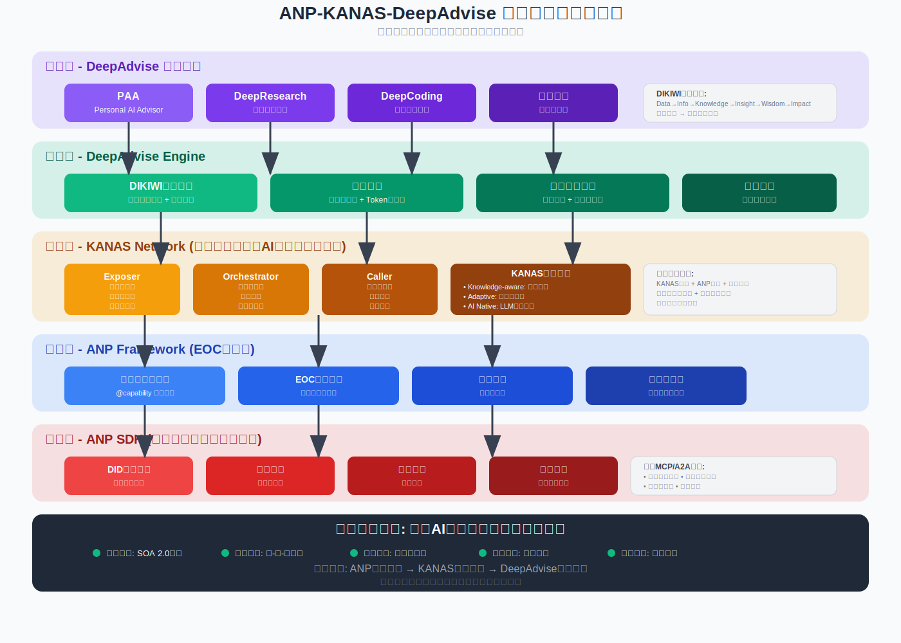
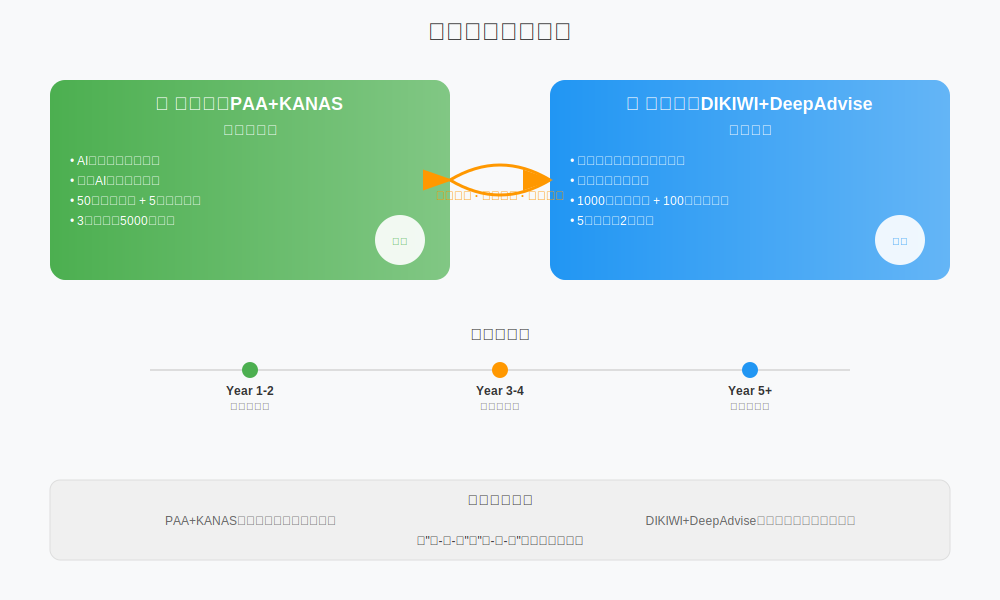
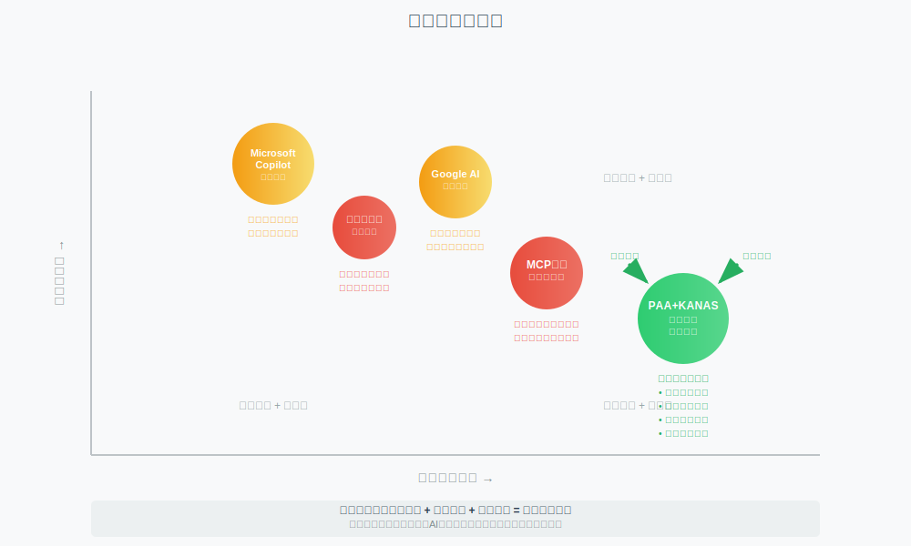
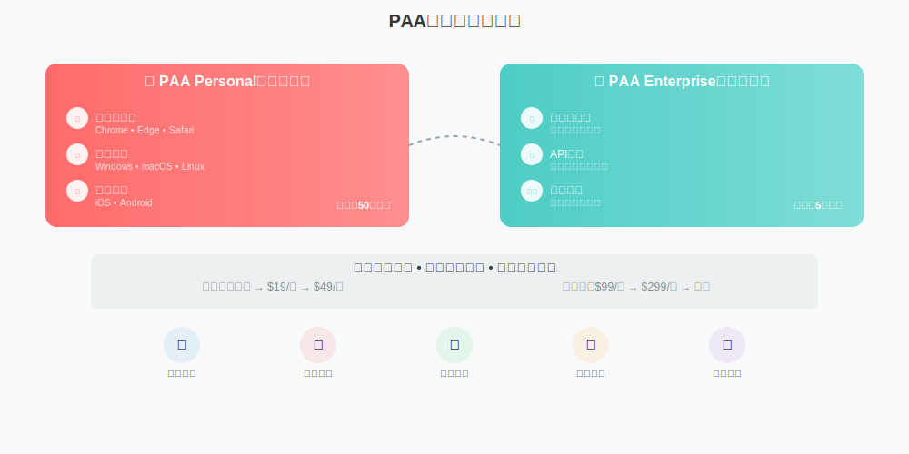
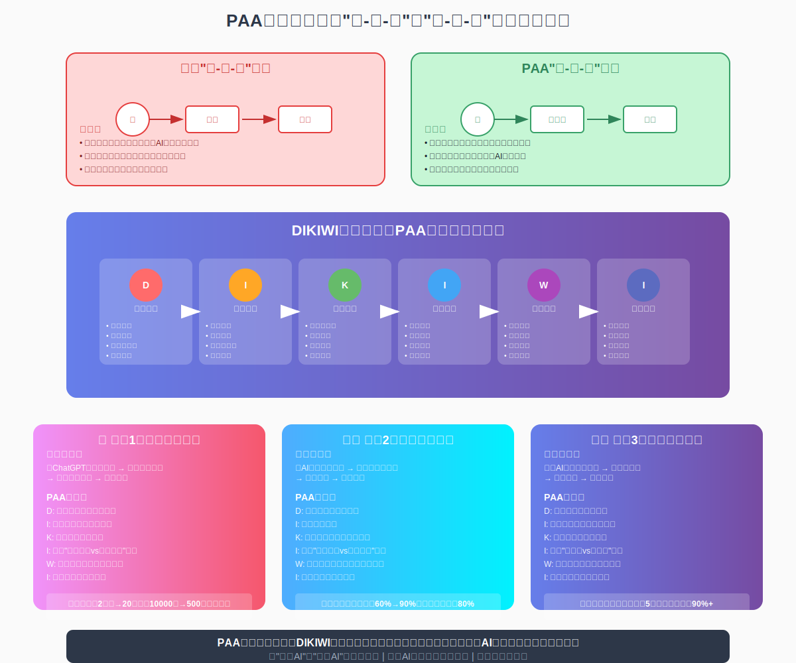
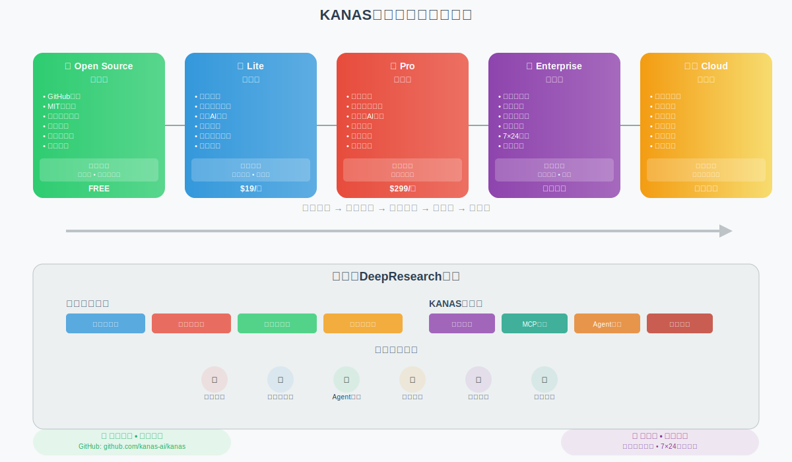
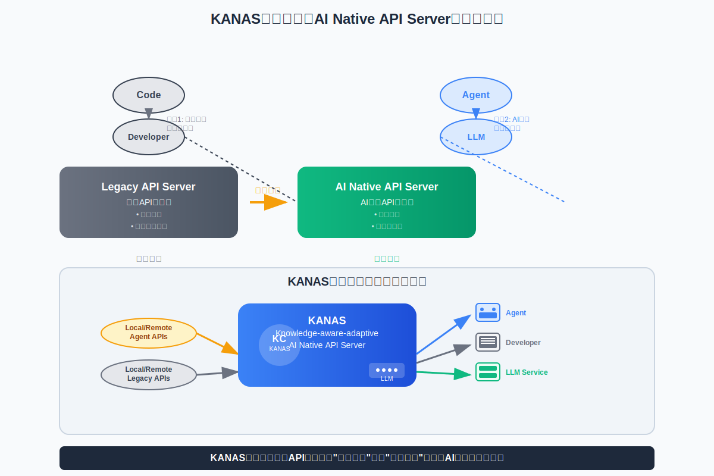
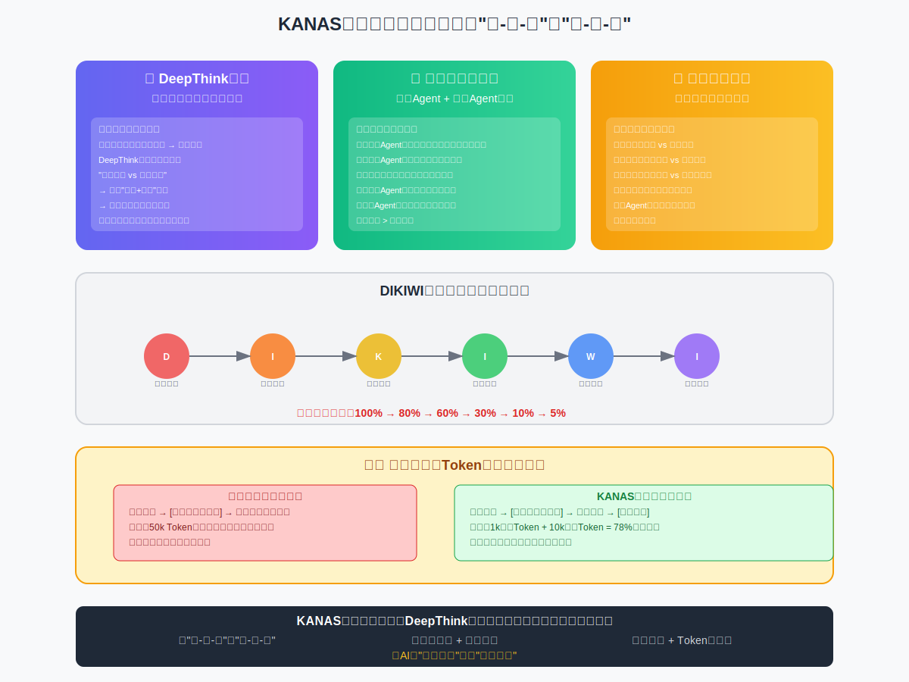
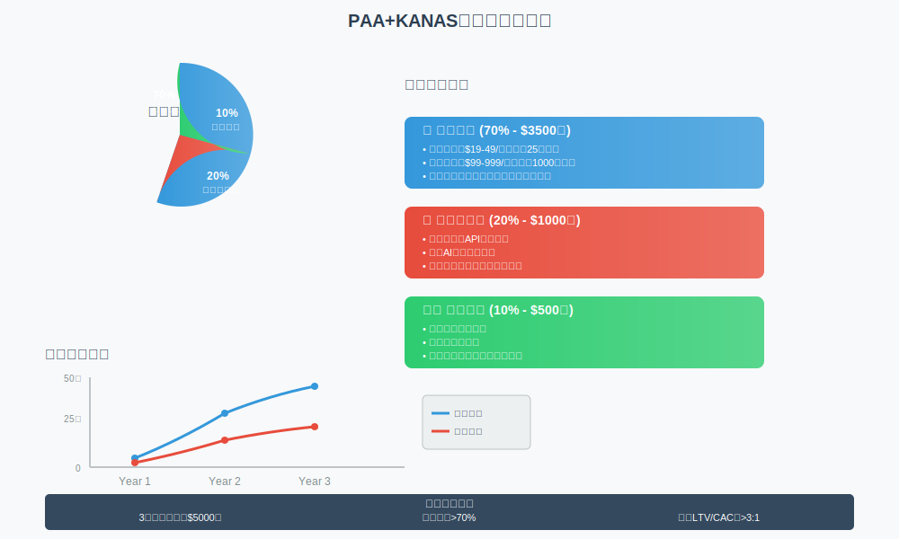

# ANP智能服务平台 双轨商业计划书

## 架构概览



## 双轨战略可视化



---

# 双轨产品战略概述

基于市场成熟度和用户接受度，我们采用**双轨并行**的产品策略：

## 🚀 **轨道一：PAA+KANAS** (市场化产品)
**定位**：AI工具的智能编排平台
**目标**：解决AI工具使用疲劳，实现"人-知-用"到"人-智-服"
**市场**：当前AI工具重度用户，企业数字化转型

## 🔬 **轨道二：DIKIWI+DeepAdvise** (前沿研究)
**定位**：基于熵理论的智慧决策系统
**目标**：构建低熵智能网络，实现真正的智慧增强
**市场**：前沿企业，研究机构，政府智库

---

# 轨道一：PAA+KANAS 商业计划书

## 执行摘要

### 项目概述
PAA+KANAS是一个解决AI工具使用疲劳的智能编排平台，通过意图理解和智能编排，让用户从"AI工具操作员"变成"意图表达者"。

### 核心价值主张
- **用户价值**：一句话完成复杂的多工具协同任务
- **技术价值**：跨端统一的AI服务编排框架
- **商业价值**：降低企业AI工具集成和使用成本
- **生态价值**：成为AI工具调用的标准接口

### 市场机会
- **TAM（总市场）**：全球AI工具市场，预计2025年达到500亿美元
- **SAM（可服务市场）**：AI工具集成和编排市场，约50亿美元
- **SOM（可获得市场）**：智能AI助手市场，约5亿美元

### 财务预测（3年）
- **营收目标**：5000万美元
- **用户规模**：50万个人用户，5万企业用户
- **盈利模式**：订阅制+按使用量+企业定制

## 1. PAA+KANAS 市场分析

### 1.1 核心用户痛点

#### AI工具使用疲劳症候群
- **认知负担过重**：需要记住各种AI工具的使用方法
- **切换成本高**：在不同工具间切换，上下文丢失
- **重复配置**：每个工具都需要单独配置和认证
- **效果不一致**：不同工具的输出质量和风格差异大
- **协同困难**：多个工具间缺乏有效的协同机制

#### 企业AI工具治理难题
- **工具分散**：员工使用各种AI工具，难以统一管理
- **成本失控**：多个AI服务订阅，成本难以控制
- **安全风险**：数据在多个AI服务间流转，安全风险高
- **效率低下**：缺乏统一的AI工具使用规范和最佳实践

### 1.2 目标市场细分

#### 个人用户市场
**AI工具重度用户（50万目标用户）**
- 程序员：使用Cursor、Cline、GitHub Copilot等
- 内容创作者：使用ChatGPT、Claude、Midjourney等
- 研究人员：使用各种AI分析和写作工具
- 知识工作者：使用AI办公和决策支持工具

**市场规模**：全球约500万AI工具重度用户，渗透率目标10%

#### 企业用户市场
**中小企业（5万目标企业）**
- 科技公司：需要AI工具集成的开发团队
- 咨询公司：需要AI辅助的专业服务团队
- 创意机构：需要AI创作工具的设计团队
- 教育机构：需要AI教学工具的教育团队

**市场规模**：全球约50万中小企业有AI工具集成需求，渗透率目标10%

### 1.3 竞争态势分析



#### 直接竞争对手
**MCP生态**
- 优势：协议标准化，工具生态丰富
- 劣势：缺乏智能编排，用户体验复杂
- 我们的差异化：智能意图理解+自动编排

**浏览器AI插件**
- 优势：用户习惯，集成简单
- 劣势：功能局限，缺乏跨应用能力
- 我们的差异化：跨端统一+深度集成

#### 间接竞争对手
**企业AI平台**
- Microsoft Copilot、Google Workspace AI
- 优势：生态完整，企业信任度高
- 劣势：封闭生态，缺乏灵活性
- 我们的差异化：开放生态+灵活编排

## 2. PAA+KANAS 产品策略

### 2.1 产品架构重新设计

#### 三层架构
```
PAA应用层：意图理解 + 用户界面
    ↓
KANAS编排层：智能路由 + 服务编排
    ↓
AI服务层：各种AI工具 + API接口
```

#### PAA产品矩阵



### 2.5 PAA核心价值场景：基于DIKIWI框架的智慧层赋能



**PAA Personal（个人版）**
- 浏览器插件：Chrome、Edge、Safari
- 桌面应用：Windows、macOS、Linux
- 移动应用：iOS、Android

**PAA Enterprise（企业版）**
- 企业控制台：统一管理和监控
- API网关：企业级安全和合规
- 私有部署：本地化部署选项

#### KANAS服务架构



### 2.2 KANAS核心价值：AI Native API Server的演进



### 2.4 KANAS核心架构价值场景



**KANAS Open Source（开源版）**
- GitHub开源，MIT许可证
- 社区驱动开发，插件生态
- 支持自托管，完全免费
- 面向开发者和技术爱好者

**KANAS Lite（轻量版）**
- 本地运行，基础编排功能
- 支持常用AI服务集成
- 适合个人用户和小团队

**KANAS Pro（专业版）**
- 云端运行，高级编排功能
- 支持企业级AI服务集成
- 适合中大型企业

**KANAS Enterprise（企业版）**
- 私有云部署，完全可控
- 企业级安全和合规
- 7×24专业支持
- 定制开发服务

**KANAS Cloud（云服务）**
- 全托管服务，无需部署
- 弹性扩展，按需付费
- 适合所有用户类型

### 2.2 核心功能设计

#### 意图理解引擎
**自然语言处理**
```
用户输入："帮我写一个关于AI趋势的PPT，要有数据支撑"
↓
意图解析：{
  "task_type": "presentation_creation",
  "topic": "AI trends",
  "requirements": ["data_support", "professional_format"],
  "output_format": "ppt"
}
↓
任务分解：[
  "research_ai_trends",
  "collect_data_statistics", 
  "create_presentation_outline",
  "generate_slide_content",
  "format_presentation"
]
```

#### 智能编排引擎
**服务选择算法**
```python
def select_best_service(task, context):
    # 1. 任务类型匹配
    suitable_services = filter_by_task_type(task.type)
    
    # 2. 质量评分
    quality_scores = evaluate_service_quality(suitable_services, task)
    
    # 3. 成本考虑
    cost_scores = evaluate_service_cost(suitable_services, task)
    
    # 4. 可用性检查
    available_services = check_service_availability(suitable_services)
    
    # 5. 综合评分
    final_scores = combine_scores(quality_scores, cost_scores, availability)
    
    return select_top_service(final_scores)
```

#### 跨端同步机制
**状态同步架构**
```
移动端PAA → KANAS Cloud → 桌面端PAA
     ↓           ↓            ↓
  任务发起    智能编排      结果展示
     ↓           ↓            ↓
  实时通知    进度跟踪      文件同步
```

### 2.3 用户体验设计

#### 渐进式学习曲线
**第一次使用**：简单的单一任务
- "帮我总结这篇文章"
- 展示AI服务选择过程
- 解释为什么选择特定服务

**熟练使用**：复杂的多步骤任务
- "分析竞争对手，写一份市场报告"
- 自动分解为多个子任务
- 并行执行，智能整合结果

**专家使用**：自定义工作流
- 用户可以保存常用的任务模板
- 支持工作流的分享和协作
- 提供工作流的性能优化建议

## 3. PAA+KANAS 技术实现

### 3.1 KANAS装饰器的跨语言实现

#### JavaScript/TypeScript（核心）
```typescript
// KANAS装饰器核心实现
@KanasService({
  autoRoute: true,
  fallback: ['openai', 'claude', 'gemini'],
  cache: true,
  timeout: 30000
})
class AIServiceManager {
  @KanasMethod({
    taskType: 'text_generation',
    priority: 'quality'
  })
  async generateText(prompt: string, options?: GenerationOptions): Promise<string> {
    // KANAS会自动选择最佳服务
    return await this.executeWithRouting(prompt, options);
  }
  
  @KanasMethod({
    taskType: 'code_generation', 
    priority: 'accuracy'
  })
  async generateCode(spec: CodeSpec): Promise<CodeResult> {
    // 自动选择最适合代码生成的AI服务
    return await this.executeWithRouting(spec);
  }
}
```

#### Python（服务端）
```python
from kanas import service_decorator, method_decorator

@service_decorator(
    auto_route=True,
    fallback=['openai', 'claude', 'gemini'],
    cache=True,
    timeout=30
)
class AIServiceManager:
    
    @method_decorator(
        task_type='text_generation',
        priority='quality'
    )
    async def generate_text(self, prompt: str, options: dict = None) -> str:
        # KANAS自动路由到最佳服务
        pass
    
    @method_decorator(
        task_type='data_analysis',
        priority='accuracy'
    )
    async def analyze_data(self, data: pd.DataFrame) -> AnalysisResult:
        # 自动选择最适合数据分析的AI服务
        pass
```

#### Java（企业级）
```java
@KanasService(
    autoRoute = true,
    fallback = {"openai", "claude", "gemini"},
    cache = true,
    timeout = 30000
)
public class AIServiceManager {
    
    @KanasMethod(
        taskType = "text_generation",
        priority = Priority.QUALITY
    )
    public CompletableFuture<String> generateText(String prompt, GenerationOptions options) {
        // KANAS自动选择最佳服务
        return executeWithRouting(prompt, options);
    }
    
    @KanasMethod(
        taskType = "document_processing",
        priority = Priority.SPEED
    )
    public CompletableFuture<ProcessResult> processDocument(Document doc) {
        // 自动选择最适合文档处理的AI服务
        return executeWithRouting(doc);
    }
}
```

### 3.2 智能路由算法

#### 服务评分系统
```python
class ServiceScorer:
    def __init__(self):
        self.quality_weights = {
            'accuracy': 0.4,
            'speed': 0.3, 
            'cost': 0.2,
            'availability': 0.1
        }
    
    def score_service(self, service: AIService, task: Task, context: Context) -> float:
        scores = {}
        
        # 质量评分
        scores['accuracy'] = self.evaluate_accuracy(service, task)
        
        # 速度评分  
        scores['speed'] = self.evaluate_speed(service, task)
        
        # 成本评分
        scores['cost'] = self.evaluate_cost(service, task)
        
        # 可用性评分
        scores['availability'] = self.check_availability(service)
        
        # 加权计算
        final_score = sum(
            scores[metric] * self.quality_weights[metric] 
            for metric in scores
        )
        
        return final_score
```

#### 自适应学习机制
```python
class AdaptiveLearner:
    def __init__(self):
        self.user_preferences = {}
        self.task_history = []
        self.service_performance = {}
    
    def learn_from_feedback(self, task: Task, service: str, result: Result, feedback: Feedback):
        # 更新服务性能记录
        self.update_service_performance(service, result, feedback)
        
        # 学习用户偏好
        self.update_user_preferences(task, service, feedback)
        
        # 调整路由权重
        self.adjust_routing_weights(task.type, service, feedback)
    
    def predict_best_service(self, task: Task, user: User) -> str:
        # 基于历史数据预测最佳服务
        candidates = self.get_suitable_services(task)
        
        scores = {}
        for service in candidates:
            # 基础评分
            base_score = self.get_base_score(service, task)
            
            # 用户偏好调整
            preference_adjustment = self.get_preference_adjustment(user, service)
            
            # 历史性能调整
            performance_adjustment = self.get_performance_adjustment(service, task)
            
            scores[service] = base_score + preference_adjustment + performance_adjustment
        
        return max(scores, key=scores.get)
```

### 3.3 企业级DeepResearch网络

#### 企业级DeepResearch架构（基于专家建议优化）
```
多模态数据源层
├── 内部结构化数据 (MySQL/PostgreSQL/MongoDB)
├── 企业知识库 (文档/Wiki/邮件)
├── 外部数据源 (爬虫/API/第三方数据)
└── 实时数据流 (日志/监控/事件)
         ↓
分布式KANAS编排层
├── 动态本体数据模型
├── MCP协议支持
├── Agent间通信管理
└── 跨服务日志传递
         ↓
智能分析处理层
├── 多AI服务并行调用
├── 循环检测与熔断
├── 可视化进度跟踪
└── 结果质量评估
         ↓
企业级输出层
├── DeepResearch报告
├── 知识图谱更新
├── 决策支持建议
└── 审计合规记录
```

#### 核心技术创新

##### 1. 跨服务生成日志传递与可视化进度
```python
class CrossServiceLogManager:
    def __init__(self):
        self.log_chain = []
        self.progress_tracker = ProgressTracker()
        self.visualization_engine = VisualizationEngine()
    
    def create_research_session(self, research_id: str) -> ResearchSession:
        """创建研究会话，支持跨服务日志追踪"""
        session = ResearchSession(
            id=research_id,
            trace_id=self.generate_trace_id(),
            start_time=datetime.now()
        )
        
        # 初始化日志链
        self.log_chain.append({
            'session_id': research_id,
            'trace_id': session.trace_id,
            'events': [],
            'progress': 0
        })
        
        return session
    
    def log_service_call(self, session_id: str, service_name: str, 
                        input_data: dict, output_data: dict = None):
        """记录服务调用日志"""
        log_entry = {
            'timestamp': datetime.now().isoformat(),
            'service': service_name,
            'input_hash': self.hash_data(input_data),
            'output_hash': self.hash_data(output_data) if output_data else None,
            'status': 'completed' if output_data else 'in_progress',
            'duration': None
        }
        
        # 更新日志链
        for chain in self.log_chain:
            if chain['session_id'] == session_id:
                chain['events'].append(log_entry)
                break
        
        # 更新可视化进度
        self.update_progress_visualization(session_id)
    
    def update_progress_visualization(self, session_id: str):
        """实时更新进度可视化"""
        progress_data = self.calculate_progress(session_id)
        
        # 生成进度图表
        visualization = {
            'timeline': self.generate_timeline_chart(session_id),
            'dependency_graph': self.generate_dependency_graph(session_id),
            'resource_usage': self.generate_resource_chart(session_id),
            'quality_metrics': self.generate_quality_metrics(session_id)
        }
        
        # 推送到前端
        self.visualization_engine.push_update(session_id, visualization)
```

##### 2. 丰富的Agent间行为管理
```python
class AgentCommunicationManager:
    def __init__(self):
        self.active_agents = {}
        self.communication_channels = {}
        self.interrupt_handlers = {}
        
    def setup_agent_behaviors(self):
        """设置Agent间的丰富交互行为"""
        
        # 打断机制
        @self.register_behavior('interrupt')
        def interrupt_agent(source_agent: str, target_agent: str, reason: str):
            """允许高优先级Agent打断低优先级Agent"""
            if self.can_interrupt(source_agent, target_agent):
                self.pause_agent(target_agent)
                self.notify_interrupt(target_agent, source_agent, reason)
                return True
            return False
        
        # 资源占用机制
        @self.register_behavior('occupy')
        def occupy_resource(agent_id: str, resource_type: str, duration: int):
            """Agent占用特定资源（如GPU、数据库连接）"""
            if self.is_resource_available(resource_type):
                self.allocate_resource(agent_id, resource_type, duration)
                return True
            else:
                self.queue_resource_request(agent_id, resource_type)
                return False
        
        # SSE流式通信
        @self.register_behavior('sse_stream')
        def setup_sse_stream(agent_id: str, client_id: str):
            """建立Server-Sent Events流式通信"""
            stream = SSEStream(agent_id, client_id)
            self.communication_channels[f"{agent_id}_{client_id}"] = stream
            return stream
        
        # StreamableHttp支持
        @self.register_behavior('streamable_http')
        def create_streamable_http(agent_id: str, endpoint: str):
            """创建可流式传输的HTTP连接"""
            connection = StreamableHttpConnection(
                agent_id=agent_id,
                endpoint=endpoint,
                chunk_size=1024,
                timeout=30
            )
            return connection

class SSEStream:
    def __init__(self, agent_id: str, client_id: str):
        self.agent_id = agent_id
        self.client_id = client_id
        self.is_active = True
        
    def send_progress_update(self, progress: dict):
        """发送进度更新"""
        if self.is_active:
            event_data = {
                'type': 'progress',
                'agent_id': self.agent_id,
                'data': progress,
                'timestamp': datetime.now().isoformat()
            }
            self.emit_event(event_data)
    
    def send_partial_result(self, partial_data: dict):
        """发送部分结果"""
        if self.is_active:
            event_data = {
                'type': 'partial_result',
                'agent_id': self.agent_id,
                'data': partial_data,
                'timestamp': datetime.now().isoformat()
            }
            self.emit_event(event_data)
```

##### 3. 分布式基础设施与循环检测
```python
class DistributedDeepResearchInfra:
    def __init__(self):
        self.execution_graph = nx.DiGraph()
        self.circuit_breaker = CircuitBreaker()
        self.cross_system_monitor = CrossSystemMonitor()
        
    def execute_distributed_research(self, research_plan: ResearchPlan):
        """执行分布式研究，防止循环调用"""
        
        # 1. 构建执行图
        execution_graph = self.build_execution_graph(research_plan)
        
        # 2. 循环检测
        if self.detect_cycles(execution_graph):
            raise CircularDependencyError("检测到循环依赖，终止执行")
        
        # 3. 分布式执行
        results = {}
        execution_queue = self.topological_sort(execution_graph)
        
        for task_batch in execution_queue:
            batch_results = self.execute_task_batch(task_batch)
            results.update(batch_results)
            
            # 检查熔断条件
            if self.circuit_breaker.should_break(batch_results):
                self.circuit_breaker.open_circuit()
                break
        
        return results
    
    def detect_cycles(self, graph: nx.DiGraph) -> bool:
        """检测执行图中的循环依赖"""
        try:
            cycles = list(nx.simple_cycles(graph))
            if cycles:
                self.log_cycles(cycles)
                return True
            return False
        except nx.NetworkXError:
            return False
    
    def execute_cross_system_call(self, source_system: str, target_system: str, 
                                 call_data: dict):
        """安全的跨系统调用"""
        
        # 1. 调用频率限制
        if not self.rate_limiter.allow_call(source_system, target_system):
            raise RateLimitExceededError("调用频率超限")
        
        # 2. 跨域数据访问控制
        if not self.access_controller.check_cross_domain_access(
            source_system, target_system, call_data
        ):
            raise AccessDeniedError("跨域访问被拒绝")
        
        # 3. 执行调用
        try:
            result = self.cross_system_monitor.execute_call(
                source_system, target_system, call_data
            )
            return result
        except Exception as e:
            self.circuit_breaker.record_failure(target_system)
            raise

class CrossDomainDataManager:
    def __init__(self):
        self.crawler_pool = CrawlerPool()
        self.mysql_connections = MySQLConnectionPool()
        self.data_fusion_engine = DataFusionEngine()
    
    def fetch_cross_domain_data(self, data_sources: List[DataSource]):
        """获取跨域数据（爬虫+数据库）"""
        
        results = {}
        
        for source in data_sources:
            if source.type == 'web_crawler':
                # 爬虫数据获取
                crawler_data = self.crawler_pool.fetch_data(
                    url=source.url,
                    headers=source.headers,
                    rate_limit=source.rate_limit
                )
                results[source.name] = crawler_data
                
            elif source.type == 'mysql':
                # MySQL数据获取
                mysql_data = self.mysql_connections.execute_query(
                    connection_id=source.connection_id,
                    query=source.query,
                    params=source.params
                )
                results[source.name] = mysql_data
        
        # 数据融合
        fused_data = self.data_fusion_engine.fuse_data(results)
        return fused_data
```

##### 4. 动态本体数据模型支持
```python
class DynamicOntologyManager:
    def __init__(self):
        self.ontology_store = OntologyStore()
        self.schema_evolution_tracker = SchemaEvolutionTracker()
        self.type_inference_engine = TypeInferenceEngine()
    
    def create_dynamic_ontology(self, domain: str, initial_data: dict):
        """创建动态本体数据模型"""
        
        # 1. 自动推断数据类型和关系
        inferred_schema = self.type_inference_engine.infer_schema(initial_data)
        
        # 2. 创建本体模型
        ontology = Ontology(
            domain=domain,
            schema=inferred_schema,
            version=1,
            created_at=datetime.now()
        )
        
        # 3. 存储本体
        self.ontology_store.save_ontology(ontology)
        
        return ontology
    
    def evolve_ontology(self, ontology_id: str, new_data: dict):
        """根据新数据演进本体模型"""
        
        # 1. 获取当前本体
        current_ontology = self.ontology_store.get_ontology(ontology_id)
        
        # 2. 检测schema变化
        schema_changes = self.detect_schema_changes(
            current_ontology.schema, new_data
        )
        
        if schema_changes:
            # 3. 创建新版本本体
            new_ontology = self.create_evolved_ontology(
                current_ontology, schema_changes
            )
            
            # 4. 数据迁移
            self.migrate_data(current_ontology, new_ontology)
            
            # 5. 记录演进历史
            self.schema_evolution_tracker.record_evolution(
                ontology_id, current_ontology.version, 
                new_ontology.version, schema_changes
            )
            
            return new_ontology
        
        return current_ontology
    
    def query_with_dynamic_schema(self, ontology_id: str, query: dict):
        """使用动态schema进行查询"""
        
        ontology = self.ontology_store.get_ontology(ontology_id)
        
        # 动态构建查询
        dynamic_query = self.build_dynamic_query(ontology.schema, query)
        
        # 执行查询
        results = self.execute_dynamic_query(dynamic_query)
        
        # 结果映射
        mapped_results = self.map_results_to_schema(ontology.schema, results)
        
        return mapped_results

class TypeInferenceEngine:
    def infer_schema(self, data: dict) -> Schema:
        """自动推断数据schema"""
        
        schema = Schema()
        
        for key, value in data.items():
            # 推断字段类型
            field_type = self.infer_field_type(value)
            
            # 推断字段关系
            relationships = self.infer_relationships(key, value, data)
            
            # 添加到schema
            schema.add_field(
                name=key,
                type=field_type,
                relationships=relationships,
                constraints=self.infer_constraints(value)
            )
        
        return schema
```

##### 5. MCP协议支持与集成
```python
class MCPIntegrationManager:
    def __init__(self):
        self.mcp_clients = {}
        self.tool_registry = MCPToolRegistry()
        self.protocol_adapter = MCPProtocolAdapter()
    
    def register_mcp_server(self, server_config: MCPServerConfig):
        """注册MCP服务器"""
        
        client = MCPClient(
            server_url=server_config.url,
            auth_token=server_config.auth_token,
            capabilities=server_config.capabilities
        )
        
        # 连接并获取工具列表
        tools = client.list_tools()
        
        # 注册工具到KANAS
        for tool in tools:
            kanas_tool = self.protocol_adapter.adapt_mcp_tool(tool)
            self.tool_registry.register_tool(kanas_tool)
        
        self.mcp_clients[server_config.name] = client
    
    def execute_mcp_tool(self, tool_name: str, parameters: dict):
        """执行MCP工具"""
        
        # 1. 查找工具
        tool_info = self.tool_registry.get_tool(tool_name)
        if not tool_info:
            raise ToolNotFoundError(f"工具 {tool_name} 未找到")
        
        # 2. 获取对应的MCP客户端
        client = self.mcp_clients[tool_info.server_name]
        
        # 3. 参数适配
        mcp_parameters = self.protocol_adapter.adapt_parameters(
            parameters, tool_info.parameter_schema
        )
        
        # 4. 执行工具
        try:
            result = client.call_tool(tool_name, mcp_parameters)
            
            # 5. 结果适配
            kanas_result = self.protocol_adapter.adapt_result(
                result, tool_info.result_schema
            )
            
            return kanas_result
            
        except MCPError as e:
            # MCP错误处理
            self.handle_mcp_error(tool_name, e)
            raise

class MCPProtocolAdapter:
    def adapt_mcp_tool(self, mcp_tool: MCPTool) -> KANASTool:
        """将MCP工具适配为KANAS工具"""
        
        return KANASTool(
            name=mcp_tool.name,
            description=mcp_tool.description,
            parameters=self.adapt_parameter_schema(mcp_tool.inputSchema),
            result_schema=self.adapt_result_schema(mcp_tool.outputSchema),
            server_name=mcp_tool.server_name,
            execution_type='mcp',
            metadata={
                'mcp_version': mcp_tool.version,
                'capabilities': mcp_tool.capabilities
            }
        )
    
    def adapt_parameters(self, kanas_params: dict, mcp_schema: dict) -> dict:
        """适配参数格式"""
        
        adapted_params = {}
        
        for param_name, param_value in kanas_params.items():
            if param_name in mcp_schema['properties']:
                # 类型转换
                expected_type = mcp_schema['properties'][param_name]['type']
                adapted_value = self.convert_type(param_value, expected_type)
                adapted_params[param_name] = adapted_value
        
        return adapted_params
```

#### 企业级功能增强

##### 多模态数据集成
```python
class MultiModalDataIntegrator:
    def __init__(self):
        self.text_processor = TextProcessor()
        self.image_processor = ImageProcessor()
        self.audio_processor = AudioProcessor()
        self.video_processor = VideoProcessor()
        self.structured_data_processor = StructuredDataProcessor()
    
    def integrate_enterprise_data(self, data_sources: List[DataSource]):
        """集成企业多模态数据"""
        
        integrated_data = {}
        
        for source in data_sources:
            if source.type == 'text':
                # 文本数据处理
                processed_text = self.text_processor.process(source.data)
                integrated_data['text'] = processed_text
                
            elif source.type == 'image':
                # 图像数据处理
                processed_images = self.image_processor.process(source.data)
                integrated_data['images'] = processed_images
                
            elif source.type == 'structured':
                # 结构化数据处理
                processed_structured = self.structured_data_processor.process(
                    source.data
                )
                integrated_data['structured'] = processed_structured
        
        # 跨模态关联分析
        cross_modal_relations = self.analyze_cross_modal_relations(
            integrated_data
        )
        
        return {
            'data': integrated_data,
            'relations': cross_modal_relations,
            'metadata': self.generate_metadata(integrated_data)
        }
```

##### 企业级安全与合规
```python
class EnterpriseSecurityManager:
    def __init__(self):
        self.access_controller = AccessController()
        self.audit_logger = AuditLogger()
        self.data_classifier = DataClassifier()
        self.compliance_checker = ComplianceChecker()
    
    def secure_research_execution(self, research_request: ResearchRequest, 
                                 user_context: UserContext):
        """安全的研究执行"""
        
        # 1. 访问权限检查
        if not self.access_controller.check_access(
            user_context, research_request.data_sources
        ):
            raise AccessDeniedError("用户无权访问指定数据源")
        
        # 2. 数据分类
        data_classification = self.data_classifier.classify_data(
            research_request.data_sources
        )
        
        # 3. 合规检查
        compliance_result = self.compliance_checker.check_compliance(
            research_request, data_classification
        )
        
        if not compliance_result.is_compliant:
            raise ComplianceViolationError(
                f"研究请求违反合规要求: {compliance_result.violations}"
            )
        
        # 4. 审计日志
        self.audit_logger.log_research_start(
            user_context, research_request, data_classification
        )
        
        return True
```

这些企业级增强功能解决了专家提出的关键技术挑战，使KANAS能够真正支撑企业级的DeepResearch服务，覆盖内外部数据、多模态数据处理，并提供完整的分布式基础设施支持。

## 4. PAA+KANAS 商业模式

### 4.1 分层定价策略

#### 个人用户定价
**PAA Free（免费版）**
- 每月100次AI调用
- 基础的意图理解
- 支持3个主流AI服务
- 社区支持

**PAA Pro（专业版）- $19/月**
- 每月2000次AI调用
- 高级意图理解和编排
- 支持10+AI服务
- 优先技术支持
- 跨端同步

**PAA Premium（高级版）- $49/月**
- 无限AI调用
- 自定义工作流
- 支持所有AI服务
- 7×24技术支持
- API访问权限

#### 企业用户定价
**KANAS Starter（入门版）- $99/月/团队**
- 最多10个用户
- 基础企业功能
- 统一管理控制台
- 使用分析报告

**KANAS Business（商业版）- $299/月/团队**
- 最多50个用户
- 高级企业功能
- DeepResearch网络
- 私有知识库集成
- SSO集成

**KANAS Enterprise（企业版）- 定制定价**
- 无限用户
- 私有部署选项
- 定制开发服务
- 专属客户成功经理
- SLA保证

### 4.2 收入模型优化



#### 多元化收入来源
**订阅收入（70%）**
- 个人用户订阅：$19-49/月
- 企业用户订阅：$99-999/月
- 预计3年内达到50万付费用户

**使用量收入（20%）**
- 超出套餐的API调用费用
- 高级AI服务的使用费
- 企业级存储和计算费用

**服务收入（10%）**
- 企业定制开发
- 培训和咨询服务
- 技术支持和维护

#### 收入预测模型


```
Year 1: $800万
- 个人用户：2万人 × $300/年 = $600万
- 企业用户：100家 × $2万/年 = $200万

Year 2: $2800万  
- 个人用户：10万人 × $240/年 = $2400万
- 企业用户：500家 × $8万/年 = $400万

Year 3: $5000万
- 个人用户：25万人 × $180/年 = $4500万
- 企业用户：1000家 × $5万/年 = $500万
```

---

# 轨道二：DIKIWI+DeepAdvise 商业计划书

## 执行摘要

### 项目概述
DIKIWI+DeepAdvise是基于熵理论的智慧决策系统，通过构建低熵智能网络，实现从数据到智慧的系统性转化，为前沿企业和研究机构提供真正的智慧增强服务。

### 核心价值主张
- **理论创新**：基于信息熵理论的智慧决策框架
- **系统性降熵**：从高熵信息到低熵智慧的系统转化
- **集体智慧**：构建低熵智能网络，实现集体智慧涌现
- **决策增强**：提供基于DIKIWI框架的深度决策支持

### 市场机会
- **TAM（总市场）**：全球决策支持系统市场，预计2025年达到200亿美元
- **SAM（可服务市场）**：智能决策平台市场，约20亿美元
- **SOM（可获得市场）**：前沿智慧决策系统，约2亿美元

### 财务预测（5年）
- **营收目标**：2亿美元
- **用户规模**：1000家前沿企业，100个研究机构
- **盈利模式**：高价值定制+研究合作+技术授权

## 1. DIKIWI+DeepAdvise 市场分析

### 1.1 目标市场定位

#### 前沿企业市场
**战略咨询公司**
- McKinsey、BCG、Bain等顶级咨询公司
- 需要深度的行业洞察和战略建议
- 愿意为高质量决策支持付费

**科技巨头研发部门**
- Google Research、Microsoft Research、Meta AI
- 需要前沿的AI研究和技术洞察
- 关注长期技术趋势和突破方向

**投资机构**
- 顶级VC、PE、对冲基金
- 需要深度的市场分析和投资决策支持
- 对决策质量极其敏感

#### 研究机构市场
**政府智库**
- 国家级政策研究机构
- 需要基于大数据的政策分析
- 关注社会经济发展趋势

**学术研究机构**
- 顶级大学的研究中心
- 需要跨学科的研究支持
- 关注理论创新和方法突破

### 1.2 DIKIWI理论框架


#### 从DIKW到DIKIWI的演进
```
Data（数据）→ Information（信息）→ Knowledge（知识）→ Wisdom（智慧）
                    ↓
Data → Information → Knowledge → Intelligence → Wisdom → Insight
```

#### 熵降机制
**信息熵计算**
```python
def calculate_information_entropy(data_set):
    """计算数据集的信息熵"""
    entropy = 0
    for category in data_set.categories:
        probability = category.count / data_set.total
        if probability > 0:
            entropy -= probability * math.log2(probability)
    return entropy

def entropy_reduction_score(before_entropy, after_entropy):
    """计算熵降效果"""
    return (before_entropy - after_entropy) / before_entropy
```

**智慧涌现模型**
```python
class WisdomEmergenceModel:
    def __init__(self):
        self.knowledge_graph = KnowledgeGraph()
        self.intelligence_layer = IntelligenceLayer()
        self.wisdom_synthesizer = WisdomSynthesizer()
    
    def process_to_wisdom(self, raw_data):
        # 1. 数据预处理和清洗
        clean_data = self.preprocess_data(raw_data)
        
        # 2. 信息提取和结构化
        information = self.extract_information(clean_data)
        
        # 3. 知识构建和关联
        knowledge = self.build_knowledge(information)
        
        # 4. 智能分析和推理
        intelligence = self.analyze_intelligence(knowledge)
        
        # 5. 智慧综合和洞察
        wisdom = self.synthesize_wisdom(intelligence)
        
        # 6. 洞察发现和验证
        insights = self.discover_insights(wisdom)
        
        return insights
```

### 1.3 DeepAdvise产品矩阵

#### DeepResearch Pro（深度研究）
**功能特性**
- 跨领域知识图谱构建
- 多源数据融合分析
- 趋势预测和情景分析
- 研究报告自动生成

**目标用户**
- 战略咨询公司
- 投资研究机构
- 政府政策部门

#### DeepInsight（深度洞察）
**功能特性**
- 复杂系统建模
- 因果关系分析
- 反直觉洞察发现
- 决策风险评估

**目标用户**
- 企业战略部门
- 风险管理部门
- 创新研发部门

#### DeepWisdom（深度智慧）
**功能特性**
- 集体智慧网络
- 专家知识整合
- 智慧决策支持
- 长期价值评估

**目标用户**
- 企业董事会
- 政府决策层
- 学术研究机构

## 2. DIKIWI+DeepAdvise 技术架构

### 2.1 低熵智能网络架构


#### 网络拓扑结构
```
专家节点 ← → 知识节点 ← → 数据节点
    ↓           ↓           ↓
智慧合成层 ← → 推理引擎 ← → 分析引擎
    ↓           ↓           ↓
决策支持层 ← → 洞察发现层 ← → 验证评估层
```

#### 熵降算法
```python
class EntropyReductionEngine:
    def __init__(self):
        self.knowledge_base = KnowledgeBase()
        self.reasoning_engine = ReasoningEngine()
        self.validation_system = ValidationSystem()
    
    def reduce_entropy(self, input_data):
        # 1. 计算初始熵
        initial_entropy = self.calculate_entropy(input_data)
        
        # 2. 知识匹配和关联
        relevant_knowledge = self.match_knowledge(input_data)
        
        # 3. 推理和综合
        synthesized_info = self.synthesize_information(
            input_data, relevant_knowledge
        )
        
        # 4. 验证和优化
        validated_result = self.validate_result(synthesized_info)
        
        # 5. 计算最终熵
        final_entropy = self.calculate_entropy(validated_result)
        
        # 6. 返回熵降结果
        return {
            'result': validated_result,
            'entropy_reduction': initial_entropy - final_entropy,
            'confidence': self.calculate_confidence(validated_result)
        }
```

### 2.2 集体智慧涌现机制

#### 专家网络协作
```python
class ExpertNetworkCollaboration:
    def __init__(self):
        self.expert_profiles = {}
        self.collaboration_history = []
        self.wisdom_synthesis_engine = WisdomSynthesisEngine()
    
    def orchestrate_collaboration(self, research_question):
        # 1. 专家匹配
        relevant_experts = self.match_experts(research_question)
        
        # 2. 协作任务分配
        tasks = self.decompose_research_tasks(research_question)
        expert_assignments = self.assign_tasks(tasks, relevant_experts)
        
        # 3. 并行研究执行
        research_results = self.execute_parallel_research(expert_assignments)
        
        # 4. 结果整合和冲突解决
        integrated_results = self.integrate_results(research_results)
        
        # 5. 智慧涌现和洞察发现
        emergent_wisdom = self.synthesize_wisdom(integrated_results)
        
        return emergent_wisdom
```

#### 知识图谱演进
```python
class EvolvingKnowledgeGraph:
    def __init__(self):
        self.graph = nx.DiGraph()
        self.concept_embeddings = {}
        self.evolution_history = []
    
    def evolve_knowledge(self, new_information):
        # 1. 新概念识别
        new_concepts = self.identify_new_concepts(new_information)
        
        # 2. 关系发现
        new_relationships = self.discover_relationships(new_concepts)
        
        # 3. 图结构更新
        self.update_graph_structure(new_concepts, new_relationships)
        
        # 4. 概念权重调整
        self.adjust_concept_weights(new_information)
        
        # 5. 冗余消除
        self.eliminate_redundancy()
        
        # 6. 一致性验证
        self.validate_consistency()
        
        return self.graph
```

## 3. DIKIWI+DeepAdvise 商业模式

### 3.1 高价值定制服务

#### 战略咨询项目
**项目类型**
- 行业深度分析：$50万-200万/项目
- 战略规划支持：$100万-500万/项目
- 并购决策分析：$200万-1000万/项目

**服务内容**
- 基于DIKIWI框架的深度分析
- 多维度情景建模和预测
- 反直觉洞察发现
- 决策风险评估和优化建议

#### 投资决策支持
**服务类型**
- 投资标的深度分析：$10万-50万/项目
- 行业趋势预测：$20万-100万/项目
- 投资组合优化：$50万-200万/项目

**核心价值**
- 基于大数据的深度洞察
- 跨领域关联分析
- 长期价值评估
- 风险预警和管理

### 3.2 研究合作模式

#### 政府智库合作
**合作形式**
- 政策影响评估：$100万-500万/年
- 社会经济趋势分析：$200万-1000万/年
- 国际关系分析：$300万-1500万/年

**价值创造**
- 基于DIKIWI的政策建模
- 多维度影响分析
- 长期趋势预测
- 决策支持和优化

#### 学术研究合作
**合作模式**
- 联合研究项目：$50万-200万/项目
- 理论框架开发：$100万-500万/项目
- 方法论创新：$200万-1000万/项目

**研究方向**
- 复杂系统理论
- 集体智慧机制
- 决策科学
- 人工智能哲学

### 3.3 技术授权模式

#### 企业技术授权
**授权类型**
- DIKIWI框架授权：$100万-500万/年
- 低熵网络技术：$200万-1000万/年
- 定制化解决方案：$500万-2000万/年

**目标客户**
- 科技巨头
- 金融机构
- 咨询公司
- 政府机构

## 4. 双轨战略的协同效应

### 4.1 技术协同

#### 共享技术栈
**KANAS框架**
- PAA+KANAS：智能编排和服务调用
- DIKIWI+DeepAdvise：深度分析和智慧合成
- 共享：分布式计算、安全认证、数据管理

**AI服务池**
- PAA+KANAS：通用AI服务集成
- DIKIWI+DeepAdvise：专业AI服务和专家系统
- 共享：服务发现、负载均衡、质量监控

### 4.2 市场协同

#### 用户路径升级
```
个人用户 → PAA Pro → PAA Premium → 企业咨询服务
    ↓         ↓         ↓              ↓
基础需求   高级需求   专业需求      战略需求
    ↓         ↓         ↓              ↓
免费试用   付费订阅   企业采购    定制合作
```

#### 数据价值放大
**数据流转**
- PAA收集用户行为数据
- KANAS积累服务使用模式
- DeepAdvise分析决策效果
- 形成完整的智慧循环

### 4.3 商业协同

#### 收入互补
**PAA+KANAS（规模收入）**
- 大量用户，相对低价
- 订阅模式，稳定现金流
- 快速增长，市场验证

**DIKIWI+DeepAdvise（价值收入）**
- 少量客户，极高价值
- 项目模式，高利润率
- 品牌建设，技术领先

#### 风险分散
- 市场风险：两个不同成熟度的市场
- 技术风险：渐进式技术演进路径
- 竞争风险：差异化的竞争策略
- 资金风险：多元化的收入来源

## 5. 实施路线图

### 5.1 双轨并行发展

#### Year 1-2：基础建设期
**PAA+KANAS轨道**
- 产品MVP开发和验证
- 开源社区建设
- 种子用户获取
- 商业模式验证

**DIKIWI+DeepAdvise轨道**
- 理论框架完善
- 核心算法开发
- 专家网络建设
- 试点项目执行

#### Year 3-4：快速发展期
**PAA+KANAS轨道**
- 用户规模快速增长
- 企业市场拓展
- 国际化扩展
- 生态建设完善

**DIKIWI+DeepAdvise轨道**
- 标杆客户建立
- 高价值项目交付
- 技术授权开始
- 学术影响力建设

#### Year 5+：成熟整合期
**双轨融合**
- 技术栈深度整合
- 用户路径打通
- 品牌统一建设
- 全球市场领导地位

### 5.2 资源配置策略

#### 人员配置（总计200人）
**PAA+KANAS团队（120人）**
- 产品开发：60人
- 市场运营：30人
- 客户服务：30人

**DIKIWI+DeepAdvise团队（80人）**
- 研究开发：40人
- 专家网络：20人
- 项目交付：20人

#### 资金配置（总计1亿美元）
**PAA+KANAS投入（6000万）**
- 产品开发：3000万
- 市场推广：2000万
- 运营支持：1000万

**DIKIWI+DeepAdvise投入（4000万）**
- 研究开发：2000万
- 专家网络：1000万
- 项目交付：1000万

## 6. 总结与展望

### 6.1 双轨战略的核心价值

#### 市场覆盖的完整性
- **广度**：PAA+KANAS覆盖大众市场
- **深度**：DIKIWI+DeepAdvise覆盖高端市场
- **连续性**：形成完整的用户价值链

#### 技术发展的可持续性
- **渐进式**：从实用到前沿的技术演进
- **互补性**：不同技术路径的相互支撑
- **前瞻性**：为未来技术突破做好准备

#### 商业模式的稳健性
- **多元化**：不同的收入来源和客户群体
- **平衡性**：规模效应和价值效应的平衡
- **可持续性**：长期竞争优势的建立

### 6.2 未来愿景

#### 5年目标
- **PAA+KANAS**：成为AI工具编排的标准平台
- **DIKIWI+DeepAdvise**：成为智慧决策的理论和技术领导者
- **整体**：建立从工具到智慧的完整生态

#### 10年愿景
- **技术愿景**：实现真正的人机协同智慧
- **商业愿景**：成为全球智能服务的基础设施
- **社会愿景**：推动人类智慧的整体提升

让我们通过双轨并行的战略，既满足当前市场的实际需求，又为未来的技术突破做好准备，最终实现从"人-知-用"到"人-智-服"的时代转变！

---

**联系方式**
- 项目官网：[待建设]
- 技术文档：[待完善]  
- 开发者社区：[待建立]
- 商务合作：[待开放]

*"智慧不是信息的堆积，而是熵的降低。让我们一起构建低熵的智能网络，开启人类智慧的新纪元。"*

### 1.1 市场现状与痛点

#### 当前AI工具市场的主要问题
1. **工具分散化**：各种AI工具孤立存在，缺乏统一调用方式
2. **集成复杂**：企业需要投入大量资源进行工具集成
3. **效率低下**：重复的认证、配置和维护工作
4. **智能不足**：缺乏智能编排和优化能力
5. **信息过载**：高熵的AI交互，难以提取真正价值

#### 市场需求分析
- **企业需求**：统一的AI工具管理平台，降低集成成本
- **开发者需求**：简化的API集成方式，标准化的开发体验
- **个人用户需求**：更智能的AI助手，能够理解和优化使用模式

### 1.2 竞争分析

#### 直接竞争对手
1. **MCP (Model Context Protocol)**
   - 优势：标准化协议，工具生态丰富
   - 劣势：缺乏智能编排，无知识感知能力

2. **Zapier/IFTTT**
   - 优势：成熟的自动化平台
   - 劣势：非AI原生，缺乏智能决策

#### 间接竞争对手
- 各大云服务商的AI平台
- 企业级RPA解决方案
- 传统的API管理平台

#### 竞争优势
1. **技术领先**：AI原生设计，知识感知能力
2. **生态兼容**：兼容现有MCP工具，平滑迁移
3. **智能编排**：基于DIKIWI框架的智能决策
4. **网络效应**：低熵网络的集体智慧积累

---

## 2. 产品策略

### 2.1 产品定位

#### 核心定位
**AI时代的智能服务编排平台**，通过DIKIWI框架实现从高熵信息到低熵智慧的转化。

#### 目标用户群体
1. **个人用户**：AI探索者、重度使用者
2. **中小企业**：需要AI工具集成的团队
3. **大型企业**：需要企业级AI治理的组织
4. **开发者**：构建AI应用的技术人员

### 2.2 产品架构

#### 四层技术栈
1. **协议层（ANP SDK）**：去中心化身份与安全通信
2. **框架层（ANP Framework）**：EOC脚手架与标准定义
3. **平台层（KANAS）**：知识感知自适应智能服务器
4. **应用层（DeepAdvise）**：基于DIKIWI的产品生态

#### 产品矩阵
```
基础设施产品：ANP SDK + ANP Framework
平台产品：KANAS Server + KANAS Cloud
应用产品：PAA + DeepResearch + DeepCoding
企业产品：Enterprise Suite + Custom Solutions
```

### 2.3 差异化优势

#### 技术差异化
1. **知识感知**：不仅调用工具，更理解工具的使用场景
2. **自适应编排**：根据使用模式动态优化服务组合
3. **双向协议**：支持长期任务协作，避免轮询低效
4. **DIKIWI框架**：系统性降熵，发现主要矛盾

#### 商业差异化
1. **渐进式定价**：从免费到企业级的完整价格梯度
2. **网络效应**：用户越多，集体智慧越强
3. **生态开放**：兼容现有工具，降低迁移成本
4. **价值导向**：按降熵效果收费，而非简单的使用量

---

## 3. 技术路线图

### 3.1 第一阶段：基础设施建设（0-12个月）

#### 核心目标
建立ANP协议和Framework基础，验证技术可行性

#### 主要里程碑
- **Month 1-3**：ANP SDK核心协议实现
- **Month 4-6**：ANP Framework脚手架开发
- **Month 7-9**：KANAS基础版本开发
- **Month 10-12**：PAA MVP版本发布

#### 成功指标
- 100个开发者使用ANP Framework
- 10个KANAS节点组成测试网络
- 1000个PAA种子用户
- 技术栈完整性验证

### 3.2 第二阶段：平台能力增强（12-24个月）

#### 核心目标
完善KANAS平台能力，构建低熵网络

#### 主要里程碑
- **Month 13-15**：知识感知引擎优化
- **Month 16-18**：自适应编排算法完善
- **Month 19-21**：企业级功能开发
- **Month 22-24**：DeepResearch产品发布

#### 成功指标
- 1万个活跃KANAS节点
- 10万个人用户
- 1000个企业用户
- 平台稳定性99.9%

### 3.3 第三阶段：生态建设（24-36个月）

#### 核心目标
建设完整的DeepAdvise产品生态

#### 主要里程碑
- **Month 25-27**：DeepCoding产品发布
- **Month 28-30**：垂直行业解决方案
- **Month 31-33**：国际化扩展
- **Month 34-36**：IPO准备

#### 成功指标
- 100万个人用户
- 10万企业用户
- 10个垂直行业解决方案
- 年营收1亿美元

---

## 4. 商业模式

### 4.1 多层次收费模式

#### 基础设施层（ANP SDK + Framework）
- **开源免费**：吸引开发者，建立生态
- **企业支持**：提供技术支持和定制开发服务
- **认证培训**：开发者认证和培训课程

#### 平台层（KANAS）
- **免费版**：基础功能，个人用户
- **专业版**：$29/月，高级功能，小团队
- **企业版**：$299/月，企业级功能，大团队
- **云服务**：按使用量计费，API调用和存储

#### 应用层（DeepAdvise产品）
- **PAA个人版**：$9.9/月，个人AI助手
- **DeepResearch**：$49/月，专业研究工具
- **DeepCoding**：$39/月，智能编程助手
- **企业套件**：定制定价，完整解决方案

### 4.2 价值创造公式

```
用户价值 = (初始熵 - 最终熵) × 决策重要性 × 使用频率
平台收益 = 用户价值 × 付费转化率 × 用户规模 × 网络效应系数
```

### 4.3 收入预测

#### 3年收入预测
```
Year 1: $500万 (主要来自早期用户和企业试点)
Year 2: $2500万 (平台用户增长，企业客户扩展)
Year 3: $1亿 (规模化运营，国际化扩展)
```

#### 收入结构预测（Year 3）
- 个人订阅：30% ($3000万)
- 企业订阅：50% ($5000万)
- 云服务使用费：15% ($1500万)
- 定制开发：5% ($500万)

---

## 5. 运营策略

### 5.1 市场进入策略

#### 阶段1：技术社区渗透
- **开源策略**：ANP Framework开源，吸引开发者
- **技术布道**：参加AI会议，发表技术文章
- **社区建设**：建立开发者社区，提供技术支持

#### 阶段2：产品市场验证
- **种子用户**：邀请100个种子用户深度试用
- **案例积累**：收集成功案例，形成标杆效应
- **口碑传播**：通过用户推荐实现自然增长

#### 阶段3：规模化扩展
- **渠道合作**：与系统集成商、咨询公司合作
- **行业深耕**：针对特定行业开发定制解决方案
- **国际化**：进入欧美和东南亚市场

### 5.2 用户获取策略

#### 个人用户获取
- **内容营销**：AI使用技巧、最佳实践分享
- **产品试用**：免费版本，降低使用门槛
- **社交传播**：用户分享降熵效果，病毒式传播

#### 企业用户获取
- **解决方案营销**：针对具体业务场景的解决方案
- **合作伙伴渠道**：通过合作伙伴触达企业客户
- **行业会议**：参加行业会议，建立品牌知名度

### 5.3 用户留存策略

#### 产品粘性
- **学习效应**：系统越用越智能，用户越用越依赖
- **数据积累**：个人知识库的价值随时间增长
- **网络效应**：用户间的协作价值

#### 服务体验
- **客户成功**：专门的客户成功团队
- **技术支持**：7×24小时技术支持
- **持续创新**：定期发布新功能和改进

---

## 6. 团队与组织

### 6.1 核心团队需求

#### 技术团队（60%）
- **架构师**：2名，负责整体技术架构
- **后端工程师**：8名，负责平台开发
- **前端工程师**：4名，负责用户界面
- **AI工程师**：4名，负责智能算法
- **DevOps工程师**：2名，负责运维部署

#### 产品团队（20%）
- **产品总监**：1名，负责产品战略
- **产品经理**：3名，负责具体产品
- **UX设计师**：2名，负责用户体验
- **数据分析师**：1名，负责数据分析

#### 商务团队（20%）
- **销售总监**：1名，负责销售战略
- **企业销售**：4名，负责企业客户
- **市场经理**：2名，负责市场推广
- **客户成功**：2名，负责客户服务

### 6.2 组织发展规划

#### 第一年：核心团队建设
- 总人数：30人
- 重点：技术开发和产品验证
- 文化：技术驱动，快速迭代

#### 第二年：团队扩张
- 总人数：80人
- 重点：市场拓展和客户服务
- 文化：客户导向，数据驱动

#### 第三年：组织成熟
- 总人数：150人
- 重点：规模化运营和国际化
- 文化：价值创造，持续创新

---

## 7. 财务规划

### 7.1 资金需求

#### 总资金需求：$5000万
- **A轮**：$1000万（产品开发，团队建设）
- **B轮**：$2000万（市场拓展，平台建设）
- **C轮**：$2000万（规模化运营，国际化）

#### 资金用途分配
- **研发投入**：60% ($3000万)
- **市场营销**：25% ($1250万)
- **运营成本**：10% ($500万)
- **储备资金**：5% ($250万)

### 7.2 收入预测

#### 详细收入预测
```
Year 1:
- 个人用户：1万人 × $120/年 = $120万
- 企业用户：100家 × $3600/年 = $36万
- 云服务：$50万
- 定制开发：$100万
- 总计：$306万

Year 2:
- 个人用户：10万人 × $120/年 = $1200万
- 企业用户：1000家 × $3600/年 = $360万
- 云服务：$300万
- 定制开发：$500万
- 总计：$2360万

Year 3:
- 个人用户：50万人 × $120/年 = $6000万
- 企业用户：5000家 × $3600/年 = $1800万
- 云服务：$1500万
- 定制开发：$1000万
- 总计：$10300万
```

### 7.3 成本结构

#### 主要成本项目
- **人力成本**：占总成本的60%
- **云服务成本**：占总成本的15%
- **营销成本**：占总成本的20%
- **其他运营成本**：占总成本的5%

#### 盈利能力分析
- **Year 1**：亏损$2000万（投入期）
- **Year 2**：亏损$500万（增长期）
- **Year 3**：盈利$2000万（盈利期）

---

## 8. 风险分析

### 8.1 技术风险

#### 主要技术风险
1. **技术复杂度**：多层架构的集成复杂性
2. **性能挑战**：大规模并发处理能力
3. **安全风险**：去中心化系统的安全保障
4. **兼容性问题**：与现有系统的集成难度

#### 风险缓解措施
- **分阶段开发**：降低技术实现复杂度
- **性能测试**：持续的性能监控和优化
- **安全审计**：定期的安全评估和加固
- **标准化接口**：提供标准化的集成接口

### 8.2 市场风险

#### 主要市场风险
1. **竞争加剧**：大厂推出类似产品
2. **市场接受度**：新概念的市场教育成本
3. **技术标准**：行业标准的不确定性
4. **经济环境**：宏观经济对企业IT投入的影响

#### 风险缓解措施
- **技术领先**：保持技术创新优势
- **用户教育**：持续的市场教育和案例展示
- **标准制定**：积极参与行业标准制定
- **多元化收入**：建立多元化的收入来源

### 8.3 运营风险

#### 主要运营风险
1. **人才流失**：核心技术人员的流失
2. **资金链**：融资进度与业务发展的匹配
3. **合规风险**：数据隐私和安全合规要求
4. **扩张风险**：快速扩张带来的管理挑战

#### 风险缓解措施
- **股权激励**：建立完善的股权激励机制
- **财务管理**：严格的财务预算和现金流管理
- **合规体系**：建立完善的合规管理体系
- **组织建设**：建立可扩展的组织架构

---

## 9. 成功指标

### 9.1 技术指标

#### 平台性能指标
- **系统可用性**：>99.9%
- **响应时间**：<100ms（API调用）
- **并发处理**：>10万QPS
- **数据准确性**：>99.5%

#### 智能化指标
- **降熵效果**：平均降低70%信息熵
- **匹配准确率**：>90%的服务匹配准确性
- **学习效果**：用户满意度随使用时间提升
- **知识积累**：集体智慧库持续增长

### 9.2 商业指标

#### 用户增长指标
- **用户规模**：Year 3达到100万用户
- **付费转化率**：>15%
- **用户留存率**：月留存>80%
- **NPS评分**：>50

#### 财务指标
- **年营收**：Year 3达到1亿美元
- **毛利率**：>70%
- **获客成本**：<年度用户价值的1/3
- **投资回报率**：>300%

### 9.3 生态指标

#### 开发者生态
- **开发者数量**：>10万注册开发者
- **第三方应用**：>1000个集成应用
- **API调用量**：>1亿次/月
- **社区活跃度**：>1万月活跃开发者

#### 合作伙伴生态
- **技术合作伙伴**：>100家
- **渠道合作伙伴**：>50家
- **行业解决方案**：>20个垂直行业
- **国际化覆盖**：>10个国家和地区

---

## 10. 总结与展望

### 10.1 项目总结

ANP-KANAS-DeepAdvise项目代表了AI时代服务架构的重要演进，通过构建从底层协议到上层应用的完整技术栈，实现了以下核心价值：

#### 技术价值
- **架构创新**：SOA 2.0的AI原生演进
- **协议突破**：双向协议与智能回调机制
- **智能增强**：知识感知与自适应编排
- **生态兼容**：与现有工具的无缝集成

#### 商业价值
- **市场机会**：千亿级的AI服务市场
- **差异化优势**：独特的降熵价值主张
- **网络效应**：用户增长带来的价值放大
- **多元收入**：从基础设施到应用的全栈变现

#### 社会价值
- **效率提升**：降低AI工具的使用门槛
- **智慧赋能**：帮助用户做出更好的决策
- **生态繁荣**：推动AI工具生态的标准化
- **技术普惠**：让更多人受益于AI技术

### 10.2 未来展望

#### 短期目标（1-2年）
- 建立技术领先优势，形成核心竞争力
- 验证商业模式，实现产品市场匹配
- 建设开发者生态，扩大技术影响力
- 获得标杆客户，形成示范效应

#### 中期目标（3-5年）
- 成为AI服务编排领域的领导者
- 实现规模化盈利，准备公开上市
- 拓展国际市场，建立全球影响力
- 推动行业标准，引领技术发展

#### 长期愿景（5-10年）
- 成为AI时代的基础设施提供商
- 构建全球最大的智能服务网络
- 推动人工智能的普及和应用
- 为人类智慧的提升做出贡献

### 10.3 行动号召

现在是最好的时机：
- **技术成熟**：AI技术发展为项目提供了坚实基础
- **市场需求**：企业和个人对AI工具集成的需求强烈
- **竞争窗口**：市场尚未形成垄断，存在先发优势
- **资本环境**：投资者对AI基础设施项目关注度高

让我们携手共建AI时代的智能服务网络，通过DIKIWI框架的力量，将高熵的AI交互转化为低熵的智慧决策，开启人工智能普惠应用的新时代！

---

**联系方式**
- 项目官网：[待建设]
- 技术文档：[待完善]
- 开发者社区：[待建立]
- 商务合作：[待开放]

*"在信息爆炸的时代，真正稀缺的不是信息，而是将信息转化为智慧的能力。ANP-KANAS-DeepAdvise，让智慧触手可及。"*
