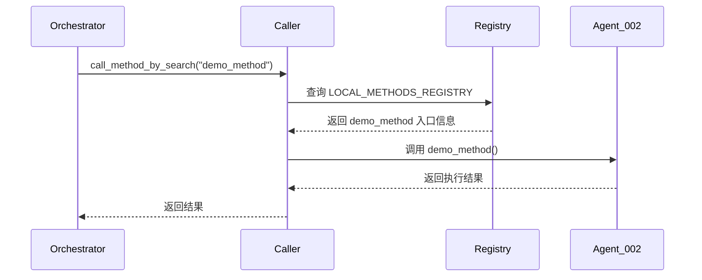
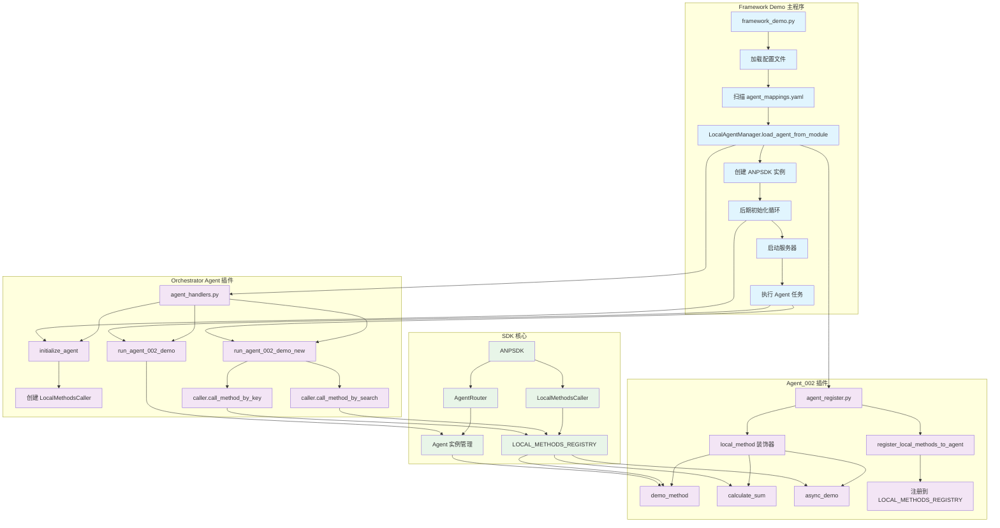
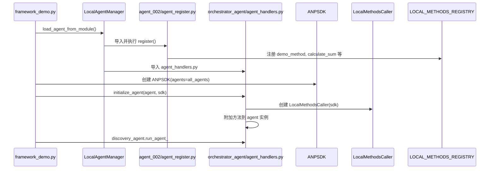

# LocalMethod 调用机制完整逻辑文档

## 概述

本文档详细描述了从 **orchestrator_agent** 的 `run_agent_002_demo` 和 `run_agent_002_demo_new` 方法开始，如何调用 **agent_002** 中注册的本地方法（LocalMethod）的完整逻辑流程。

## 1. Agent_002 中的 LocalMethod 注册机制

### 1.1 注册流程 (agent_register.py)

```python
# 使用装饰器注册本地方法
@local_method(description="演示方法，返回agent信息", tags=["demo", "info"])
def demo_method():
    return f"这是来自 {agent.name} 的演示方法"

@local_method(description="计算两个数的和", tags=["math", "calculator"])
def calculate_sum(a: float, b: float):
    return {"result": a + b, "operation": "add"}

@local_method(description="异步演示方法", tags=["demo", "async"])
async def async_demo():
    await asyncio.sleep(0.1)
    return "异步方法结果"

# 自动注册所有标记的本地方法
register_local_methods_to_agent(agent, locals())
```

### 1.2 注册机制详解

1. **装饰器标记**：`@local_method` 装饰器将方法信息存储到全局注册表 `LOCAL_METHODS_REGISTRY`
2. **方法元数据**：每个方法包含描述、标签等元数据
3. **批量注册**：`register_local_methods_to_agent(agent, locals())` 将所有标记的方法注册到指定 agent

## 2. Orchestrator Agent 中的调用机制

### 2.1 初始化阶段

```python
async def initialize_agent(agent, sdk_instance):
    global my_agent_instance, caller
    my_agent_instance = agent

    # 创建本地方法调用器
    caller = LocalMethodsCaller(sdk_instance)

    # 将调用方法附加到 agent 实例
    agent.run_agent_002_demo = run_agent_002_demo
    agent.run_agent_002_demo_new = run_agent_002_demo_new
```

**关键组件：**

- **LocalMethodsCaller**：负责跨 agent 的方法调用
- **sdk_instance**：提供 agent 管理和通信能力

### 2.2 调用方式对比

#### 方式一：直接调用 (`run_agent_002_demo`)

```python
async def run_agent_002_demo(sdk, **kwargs):
    try:
        # 通过 SDK 获取目标 agent 实例
        target_agent = sdk.get_agent("did:wba:localhost%3A9527:wba:user:5fea49e183c6c211")

        # 直接调用 agent 上的方法
        if hasattr(target_agent, 'demo_method') and callable(target_agent.demo_method):
            result = target_agent.demo_method()
            return result
    except Exception as e:
        return f"调用时出错: {e}"
```

**特点：**

- 直接通过 agent 实例调用
- 需要明确知道方法名
- 同步调用方式

#### 方式二：通过调用器调用 (`run_agent_002_demo_new`)

```python
async def run_agent_002_demo_new():
    try:
        # 方式1：通过关键词搜索调用
        result = await caller.call_method_by_search("demo_method")

        # 方式2：通过方法键直接调用
        result2 = await caller.call_method_by_key(
            "did:wba:localhost%3A9527:wba:user:5fea49e183c6c211::calculate_sum",
            10.5, 20.3
        )

        return result
    except Exception as e:
        return f"调用时出错: {e}"
```

**特点：**

- 使用 LocalMethodsCaller 进行调用
- 支持搜索和直接调用两种方式
- 异步调用方式
- 支持跨 agent 调用

## 3. 完整调用链路

### 3.1 调用流程图



### 3.2 关键技术点

1. **DID 标识**：每个 agent 通过唯一的 DID 进行标识
2. **方法键格式**：`{agent_did}::{method_name}`
3. **全局注册表**：`LOCAL_METHODS_REGISTRY` 存储所有注册的方法
4. **跨 agent 通信**：通过 SDK 实现不同 agent 间的方法调用

### 3.3 方法搜索机制

```python
# 通过关键词搜索
result = await caller.call_method_by_search("demo_method")

# 通过完整方法键调用
result = await caller.call_method_by_key(
    "did:wba:localhost%3A9527:wba:user:5fea49e183c6c211::calculate_sum",
    10.5, 20.3
)
```

## 4. 优势与特点

### 4.1 设计优势

1. **解耦合**：调用方不需要直接持有被调用 agent 的引用
2. **动态发现**：支持通过搜索发现可用方法
3. **统一接口**：提供统一的跨 agent 调用接口
4. **元数据支持**：方法包含丰富的描述和标签信息

### 4.2 使用场景

1. **服务编排**：orchestrator agent 可以调用多个专业 agent 的服务
2. **功能组合**：将不同 agent 的能力组合成复杂的业务逻辑
3. **动态调用**：根据需求动态发现和调用合适的方法

## 5. 总结

这套 LocalMethod 调用机制实现了一个完整的跨 agent 方法调用框架，通过装饰器注册、全局注册表管理、DID 标识和统一调用器，实现了灵活、可扩展的 agent 间协作能力。

---

## Agent 插件与 Framework Demo 调用关系图



## 详细调用时序图


