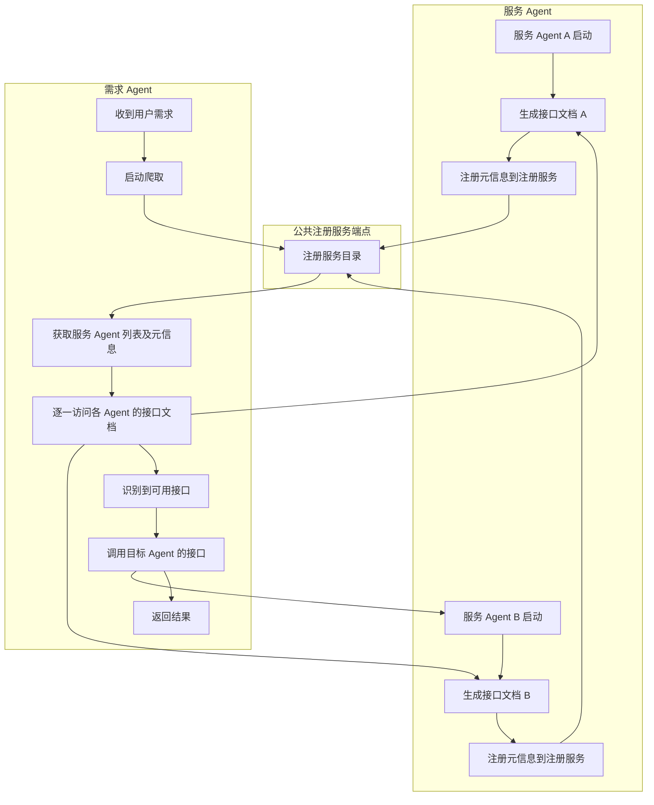
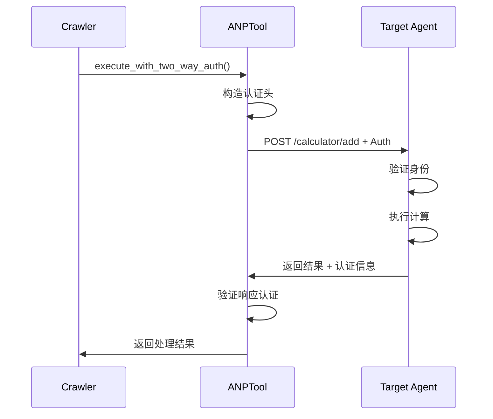

# ANP智能Agent网络完全自动化流程详解

## 概述

ANP (Agent Network Protocol) 智能Agent网络实现了从用户需求描述到API调用的完全自动化流程。该架构通过智能爬虫、标准化文档生成、双向认证等技术，实现了无需人工干预即可发现、理解和调用分布式agent网络中的服务。

## 完整自动化流程



## 1. Agent启动 → 自动生成接口文档

### 启动时自动化处理

```python
# framework_demo.py 中的启动流程
async def main():
    # 加载所有Agent
    prepared_agents_info = [LocalAgentManager.load_agent_from_module(f) for f in agent_files]
    all_agents = [info[0] for info in valid_agents_info]

    # 创建SDK实例
    sdk = ANPSDK(mode=SdkMode.MULTI_AGENT_ROUTER, agents=all_agents)

    # 关键：为每个Agent自动生成接口文档
    for agent in all_agents:
        await LocalAgentManager.generate_and_save_agent_interfaces(agent, sdk)
        # 生成文件：
        # - /data_user/localhost_9527/agents_config/agent_xxx/api_interface.yaml
        # - /data_user/localhost_9527/agents_config/agent_xxx/api_interface.json
```

### 自动生成的文档结构

#### OpenAPI YAML 文档

```yaml
openapi: 3.0.0
info:
  title: CalculatorAgent API
  version: 1.0.0
paths:
  /calculator/add:
    post:
      summary: 计算两个数相加
      requestBody:
        required: true
        content:
          application/json:
            schema:
              type: object
              properties:
                a:
                  type: string
                b:
                  type: string
      responses:
        '200':
          description: 返回结果
```

#### JSON-RPC 文档

```json
{
  "jsonrpc": "2.0",
  "info": {
    "title": "Calculator JSON-RPC Interface",
    "version": "0.1.0"
  },
  "methods": [{
    "name": "calculator.add",
    "summary": "计算两个数相加",
    "params": {
      "a": {"type": "Any"},
      "b": {"type": "Any"}
    },
    "meta": {
      "httpMethod": "POST",
      "endpoint": "/calculator/add"
    }
  }]
}
```

## 2. 用户请求 → 启动智能爬取

### 用户触发入口

```python
# framework_demo.py 中的调用
if discovery_agent:
    # 用户需求："我需要计算两个浮点数相加 2.88888+999933.4445556"
    result = await discovery_agent.run_ai_root_crawler_demo()
```

### 爬取任务初始化

```python
# orchestrator_agent/agent_handlers.py
async def run_ai_root_crawler_demo():
    target_did = "did:wba:localhost%3A9527:wba:user:28cddee0fade0258"
    crawler = ANPToolCrawler()

    task_description = "我需要计算两个浮点数相加 2.88888+999933.4445556"

    result = await crawler.run_crawler_demo(
        req_did=my_agent_instance.id,
        resp_did=target_did,
        task_input=task_description,
        initial_url="http://localhost:9527/publisher/agents",  # 根URL
        use_two_way_auth=True,
        task_type="root_query"
    )
```

## 3. 发现阶段 → 从根URL获取agent列表

### 智能发现流程

```python
# ANPToolCrawler._intelligent_crawler
async def _intelligent_crawler(self, ...):
    # 第一步：获取根URL内容
    initial_content = await anp_tool.execute_with_two_way_auth(
        url="http://localhost:9527/publisher/agents",  # 获取所有agent列表
        method='GET'
    )
```

### 根URL返回的Agent列表格式

```json
{
  "agents": [
    {
      "did": "did:wba:localhost%3A9527:wba:user:28cddee0fade0258",
      "name": "Calculator Agent",
      "description": "提供数学计算功能"
    },
    {
      "did": "did:wba:localhost%3A9527:wba:user:5fea49e183c6c211",
      "name": "Hello Agent",
      "description": "提供问候功能"
    }
  ]
}
```

### LLM分析agent列表

```python
# 系统提示模板指导LLM
prompt_template = """
你是一个智能搜索工具。从agent列表中选择合适的agent完成任务。

## 重要提示
1. 每个agent的did格式为 'did:wba:localhost%3A9527:wba:user:5fea49e183c6c211'
2. 从did格式可以获取agent的did文件地址：
   http://localhost:9527/wba/user/5fea49e183c6c211/did.json
3. 从did文件中，可以获得serviceEndpoint
4. 从ad.json，你可以获得这个代理的详细结构、功能和API使用方法
5. 你要优先理解api_interface.json这样的文件对api使用方式的描述

## 当前任务
{task_description}
"""
```

## 4. 文档获取 → 自动访问标准化文档

### DID文档获取

```python
# LLM通过工具调用自动执行
{
    "function": "anp_tool",
    "arguments": {
        "url": "http://localhost:9527/wba/user/28cddee0fade0258/did.json",
        "method": "GET"
    }
}
```

### DID文档格式

```json
{
  "@context": ["https://www.w3.org/ns/did/v1"],
  "id": "did:wba:localhost%3A9527:wba:user:28cddee0fade0258",
  "service": [{
    "id": "#agent-description",
    "type": "AgentDescription",
    "serviceEndpoint": "http://localhost:9527/wba/user/28cddee0fade0258/ad.json"
  }],
  "verificationMethod": [...]
}
```

### Agent描述文档获取

```python
# LLM自动提取serviceEndpoint并访问
{
    "function": "anp_tool",
    "arguments": {
        "url": "http://localhost:9527/wba/user/28cddee0fade0258/ad.json",
        "method": "GET"
    }
}
```

### Agent描述文档格式

```json
{
  "name": "Calculator Agent",
  "description": "提供基础数学计算功能",
  "version": "1.0.0",
  "capabilities": [
    "数学运算",
    "加减乘除",
    "浮点数计算"
  ],
  "interfaces": {
    "jsonrpc": "http://localhost:9527/wba/user/28cddee0fade0258/api_interface.json",
    "openapi": "http://localhost:9527/wba/user/28cddee0fade0258/api_interface.yaml"
  }
}
```

### 接口文档获取

```python
# LLM自动构造接口文档URL并访问
{
    "function": "anp_tool",
    "arguments": {
        "url": "http://localhost:9527/wba/user/28cddee0fade0258/api_interface.json",
        "method": "GET"
    }
}
```

## 5. 智能分析 → LLM理解API用法

### LLM分析过程

```
用户需求：计算两个浮点数相加 2.88888+999933.4445556

分析接口文档：
- 找到API：calculator.add
- 参数要求：a (Any类型), b (Any类型)
- 调用方式：POST /calculator/add
- 需要构造请求：{"a": 2.88888, "b": 999933.4445556}

决策：使用calculator.add接口完成计算任务
```

### 自动参数映射

```python
# LLM智能解析用户输入
user_input = "计算两个浮点数相加 2.88888+999933.4445556"

# ↓ LLM自动提取参数
extracted_numbers = [2.88888, 999933.4445556]

# ↓ 映射到API参数
api_params = {
    "a": 2.88888,
    "b": 999933.4445556
}
```

## 6. 自动调用 → 构造并执行API调用

### LLM自动构造API调用

```python
# LLM生成工具调用请求
{
    "function": "anp_tool",
    "arguments": {
        "url": "http://localhost:9527/wba/user/28cddee0fade0258/calculator/add",
        "method": "POST",
        "body": {
            "a": 2.88888,
            "b": 999933.4445556
        }
    }
}
```

### 双向认证执行

```python
# ANPTool内部执行流程
async def execute_with_two_way_auth(self, ...):
    # 1. 准备请求参数
    final_url = "http://localhost:9527/wba/user/28cddee0fade0258/calculator/add"
    request_data = {"a": 2.88888, "b": 999933.4445556}

    # 2. 调用双向认证
    status, response, info, is_auth_pass = await agent_auth_request(
        caller_agent=my_agent_instance.id,
        target_agent="did:wba:localhost%3A9527:wba:user:28cddee0fade0258",
        request_url=final_url,
        method="POST",
        json_data=request_data,
        use_two_way_auth=True
    )

    # 3. 处理响应
    return await self._process_two_way_response(response, final_url, status, info, is_auth_pass)
```

### API调用时序图



## 7. 结果返回 → 处理结果给用户

### API响应处理

```json
{
    "result": 1000002.3333556,
    "status": "success",
    "timestamp": "2024-01-15T10:30:00Z"
}
```

### LLM整理最终回复

```python
# LLM生成用户友好的回复
final_response = """
✅ 计算完成！

**计算结果：**
2.88888 + 999933.4445556 = 1,000,002.3333556

**执行过程：**
1. 🔍 自动发现了Calculator Agent智能体
2. 📋 获取了其完整的API接口文档
3. 🔧 智能解析了您的计算需求
4. 📡 调用了 /calculator/add 接口
5. ✨ 成功返回了精确的计算结果

**技术细节：**
- 使用双向认证确保安全通信
- 自动处理浮点数精度
- 完整的调用链追踪
"""
```

### 完整调用链追踪

```python
# 返回完整的处理信息
return {
    "content": final_response,
    "type": "text",
    "visited_urls": [
        "http://localhost:9527/publisher/agents",
        "http://localhost:9527/wba/user/28cddee0fade0258/did.json",
        "http://localhost:9527/wba/user/28cddee0fade0258/ad.json",
        "http://localhost:9527/wba/user/28cddee0fade0258/api_interface.json",
        "http://localhost:9527/wba/user/28cddee0fade0258/calculator/add"
    ],
    "crawled_documents": [
        {
            "url": "http://localhost:9527/publisher/agents",
            "method": "GET",
            "content": {"agents": [...]}
        },
        {
            "url": "http://localhost:9527/wba/user/28cddee0fade0258/did.json",
            "method": "GET",
            "content": {"@context": [...], "service": [...]}
        },
        # ... 其他访问的文档
    ],
    "task_type": "root_query",
    "execution_time": "2.34s",
    "auth_success": true
}
```

## 关键技术特性

### 1. 零配置发现

- **无需预配置**：不需要预先知道任何agent信息
- **动态发现**：从根URL开始自动发现整个agent网络
- **智能筛选**：根据任务需求自动选择合适的agent

### 2. 标准化协议

- **统一文档格式**：所有agent遵循相同的DID、AD、接口文档结构
- **标准化路径**：可预测的URL模式便于自动构造
- **版本兼容**：支持多种接口描述格式（OpenAPI、JSON-RPC）

### 3. 智能路径规划

- **LLM驱动**：使用大语言模型进行智能决策
- **自适应策略**：根据文档内容动态调整访问策略
- **错误恢复**：自动处理访问失败和重试机制

### 4. 双向认证安全

- **身份验证**：确保调用方和被调用方的身份真实性
- **数据完整性**：防止数据在传输过程中被篡改
- **访问控制**：基于DID的细粒度权限控制

### 5. 智能参数映射

- **自然语言理解**：从用户描述中提取结构化参数
- **类型推断**：自动推断参数类型和格式
- **验证机制**：确保参数符合API要求

## 架构优势

### 1. 完全自动化

```
用户输入 → 自动发现 → 智能分析 → 自动调用 → 结果返回
```

整个流程无需人工干预，真正实现"说出需求，自动完成"。

### 2. 高度可扩展

- **水平扩展**：支持任意数量的agent加入网络
- **功能扩展**：新agent自动被发现和集成
- **协议扩展**：支持新的接口描述格式

### 3. 强健性

- **容错机制**：单个agent失败不影响整体功能
- **降级策略**：在部分功能不可用时提供替代方案
- **监控追踪**：完整的调用链追踪便于问题诊断

### 4. 安全性

- **端到端加密**：所有通信都经过加密
- **身份验证**：基于密码学的身份验证机制
- **权限控制**：细粒度的访问权限管理

## 应用场景

### 1. 企业内部服务集成

```
"帮我查询张三的考勤记录并生成月度报告"
→ 自动发现HR系统 → 调用考勤API → 调用报告生成API
```

### 2. 跨系统数据处理

```
"从CRM获取客户数据，用AI分析后存入数据仓库"
→ 发现CRM Agent → 发现AI分析Agent → 发现数据仓库Agent
```

### 3. 智能运维自动化

```
"检查服务器状态，如有异常自动重启并发送通知"
→ 监控Agent → 重启Agent → 通知Agent
```

### 4. 科研计算协作

```
"用蒙特卡洛方法计算π值，精度到小数点后10位"
→ 发现数学计算Agent → 调用高精度计算API
```

## 总结

ANP智能Agent网络通过完全自动化的7步流程，实现了从用户自然语言需求到具体API调用的无缝转换。该架构结合了现代AI技术、标准化协议设计和安全认证机制，为构建大规模分布式智能服务网络提供了完整的解决方案。

这种"说出需求，自动完成"的能力，将极大地降低系统集成的复杂度，提高开发效率，并为未来的智能化服务生态奠定基础。
