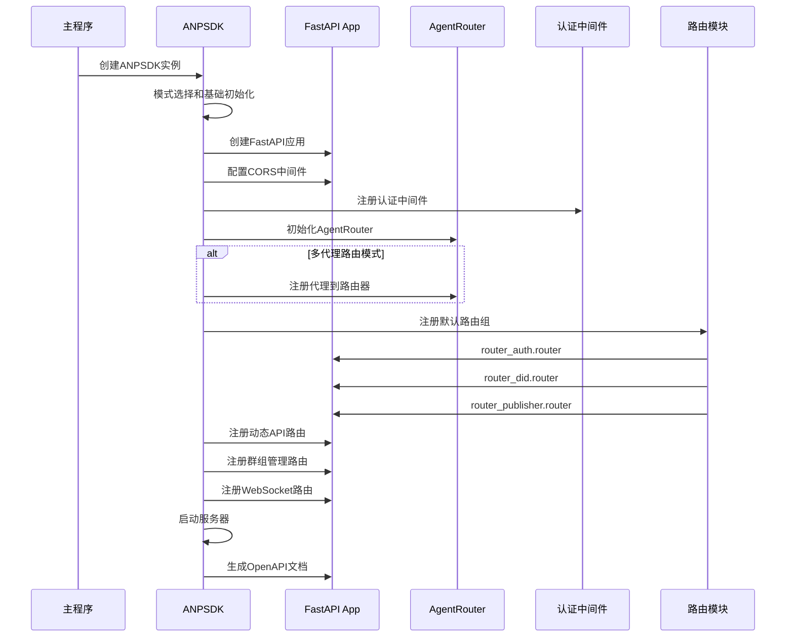
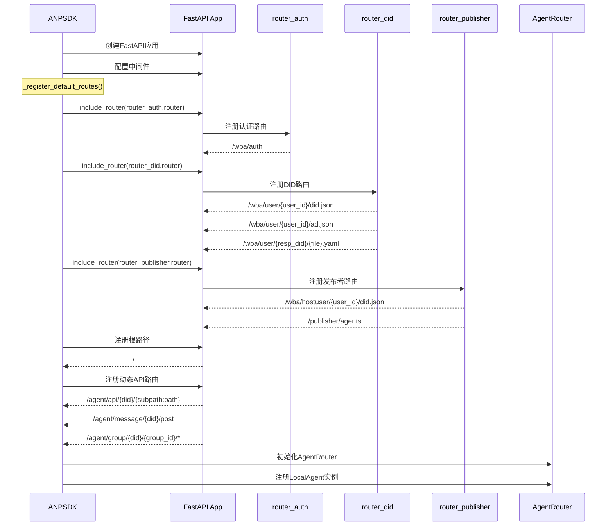
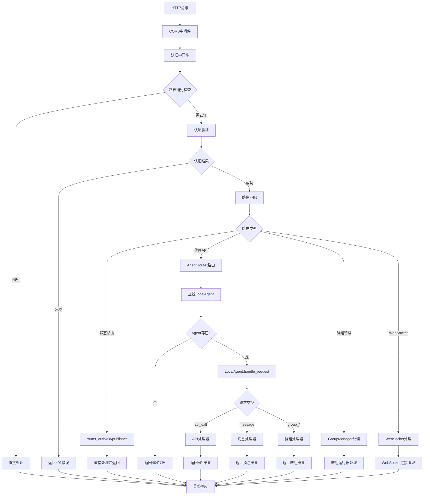

# ANPSDK启动、加载与路由系统完整分析

## 目录

- 1. ANPSDK启动流程
- 2. 路由系统架构
- 3. 五大路由类型详解
- 4. 路由加载机制
- 5. 请求处理流程
- 6. 运行模式与路由配置
- 7. 动态路由管理
- 8. 性能优化策略

## 1. ANPSDK启动流程

### 1.1 完整启动时序图



### 1.2 详细启动阶段

#### 阶段1：实例创建与模式配置

```python
class ANPSDK:
    def __init__(self, mode=SdkMode.MULTI_AGENT_ROUTER, agents=None, ws_host="0.0.0.0", ws_port=9527, **kwargs):
        if hasattr(self, 'initialized'):
            return

        # 1. 基础属性初始化
        self.mode = mode
        self.agents = agents or []
        self.port = ws_port
        self.server_running = False

        # 2. 路由相关组件
        self.api_routes = {}           # 动态API路由
        self.api_registry = {}         # API注册表
        self.message_handlers = {}     # 消息处理器

        # 3. 连接管理
        self.ws_connections = {}       # WebSocket连接
        self.sse_clients = set()       # SSE客户端

        # 4. 核心管理器
        self.group_manager = GroupManager(self)
        self.user_data_manager = LocalUserDataManager()
        self.router = AgentRouter()    # 代理路由器

        # 5. 配置加载
        config = get_global_config()
        self.debug_mode = config.anp_sdk.debug_mode
```

#### 阶段2：FastAPI应用配置

```python
# 根据调试模式创建不同配置的FastAPI应用
if self.debug_mode:
    self.app = FastAPI(
        title="ANP SDK Server in DebugMode",
        description="ANP SDK Server in DebugMode",
        version="0.1.0",
        reload=False,
        docs_url="/docs",      # 启用文档
        redoc_url="/redoc"
    )
else:
    self.app = FastAPI(
        title="ANP SDK Server",
        description="ANP SDK Server",
        version="0.1.0",
        reload=True,
        docs_url=None,         # 禁用文档
        redoc_url=None
    )

# 设置应用状态，供路由访问
self.app.state.sdk = self

# 配置CORS中间件
self.app.add_middleware(
    CORSMiddleware,
    allow_origins=["*"],
    allow_credentials=True,
    allow_methods=["*"],
    allow_headers=["*"],
)

# 配置认证中间件
@self.app.middleware("http")
async def auth_middleware_wrapper(request, call_next):
    return await auth_middleware(request, call_next)
```

#### 阶段3：模式特定初始化

```python
# 根据运行模式进行特定配置
if mode == SdkMode.MULTI_AGENT_ROUTER:
    # 多代理路由模式：注册所有代理并启用完整路由
    for agent in self.agents:
        self.register_agent(agent)
    self._register_default_routes()

elif mode == SdkMode.DID_REG_PUB_SERVER:
    # DID注册发布服务器模式：主要用于DID托管和发布
    self._register_default_routes()

elif mode == SdkMode.SDK_WS_PROXY_SERVER:
    # WebSocket代理服务器模式：支持WebSocket代理
    self._register_default_routes()
    self._register_ws_proxy_server(ws_host, ws_port)

# 启动时事件：生成OpenAPI文档
@self.app.on_event("startup")
async def generate_openapi_yaml():
    self.save_openapi_yaml()
```

## 2. 路由系统架构

### 2.1 路由层次结构图

```mermaid
graph TD
    A[ANPSDK FastAPI App] --> B[认证中间件层]
    B --> C[路由分发层]

    C --> D[静态路由组]
    C --> E[动态路由组]
    C --> F[代理路由组]

    D --> D1[router_auth<br/>认证相关路由]
    D --> D2[router_did<br/>DID文档路由]
    D --> D3[router_publisher<br/>发布者路由]
    D --> D4[系统路由<br/>根路径等]

    E --> E1[expose_api<br/>动态注册API]
    E --> E2[message_handlers<br/>消息处理器]
    E --> E3[群组管理路由<br/>运行时注册]

    F --> F1[AgentRouter<br/>代理路由器]
    F --> F2[/agent/api/*<br/>代理API路由]
    F --> F3[/agent/message/*<br/>代理消息路由]
    F --> F4[/agent/group/*<br/>代理群组路由]

    G[WebSocket路由] --> G1[/ws/agent<br/>代理WebSocket]
    G --> G2[/ws/message<br/>消息WebSocket]

    C --> G
```

### 2.2 路由优先级与匹配规则

```python
# 路由匹配优先级（FastAPI内部处理）
ROUTE_MATCHING_ORDER = [
    # 1. 精确路径匹配（最高优先级）
    "/",
    "/docs",
    "/redoc",
    "/openapi.json",
    "/wba/adapter_auth",

    # 2. 静态路由模块（按注册顺序）
    "router_auth.router",      # 认证路由
    "router_did.router",       # DID路由
    "router_publisher.router", # 发布者路由

    # 3. 参数化路由（按具体程度排序）
    "/wba/user/{user_id}/did.json",
    "/wba/user/{user_id}/ad.json",
    "/wba/user/{resp_did}/{yaml_file_name}.yaml",
    "/wba/hostuser/{user_id}/did.json",
    "/publisher/agents",

    # 4. 通配符路由（最低优先级）
    "/agent/api/{did}/{subpath:path}",
    "/agent/message/{did}/post",
    "/agent/group/{did}/{group_id}/join",
]

# 豁免认证的路径模式
EXEMPT_PATHS = [
    "/docs", "/anp-nlp/", "/ws/", "/publisher/agents", "/agent/group/*",
    "/redoc", "/openapi.json", "/wba/hostuser/*", "/wba/user/*", "/", "/favicon.ico",
    "/agents/example/ad.json"
]
```

## 3. 五大路由类型详解

### 3.1 认证路由 (router_auth)

```python
# anp_open_sdk/service/router/router_auth.py
router = APIRouter(tags=["authentication"])

@router.get("/wba/auth", summary="DID WBA authentication endpoint")
async def test_endpoint(request: Request) -> Dict:
    """WBA认证测试端点"""
    # 1. 获取请求参数
    req_did = request.query_params.get("req_did", "demo_caller")
    resp_did = request.query_params.get("resp_did", "demo_responser")

    # 2. 解析认证数据
    try:
        if req_did != "":  # token用户
            user = req_did
        else:  # DID用户
            auth_data = request.state.headers.get("authorization", "")
            if isinstance(auth_data, str) and " " in auth_data:
                auth_data = auth_data.split(" ", 1)[1]
                auth_dict = parse_auth_str_to_dict(auth_data)
                user = auth_dict.get("req_did")
    except Exception as e:
        logger.warning(f"解析认证数据时出错: {e}")
        user = None

    # 3. 返回认证结果
    return {
        "status": "success",
        "message": "Successfully authenticated",
        "RquestUser": user,
        "authenticated": True
    }

def parse_auth_str_to_dict(auth_str: str) -> dict:
    """解析认证字符串为字典"""
    result = {}
    try:
        for kv in auth_str.split(", "):
            if "=" in kv:
                k, v = kv.split("=", 1)
                result[k.strip()] = v.strip('"')
    except Exception as e:
        logger.warning(f"解析认证字符串为字典时出错: {e}")
    return result
```

### 3.2 DID文档路由 (router_did)

```python
# anp_open_sdk/service/router/router_did.py
router = APIRouter(tags=["did"])

@router.get("/wba/user/{user_id}/did.json", summary="Get DID document")
async def get_did_document(user_id: str, request: Request) -> Dict:
    """获取用户DID文档"""
    config = get_global_config()
    did_path = Path(config.anp_sdk.user_did_path)
    did_path = did_path.joinpath(f"user_{user_id}", "did_document.json")
    did_path = Path(UnifiedConfig.resolve_path(did_path.as_posix()))

    if not did_path.exists():
        raise HTTPException(status_code=404, detail=f"DID document not found for user {user_id}")

    try:
        with open(did_path, 'r', encoding='utf-8') as f:
            did_document = json.load(f)
        return did_document
    except Exception as e:
        logger.debug(f"Error loading DID document: {e}")
        raise HTTPException(status_code=500, detail="Error loading DID document")

@router.get("/wba/user/{user_id}/ad.json", summary="Get agent description")
async def get_agent_description(user_id: str, request: Request) -> Dict:
    """获取代理描述文档"""
    host = request.url.hostname
    port = request.url.port
    resp_did = url_did_format(user_id, request)

    # 1. 验证DID和代理
    success, did_doc, user_dir = get_user_dir_did_doc_by_did(resp_did)
    if not success:
        raise HTTPException(status_code=404, detail=f"Agent with DID {resp_did} not found")

    sdk = request.app.state.sdk
    agent = sdk.get_agent(resp_did)

    if agent.is_hosted_did:
        raise HTTPException(status_code=403, detail=f"{resp_did} is hosted did")

    # 2. 动态生成端点信息
    endpoints = {}
    for route in sdk.app.routes:
        if hasattr(route, "methods") and hasattr(route, "path"):
            path = route.path
            if not path.startswith("/agent/api/"):
                continue
            endpoint_name = path.replace("/agent/api/", "api_").replace("/", "_").strip("_")
            endpoints[endpoint_name] = {
                "path": path,
                "description": getattr(route, "summary", getattr(route, "name", "相关端点"))
            }

    # 3. 添加代理自定义API
    for path, _ in agent.api_routes.items():
        endpoint_name = path.replace('/', '_').strip('_')
        endpoints[endpoint_name] = {
            "path": f"/agent/api/{resp_did}{path}",
            "description": f"API 路径 {path} 的端点"
        }

    # 4. 构建代理描述
    result = {
        "@context": {
            "@vocab": "https://schema.org/",
            "did": "https://w3id.org/did#",
            "ad": "https://agent-network-protocol.com/ad#"
        },
        "@type": "ad:AgentDescription",
        "name": f"ANP Agent {agent.name}",
        "owner": {
            "name": f"{agent.name}的开发者",
            "@id": agent.id
        },
        "description": "ANP Agent",
        "version": "0.1.0",
        "ad:interfaces": []
    }

    # 5. 添加接口定义
    for name, data in endpoints.items():
        if data.get("path", "").startswith("/agent/api/"):
            result["ad:interfaces"].append({
                "@type": "ad:StructuredInterface",
                "protocol": "HTTP",
                "name": name,
                "url": data.get("path"),
                "description": data.get("description")
            })

    return result

def url_did_format(user_id, request):
    """URL中的用户ID格式化为DID"""
    host = request.url.hostname
    port = request.url.port
    user_id = urllib.parse.unquote(user_id)

    if user_id.startswith("did:wba"):
        # 处理已经是DID格式的情况
        if "%3A" not in user_id:
            parts = user_id.split(":")
            if len(parts) > 4 and parts[3].isdigit():
                resp_did = ":".join(parts[:3]) + "%3A" + ":".join(parts[3:])
        else:
            resp_did = user_id
    elif len(user_id) == 16:  # unique_id
        if port == 80 or port == 443:
            resp_did = f"did:wba:{host}:wba:user:{user_id}"
        else:
            resp_did = f"did:wba:{host}%3A{port}:wba:user:{user_id}"
    else:
        resp_did = "not_did_wba"

    return resp_did
```

### 3.3 发布者路由 (router_publisher)

```python
# anp_open_sdk/service/router/router_publisher.py
router = APIRouter(tags=["publisher"])

@router.get("/wba/hostuser/{user_id}/did.json", summary="Get Hosted DID document")
async def get_hosted_did_document(user_id: str) -> Dict:
    """获取托管DID文档"""
    config = get_global_config()
    did_path = Path(config.anp_sdk.user_hosted_path)
    did_path = did_path.joinpath(f"user_{user_id}", "did_document.json")
    did_path = Path(UnifiedConfig.resolve_path(did_path.as_posix()))

    if not did_path.exists():
        raise HTTPException(status_code=404, detail=f"Hosted DID document not found for user {user_id}")

    try:
        with open(did_path, 'r', encoding='utf-8') as f:
            did_document = json.load(f)
        return did_document
    except Exception as e:
        logger.debug(f"Error loading hosted DID document: {e}")
        raise HTTPException(status_code=500, detail="Error loading hosted DID document")

@router.get("/publisher/agents", summary="Get published agent list")
async def get_agent_publishers(request: Request) -> Dict:
    """获取已发布的代理列表"""
    try:
        # 通过request.app.state获取SDK实例
        sdk = request.app.state.sdk

        # 从SDK实例中获取所有已注册的代理
        all_agents = sdk.get_agents()

        public_agents = []
        for agent in all_agents:
            public_agents.append({
                "did": getattr(agent, "id", "unknown"),
                "name": getattr(agent, "name", "unknown")
            })

        return {
            "agents": public_agents,
            "count": len(public_agents)
        }
    except Exception as e:
        logger.error(f"Error getting agent list from SDK instance: {e}")
        raise HTTPException(status_code=500, detail="Error getting agent list from SDK instance")
```

### 3.4 代理路由 (AgentRouter)

```python
# anp_open_sdk/service/router/router_agent.py
class AgentRouter:
    """智能体路由器，负责管理多个本地智能体并路由请求"""

    def __init__(self):
        self.local_agents = {}  # did -> LocalAgent实例
        self.logger = logger

    def register_agent(self, agent):
        """注册一个本地智能体"""
        self.local_agents[str(agent.id)] = agent
        self.logger.debug(f"已注册智能体到多智能体路由: {agent.id}")
        return agent

    def get_agent(self, did: str):
        """获取指定DID的本地智能体"""
        return self.local_agents.get(str(did))

    async def route_request(self, req_did: str, resp_did: str, request_data: Dict, request: Request) -> Any:
        """路由请求到对应的本地智能体"""
        resp_did = url_did_format(resp_did, request)

        if resp_did in self.local_agents:
            if hasattr(self.local_agents[resp_did].handle_request, "__call__"):
                resp_agent = self.local_agents[resp_did]
                # 将agent实例挂载到request.state方便在处理中引用
                request.state.agent = resp_agent
                logger.info(f"成功路由到{resp_agent.id}的处理函数, 请求数据为{request_data}")
                return await self.local_agents[resp_did].handle_request(req_did, request_data, request)
            else:
                self.logger.error(f"{resp_did} 的 `handle_request` 不是一个可调用对象")
                raise TypeError(f"{resp_did} 的 `handle_request` 不是一个可调用对象")
        else:
            self.logger.error(f"智能体路由器未找到本地智能体注册的调用方法: {resp_did}")
            raise ValueError(f"未找到本地智能体: {resp_did}")

# 业务处理器包装器
def wrap_business_handler(business_func):
    """将业务函数包装为API处理器"""
    sig = inspect.signature(business_func)
    param_names = list(sig.parameters.keys())

    @functools.wraps(business_func)
    async def api_handler(request_data, request):
        import json
        try:
            kwargs = {k: request_data.get(k) for k in param_names if k in request_data}
            if "params" in request_data:
                params = request_data["params"]
                if isinstance(params, str):
                    params = json.loads(params)
                for k in param_names:
                    if k in params:
                        kwargs[k] = params[k]

            kwargs_str = json.dumps(kwargs, ensure_ascii=False)
            logger.info(f"api封装器发送参数 {kwargs_str}到{business_func.__name__}")

            if 'request' in sig.parameters:
                return await business_func(request, **kwargs)
            else:
                return await business_func(**kwargs)
        except Exception as e:
            logger.error(f"wrap error {e}")
            return f"wrap error {e}"

    return api_handler
```

### 3.5 动态API路由

```python
# 在ANPSDK中注册的动态API路由
@self.app.get("/agent/api/{did}/{subpath:path}")
async def api_entry_get(did: str, subpath: str, request: Request):
    """代理API GET请求入口"""
    data = dict(request.query_params)
    req_did = request.query_params.get("req_did", "demo_caller")
    resp_did = did
    data["type"] = "api_call"
    data["path"] = f"/{subpath}"
    result = self.router.route_request(req_did, resp_did, data, request)
    if asyncio.iscoroutine(result):
        result = await result
    return result

@self.app.post("/agent/api/{did}/{subpath:path}")
async def api_entry_post(did: str, subpath: str, request: Request):
    """代理API POST请求入口"""
    try:
        data = await request.json()
        if not data:
            data = {}
    except Exception:
        data = {}
    req_did = request.query_params.get("req_did", "demo_caller")
    resp_did = did
    data["type"] = "api_call"
    data["path"] = f"/{subpath}"
    result = await self.router.route_request(req_did, resp_did, data, request)
    if asyncio.iscoroutine(result):
        result = await result
    return result

@self.app.post("/agent/message/{did}/post")
async def message_entry_post(did: str, request: Request):
    """代理消息POST请求入口"""
    data = await request.json()
    req_did = request.query_params.get("req_did", "demo_caller")
    resp_did = did
    data["type"] = "message"
    result = await self.router.route_request(req_did, resp_did, data, request)
    if asyncio.iscoroutine(result):
        result = await result
    return result
```

## 4. 路由加载机制

### 4.1 路由加载时序



### 4.2 路由注册详细流程

```python
def _register_default_routes(self):
    """注册默认路由组"""
    # 1. 静态路由模块注册
    self.app.include_router(router_auth.router)
    self.app.include_router(router_did.router)
    self.app.include_router(router_publisher.router)

    # 2. 系统根路径
    @self.app.get("/", tags=["status"])
    async def root():
        return {
            "status": "running",
            "service": "ANP SDK Server",
            "version": "0.1.0",
            "mode": "Server and client",
            "documentation": "/docs"
        }

    # 3. 代理API路由（支持GET和POST）
    @self.app.get("/agent/api/{did}/{subpath:path}")
    async def api_entry_get(did: str, subpath: str, request: Request):
        # API GET请求处理逻辑
        pass

    @self.app.post("/agent/api/{did}/{subpath:path}")
    async def api_entry_post(did: str, subpath: str, request: Request):
        # API POST请求处理逻辑
        pass

    # 4. 代理消息路由
    @self.app.post("/agent/message/{did}/post")
    async def message_entry_post(did: str, request: Request):
        # 消息处理逻辑
        pass

    # 5. 群组管理路由
    self.group_queues = {}
    self.group_members = {}

    @self.app.post("/agent/group/{did}/{group_id}/join")
    async def join_group(did: str, group_id: str, request: Request):
        # 群组加入逻辑
        pass

    @self.app.post("/agent/group/{did}/{group_id}/leave")
    async def leave_group(did: str, group_id: str, request: Request):
        # 群组离开逻辑
        pass

    @self.app.post("/agent/group/{did}/{group_id}/message")
    async def group_message(did: str, group_id: str, request: Request):
        # 群组消息逻辑
        pass

    @self.app.get("/agent/group/{did}/{group_id}/connect")
    async def group_connect(did: str, group_id: str, request: Request):
        # SSE连接逻辑
        pass

    # 6. WebSocket路由
    @self.app.post("/api/message")
    async def receive_message(request: Request):
        # 消息接收逻辑
        pass

    @self.app.websocket("/ws/message")
    async def websocket_endpoint(websocket: WebSocket):
        # WebSocket消息处理
        pass
```

## 5. 请求处理流程

### 5.1 完整请求处理流程图



### 5.2 认证中间件处理流程

```python
async def auth_middleware(request: Request, call_next: Callable, auth_method: str = "wba"):
    try:
        # 1. 创建认证服务器
        auth_server = AgentAuthServer(create_authenticator(auth_method))

        # 2. 执行认证检查
        response_auth = await authenticate_request(request, auth_server)

        # 3. 保存请求头到状态
        headers = dict(request.headers)
        request.state.headers = headers

        # 4. 处理请求
        if response_auth is not None:
            response = await call_next(request)
            # 5. 添加认证响应头
            response.headers['authorization'] = json.dumps(response_auth) if response_auth else ""
            return response
        else:
            return await call_next(request)

    except HTTPException as exc:
        logger.debug(f"Authentication error: {exc.detail}")
        return JSONResponse(
            status_code=exc.status_code,
            content={"detail": exc.detail}
        )
    except Exception as e:
        logger.debug(f"Unexpected error in adapter_auth middleware: {e}")
        return JSONResponse(
            status_code=500,
            content={"detail": "Internal server error"}
        )

async def authenticate_request(request: Request, auth_server: AgentAuthServer):
    """认证请求处理"""
    # 1. 特殊路径处理
    if request.url.path == "/wba/adapter_auth":
        logger.debug(f"安全中间件拦截/wba/auth进行认证")
        success, msg = await auth_server.verify_request(request)
        if not success:
            raise HTTPException(status_code=401, detail=f"认证失败: {msg}")
        return msg

    # 2. 豁免路径检查
    for exempt_path in EXEMPT_PATHS:
        if exempt_path == "/" and request.url.path == "/":
            return None
        elif request.url.path == exempt_path or (exempt_path != '/' and exempt_path.endswith('/') and request.url.path.startswith(exempt_path)):
            return None
        elif is_exempt(request.url.path):
            return None

    # 3. 执行认证
    logger.debug(f"安全中间件拦截检查url:\n{request.url}")
    success, msg = await auth_server.verify_request(request)
    if not success:
        raise HTTPException(status_code=401, detail=f"认证失败: {msg}")
    return msg
```

### 5.3 代理路由处理流程

```python
async def route_request(self, req_did: str, resp_did: str, request_data: Dict, request: Request) -> Any:
    """代理路由请求处理"""
    # 1. 格式化响应DID
    resp_did = url_did_format(resp_did, request)

    # 2. 查找本地代理
    if resp_did in self.local_agents:
        if hasattr(self.local_agents[resp_did].handle_request, "__call__"):
            resp_agent = self.local_agents[resp_did]
            # 3. 将agent实例挂载到request.state方便在处理中引用
            request.state.agent = resp_agent
            logger.info(f"成功路由到{resp_agent.id}的处理函数, 请求数据为{request_data}")
            # 4. 调用代理处理请求
            return await self.local_agents[resp_did].handle_request(req_did, request_data, request)
        else:
            self.logger.error(f"{resp_did} 的 `handle_request` 不是一个可调用对象")
            raise TypeError(f"{resp_did} 的 `handle_request` 不是一个可调用对象")
    else:
        self.logger.error(f"智能体路由器未找到本地智能体注册的调用方法: {resp_did}")
        raise ValueError(f"未找到本地智能体: {resp_did}")
```

## 6. 运行模式与路由配置

### 6.1 多代理路由模式 (MULTI_AGENT_ROUTER)

```python
if mode == SdkMode.MULTI_AGENT_ROUTER:
    # 1. 注册所有代理到路由器
    for agent in self.agents:
        self.register_agent(agent)

    # 2. 注册完整路由集
    self._register_default_routes()

# 启用的路由：
ENABLED_ROUTES = [
    # 认证路由
    "/wba/adapter_auth",

    # DID文档路由
    "/wba/user/{user_id}/did.json",
    "/wba/user/{user_id}/ad.json",
    "/wba/user/{resp_did}/{file}.yaml",
    "/wba/user/{resp_did}/{file}.json",

    # 发布者路由
    "/wba/hostuser/{user_id}/did.json",
    "/publisher/agents",

    # 代理路由
    "/agent/api/{did}/{subpath:path}",
    "/agent/message/{did}/post",
    "/agent/group/{did}/{group_id}/*",

    # 系统路由
    "/",
    "/docs",
    "/redoc",
    "/openapi.json",

    # WebSocket路由
    "/ws/message",
    "/api/message"
]
```

### 6.2 DID注册发布服务器模式 (DID_REG_PUB_SERVER)

```python
if mode == SdkMode.DID_REG_PUB_SERVER:
    # 只注册默认路由，专注于DID服务
    self._register_default_routes()

# 主要功能路由：
PRIMARY_ROUTES = [
    # DID托管服务
    "/wba/hostuser/{user_id}/did.json",

    # 代理发布服务
    "/publisher/agents",

    # DID文档服务
    "/wba/user/{user_id}/did.json",
    "/wba/user/{user_id}/ad.json",

    # 认证服务
    "/wba/adapter_auth"
]
```

### 6.3 WebSocket代理服务器模式 (SDK_WS_PROXY_SERVER)

```python
if mode == SdkMode.SDK_WS_PROXY_SERVER:
    # 1. 注册默认路由
    self._register_default_routes()

    # 2. 注册WebSocket代理路由
    self._register_ws_proxy_server(ws_host, ws_port)

def _register_ws_proxy_server(self, ws_host, ws_port):
    """注册WebSocket代理服务器路由"""
    self.ws_clients = {}

    @self.app.websocket("/ws/agent")
    async def ws_agent_endpoint(websocket: WebSocket):
        """代理WebSocket端点"""
        await websocket.accept()
        client_id = id(websocket)
        self.ws_clients[client_id] = websocket
        try:
            while True:
                msg = await websocket.receive_text()
                data = json.loads(msg)
                # 处理代理注册、DID发布、API代理等
        except Exception as e:
            self.logger.error(f"WebSocket客户端断开: {e}")
        finally:
            self.ws_clients.pop(client_id, None)

# WebSocket路由：
WEBSOCKET_ROUTES = [
    "/ws/agent",      # 代理WebSocket连接
    "/ws/message",    # 消息WebSocket连接
]
```

## 7. 动态路由管理

### 7.1 API动态注册机制

```python
def expose_api(self, route_path: str, methods: List[str] = None):
    """动态注册API路由"""
    if methods is None:
        methods = ["GET"]

    def decorator(func):
        # 1. 存储到路由表
        self.api_routes[route_path] = {'func': func, 'methods': methods}

        # 2. 如果服务器已运行，立即添加路由
        if self.server_running:
            self.app.add_api_route(f"/{route_path}", func, methods=methods)
        return func
    return decorator

# 使用示例
@sdk.expose_api("custom/data", ["GET", "POST"])
async def get_custom_data():
    return {"data": "custom response"}
```

### 7.2 代理API注册

```python
class LocalAgent:
    def expose_api(self, path: str, func: Callable = None, methods=None):
        """代理API注册到全局注册表"""
        methods = methods or ["GET", "POST"]
        if func is None:
            def decorator(f):
                # 1. 注册到代理本地路由表
                self.api_routes[path] = f

                # 2. 注册到全局API注册表
                api_info = {
                    "path": f"/agent/api/{self.id}{path}",
                    "methods": methods,
                    "summary": f.__doc__ or f"{self.name}的{path}接口",
                    "agent_id": self.id,
                    "agent_name": self.name
                }

                # 3. 添加到ANPSDK的API注册表
                from anp_open_sdk.anp_sdk import ANPSDK
                if hasattr(ANPSDK, 'instance') and ANPSDK.instance:
                    if self.id not in ANPSDK.instance.api_registry:
                        ANPSDK.instance.api_registry[self.id] = []
                    ANPSDK.instance.api_registry[self.id].append(api_info)
                    logger.debug(f"注册 API: {api_info}")
                return f
            return decorator

# 使用示例
@agent.expose_api("/data", ["GET"])
async def get_agent_data(request_data, request):
    return {"agent_data": "response"}
```

### 7.3 群组运行器注册

```python
def register_group_runner(self, group_id: str, runner_class: type[GroupRunner], url_pattern: Optional[str] = None):
    """注册群组运行器"""
    self.group_manager.register_runner(group_id, runner_class, url_pattern)

def unregister_group_runner(self, group_id: str):
    """注销群组运行器"""
    self.group_manager.unregister_runner(group_id)

# 群组路由处理
@self.app.post("/agent/group/{did}/{group_id}/join")
async def join_group(did: str, group_id: str, request: Request):
    data = await request.json()
    req_did = request.query_params.get("req_did", "demo_caller")

    # 1. 查找群组运行器
    runner = self.group_manager.get_runner(group_id)
    if runner:
        # 2. 使用群组运行器处理
        agent = Agent(
            id=req_did,
            name=data.get("name", req_did),
            port=data.get("port", 0),
            metadata=data.get("metadata", {})
        )
        allowed = await runner.on_agent_join(agent)
        if allowed:
            runner.agents[req_did] = agent
            return {"status": "success", "message": "Joined group", "group_id": group_id}
        else:
            return {"status": "error", "message": "Join request rejected"}

    # 3. 回退到代理路由器
    resp_did = did
    data["type"] = "group_join"
    data["group_id"] = group_id
    data["req_did"] = req_did
    result = await self.router.route_request(req_did, resp_did, data, request)
    if asyncio.iscoroutine(result):
        result = await result
    return result
```

## 8. 性能优化策略

### 8.1 路由缓存优化

```python
# 1. 代理路由器缓存
class AgentRouter:
    def __init__(self):
        self.local_agents = {}  # DID -> LocalAgent缓存
        self._route_cache = {}  # 路由缓存

    def get_agent(self, did: str):
        """带缓存的代理获取"""
        return self.local_agents.get(str(did))

# 2. API注册表缓存
class ANPSDK:
    def __init__(self):
        self.api_registry = {}  # 全局API注册表缓存
        self._compiled_routes = None  # 编译后的路由缓存
```

### 8.2 启动时优化

```python
@self.app.on_event("startup")
async def generate_openapi_yaml():
    """启动时生成OpenAPI文档"""
    self.save_openapi_yaml()

def start_server(self):
    """优化的服务器启动"""
    if self.server_running:
        self.logger.warning("服务器已经在运行")
        return True

    # 1. 批量添加动态路由
    for route_path, route_info in self.api_routes.items():
        func = route_info['func']
        methods = route_info['methods']
        self.app.add_api_route(f"/{route_path}", func, methods=methods)

    # 2. 异步启动服务器
    import uvicorn
    import threading

    config = get_global_config()
    port = config.anp_sdk.port
    host = config.anp_sdk.host

    if not self.debug_mode:
        config = uvicorn.Config(self.app, host=host, port=port)
        server = uvicorn.Server(config)
        self.uvicorn_server = server

        def run_server():
            import asyncio
            loop = asyncio.new_event_loop()
            asyncio.set_event_loop(loop)
            loop.run_until_complete(server.serve())

        server_thread = threading.Thread(target=run_server)
        server_thread.daemon = True
        server_thread.start()
        self.server_running = True
        return server_thread
    else:
        uvicorn.run(self.app, host=host, port=port)
        self.server_running = True
    return True
```

### 8.3 内存优化

```python
# 1. 连接池管理
def __init__(self):
    self.ws_connections = {}  # WebSocket连接池
    self.sse_clients = set()  # SSE客户端集合
    self._connection_limit = 1000  # 连接数限制

# 2. 资源清理
def stop_server(self):
    """优雅关闭服务器"""
    if not self.server_running:
        return True

    # 清理WebSocket连接
    for ws in self.ws_connections.values():
        asyncio.create_task(ws.close())
    self.ws_connections.clear()

    # 清理SSE客户端
    self.sse_clients.clear()

    # 关闭服务器
    if hasattr(self, 'uvicorn_server'):
        self.uvicorn_server.should_exit = True
        self.logger.debug("已发送服务器关闭信号")

    self.server_running = False
    self.logger.debug("服务器已停止")
    return True

def __del__(self):
    """确保资源清理"""
    try:
        if self.server_running:
            self.stop_server()
    except Exception as e:
        pass
```

## 总结

ANPSDK的路由系统具有以下特点：

### 优势

1. **模块化设计**：五大路由类型各司其职，职责清晰
2. **动态扩展**：支持运行时动态注册API和群组运行器
3. **多模式支持**：根据不同运行模式启用不同的路由集
4. **统一认证**：所有路由都通过统一的认证中间件
5. **高性能**：缓存机制和异步处理优化性能

### 核心特性

1. **分层路由架构**：静态路由 + 动态路由 + 代理路由
2. **智能路由匹配**：基于FastAPI的高效路由匹配
3. **灵活的认证机制**：支持路径豁免和多种认证方式
4. **完整的生命周期管理**：从启动到关闭的完整流程
5. **丰富的扩展接口**：支持自定义路由和处理器

这个路由系统为ANP SDK提供了强大、灵活、高效的HTTP服务基础设施，支持复杂的分布式代理网络应用场景。
