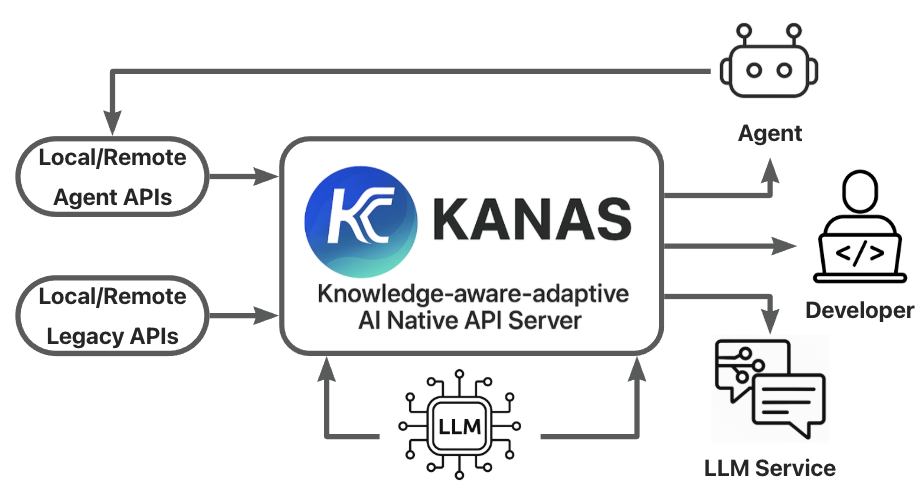

# KANAS: A Knowledge-aware-adaptive AI Native API Server

## 1. KANAS：AI 原生 API 调度端点

**KANAS (A Knowledge-aware-adaptive AI Native API Server)** 是一个为智能体（agents）、自治系统（autonomy）和 API 演进（API evolution）设计的、具备知识感知与自适应能力的 AI 原生 API 服务器。

它不仅仅是一个被动响应的服务器，而是一个面向智能体系统，用于发布、编排和智能转发传统 API 能力的服务节点。它作为 AI 原生系统与传统服务之间的核心接入点，让智能体能够以自治、语义化的方式调用现有 API，从而实现：

- **API 注册与能力声明**：像一个动态更新的注册表或开放目录，让智能体可以发现和理解可用的能力。
- **请求转发与智能调度**：支持基于上下文感知的意图路由，而不仅仅是静态的 URL 匹配。
- **任务编排与服务桥接**：支持 Agent 架构中复杂的多阶段协作任务。
- **暴露“思维接口”**：向 AI 暴露传统系统的“思维接口”，而不只是一个僵化的 HTTP 通道，让 AI 能够理解“能做什么”以及“如何做”。

作为一个基于 Anp Open SDK 构建的、面向未来的智能 API 服务器方案。它旨在将传统的 API 服务无缝升级为“AI原生”服务，使其能被大语言模型（LLM）和软件智能体（Agent）高效、稳定地调用，从而弥合当前 LLM 应用与存量 API 生态之间的鸿沟。

我们的核心目标是：

1. **服务当前价值：** 立即着手对现有 API 进行 AI 化改造，发布一个即支持 LLM 和传统代码混合调用“模码融合”，又支持AI对本地能力和远程能力统一“网地通联”，可以端到端自动化发布调用升级的“自维接口"，可以LLM动态注册事件响应的"智管事件"的AI原生API 平台，提升服务能力和开发者体验。
2. **面向未来准备：** 底层预置可以一键打开的ANP底层智能体通信协议，让每个 KANAS 节点都具备成为未来去中心化智能体网络（Agent Network）成员的潜力，为长远的技术演进铺平道路。

正如您所指出的，Agent 之间的协同，本质上是更高效、更稳定的 API 暴露与调用。ANAS 正是实现这一目标的核心基础设施。


*图 1：KANAS 核心概念视图。 KANAS 作为一个统一的 AI 原生 API 服务器，旨在将本地或远程的传统 API (Legacy APIs) 与智能体 API (Agent APIs) 进行整合、编排与智能转发，并以统一、可靠的方式暴露给大语言模型 (LLM)、软件智能体 (Agent) 和开发者 (Developer)。*

**本质上 anp_tool是和mcp_client同一系统层级的服务，但是可以通过anp_tool组装 crawler暴露给mcp_client或者作为一个 anp_tool能调用的本地服务来降低主llm的token消耗，也可以通过生成local method 来降低crawler的反复token浪费，通过anp_tool作为缓冲层，降低了mcp_tool都传送到llm的消耗，也免除了手动mcp选择问题。**

---

## 2. 核心技术基石：端到端容错调用机制

KANAS 方案的实现，完全建立在 `analysis_anp_tool_and_router_cooperation.md` 中所阐述的**端到端容错调用机制** 之上。这套机制是 KANAS “AI原生”能力的根基。

- **客户端 (`_handle_anp_tool_call`)**: 作为调用方的 `anp_tool`，它能“宽容”地理解 LLM 生成的、格式可能不尽完美的函数调用请求，并将其可靠地封装成一个标准的 HTTP 请求。
- **服务端 (`wrap_business_handler`)**: 作为 KANAS 服务器中的装饰器，它能“灵活”地将接收到的 HTTP 请求适配到具体的业务函数签名上，无论请求参数的结构如何。

这个组合完美解决了 LLM 输出的“不确定性”与程序代码所需的“确定性”之间的核心矛盾，是实现知识感知与自适应调度的基础。

- **API 对 AI 更友好**：开发者无需为 LLM 编写复杂的 Prompt 来强制其输出特定格式，ANAS 服务器天生就能理解多种格式的调用意图。
- **开发者体验更佳**：API 的开发者可以编写纯粹、简洁的 Python 函数，所有与 AI 调用相关的适配工作都由框架自动完成。

---

## 3. KANAS 节点服务器架构

每个 KANAS 实例都是一个独立的、可部署的节点，其内部架构分为以下几个层次：

1. **统一接入层 (FastAPI)**: 所有外部请求（来自 LLM、Agent 或传统客户端）的统一入口。
2. **多模式认证中间件**: KANAS 的“安全大门”，负责处理所有请求的认证和授权，支持开放、API Key 和 DID 三种模式。它将基于 `auth_server` 进行扩展，实现一个可插拔的、根据 API 声明进行决策的认证系统。
3. **智能调度与适配层**: KANAS 的核心引擎。它使用 `ANPSDK Router` 和 `wrap_business_handler` 装饰器，不仅完成请求的路由和参数适配，更是未来实现**上下文感知**和**意图路由**等高级调度策略的基础。
4. **API 实现与声明层**: 开发者在此处定义具体的业务逻辑。通过装饰器，每个 API 在定义时就声明了自己的能力、参数和认证模式，这使得 API 本身就具备了“自描述”的特性。

   - **资源 API (Resource API)**: 传统的 RESTful API，如 `GET /users/{id}`。这些 API 经过 `wrap_business_handler` 包装后，也能被 LLM 轻松调用。
   - **智能体 API (Agentic API)**: 面向自然语言和任务的 API，如 `POST /tasks/summarize`，其输入可以是一个完整的句子。这类 API 是“AI原生”的，天然适合 Agent 场景。
5. **API能力注册与发现层**: 所有在 KANAS 中定义的 API 都可以被自动发现，自动注册，并生成结构化的文档（如 OpenAPI Spec / JSON）。这让外部智能体可以动态查询和理解节点的能力。
6. **本地能力注册层：** KANAS也提供了声明为本地智能体API的发现注册机制，可以让本地智能体间快速调用内部功能，这一机制也可以应用在LLM调用侧，允许LLM基于对远程API的理解，自动编写测试发布基于代码的API调用，并发布为本地方法用于后续LLM或其他系统进行调用。

---

## 4. 统一认证方案设计

为了支持开放、API Key 和 DID 三种服务模式，KANAS 采用基于 API 声明的动态认证机制。

**实现思路：**

1. **API 认证声明**: 我们将引入一个装饰器，允许开发者在定义 API 时声明其所需的认证模式，例如：

   ```python
   from anp_open_sdk.router import api

   @api(auth_mode='public')
   async def get_public_info():
       ...

   @api(auth_mode='apikey')
   async def get_premium_data(api_key: str):
       ...

   @api(auth_mode='did')
   async def perform_secure_action(request: Request):
       # request.state.did_info 将包含认证后的DID信息
       ...
   ```
2. **改造认证中间件**: `authenticate_request` 的逻辑将修改如下：

   - 首先，根据请求的 `request.url.path` 匹配到对应的 API 函数。
   - 然后，读取该函数上通过 `@api` 装饰器声明的 `auth_mode`。
   - **分发认证逻辑**：
     - 如果 `auth_mode` 是 `public`，则直接放行，返回 `None`。
     - 如果 `auth_mode` 是 `apikey`，则从请求头提取 Key，并进行校验。失败则抛出 401 异常。
     - 如果 `auth_mode` 是 `did`，则执行现有的 `auth_server.verify_request(request)` 完整流程，进行 DID 签名验证。失败则抛出 401 异常。

通过这种方式，ANAS 服务器可以灵活地为不同的 API 端点配置不同的安全级别，实现了清晰、声明式的权限管理。

这种方式实现了清晰、灵活、声明式的权限管理，是构建可信智能体网络的基础。

---

## 5. 发展路线图：演进之路

我们将分三步走，逐步实现 KANAS 的完整愿景：

### **第一阶段：LLM 驱动的 API 能力增强与演进**

- **目标**: 快速实现价值，让 LLM 能够稳定、高效地调用 KANAS 服务器，并驱动 API 自身的演进。
- **实现**:

  1. **Server 端**: 开发者使用 Anp Open SDK 快速将现有 Python 函数封装成 KANAS API，并通过装饰器结合yaml声明其能力和认证模式。
  2. **Client 端 (LLM Agent)**: LLM Agent 使用 `anp_tool` 调用 KANAS API。

* **能力沉淀与 API 演进 (Self-maintaining API)**: 对于频繁调用的 API，LLM Agent 可以在交互后，**动态生成一个专用的、硬编码的 Python 函数（Local Method）**。这个过程不仅提升了后续调用的性能和稳定性，其本身就是一种 **API 演进** 的体现——系统通过观察调用模式，自动创建了更高效的接口形式。这完美实现了“LLM 通过 anp tool 调 server”和“生成代码做 local method”的闭环。这个函数直接使用 `httpx` 或 `requests` 库来调用目标 API。这样做的好处是：
  - **提升性能与并发**: 后续调用不再需要经过 LLM 借助 `anp_tool` 的解析思考，而是直接通过 `anp_tool` 调用本地方法，执行速度更快，稳定性更高。
  - **降低成本**: 减少了对 LLM 的消耗。

### **第二阶段：MCP 生态融合（Model Context Protocol）**

- **目标**: 本阶段旨在将现有的 anp_tool 服务封装为 mcp_tool，以便支持 MCP 协议的各类大模型和智能体（LLM/Agent）能够便捷地接入并调用 KANAS，从而推动 KANAS 与 MCP 客户端侧生态系统的深度融合与协同。
- **实现**:
  1. 实现MCP_server api的封装
  2. 将 anp_tool 升级/封装为 mcp_tool，LLM 通过 mcp_tool快速调用。
  3. KANAS 服务器作为端，负责解析和分发这些结构化协作请求到对应的 API 或 Agent。

### **第三阶段：实现完全体的 DID Agent Network**

- **目标**: 激活 ANAS 的全部潜力，构建一个去中心化、可信的智能体网络。
- **实现**:
  1. 全面启用在第一阶段就已构建的 DID 认证模式。
  2. Agent 在网络中通过其 DID 进行身份标识和发现。
  3. Agent 间的交互严格遵循 DID 认证，确保通信的安全和可信。
  4. 每个 ANAS 节点都成为网络中的一个对等节点，可以作为服务的提供者，也可以作为服务的消费者。

通过以上三个阶段，ANAS 将从一个强大的 AI API 服务器，逐步演进为未来去中心化智能体网络的核心基础设施，最终实现 Agent 之间高效、稳定、可信的协同工作。
