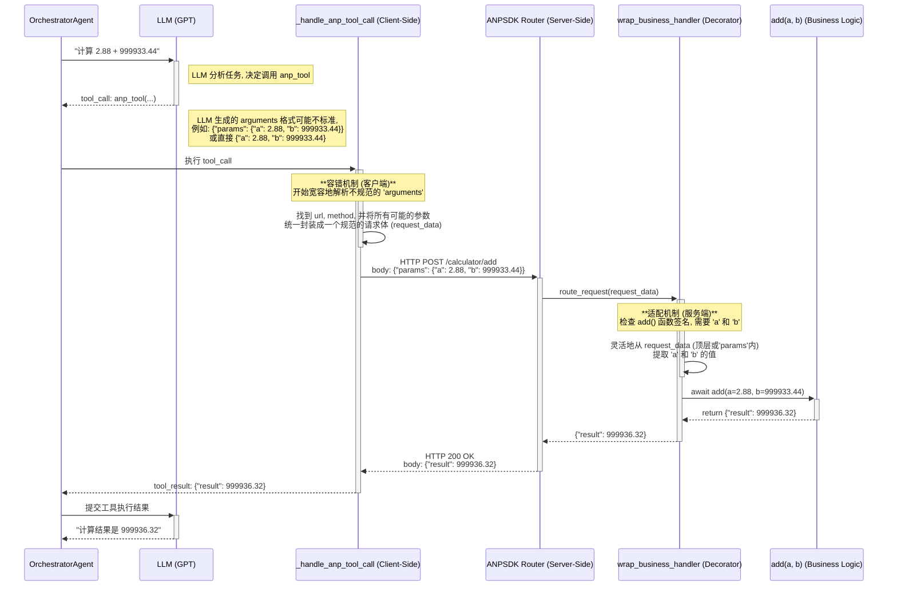

# 分析报告：`_handle_anp_tool_call` 与 `wrap_business_handler` 的协同机制

## 1. 核心思想

本文档旨在深入分析 `anp_tool.py` 中的 `_handle_anp_tool_call` 方法与 `router_agent.py` 中的 `wrap_business_handler` 装饰器之间的协同关系。

其设计的核心思想是：**通过在调用端和接收端建立一个端到端的、具有高度容错性的参数封装与解析机制，来隔离和解耦大语言模型（LLM）不稳定的函数调用输出格式与后端业务逻辑函数严格的签名之间的矛盾，从而显著降低因格式问题导致的函数调用失败率，提升整个多智能体系统的健壮性。**

---

## 2. 角色分工与实现

这个机制分为客户端（调用方）和服务端（被调用方）两部分，它们像一个灵活的“握手”协议的两端，共同协作。

### 2.1. 客户端: `_handle_anp_tool_call` —— 宽容的请求生成器

此函数位于智能体工具调用的最前端，直接处理来自 LLM 的 `tool_calls` 输出。我们知道，LLM 在生成函数调用的参数（一个 JSON 对象）时，其结构可能存在不一致性。`_handle_anp_tool_call` 的主要职责就是**最大程度地理解 LLM 的“意图”，并将其组装成一个尽可能规范的 HTTP 请求。**

它的“宽容”体现在以下几点：

1.  **兼容多种参数结构**:
    LLM 可能生成 `{"params": {"city": "北京"}}`，也可能生成 `{"parameters": {"params": {"city": "北京"}}}`，甚至是扁平化的 `{"city": "北京"}`。此函数通过多层检查来寻找真正的参数体：
    ```python
    # anp_open_sdk/service/interaction/anp_tool.py

    params = function_args.get("params", {})
    if not params and "parameters" in function_args and isinstance(function_args["parameters"], dict):
                parameters = function_args["parameters"]
                if "params" in parameters and isinstance(parameters["params"], dict):
                    params = parameters["params"]
                else:
                    # 如果parameters本身就是参数字典，直接作为params
                    params = parameters
    ```
    这种设计使得无论 LLM 输出哪种结构，系统都能正确提取出 `params`。

2.  **智能提取核心载荷**:
    在很多场景下，LLM 的核心输出是 `message`。该函数通过 `_find_message_in_args` 递归查找 `message` 字段，如果找到，就将其作为请求的 `body`。这避免了需要通过复杂的 Prompt 指示 LLM 必须将消息封装在 `body.message` 中。
    ```python
    # anp_open_sdk/service/interaction/anp_tool.py

    if len(body) == 0:
        message_value = self._find_message_in_args(function_args)
        if message_value is not None:
            body = {"message": message_value}
    ```

**小结**: 客户端的目标是“尽力而为”，它不强求 LLM 输出完美的格式，而是主动去适应多种可能性，确保能发出一个有效的请求。

### 2.2. 服务端: `wrap_business_handler` —— 灵活的参数适配器

当请求到达服务端，`wrap_business_handler` 装饰器开始工作。它被应用在具体的业务函数上，其核心职责是**将收到的、结构可能多样的 `request_data`（请求体），精准地映射到被包裹的业务函数所需的参数上。**

它的“灵活”体现在：

1.  **动态参数映射**:
    通过 Python 的 `inspect.signature`，装饰器能自动获知业务函数需要哪些参数（例如 `def get_weather(city: str, date: str):`）。

2.  **多路径参数解析**:
    它会尝试从两个地方寻找业务函数所需的参数：
    *   直接从请求体的顶层寻找 (`request_data.get(k)`)。
    *   从请求体的 `params` 字段里寻找 (`params[k]`)。

    ```python
    # anp_open_sdk/service/router/router_agent.py

    kwargs = {k: request_data.get(k) for k in param_names if k in request_data}
    if "params" in request_data:
        params = request_data["params"]
        # ...
        for k in param_names:
            if k in params:
                kwargs[k] = params[k]
    ```
    这种设计与客户端的“宽容”形成了完美互补。无论客户端是将参数扁平化放置，还是封装在 `params` 键中，服务端都能正确解析并传递给业务函数。

**小结**: 服务端的目标是“无缝对接”，它将解析请求的复杂性完全封装在装饰器内，使得业务函数的开发者只需关心业务逻辑本身，无需编写任何解析和校验 `request_data` 的模板代码。

---

## 3. 协同效应与价值

这种端到端的协同设计带来了巨大的价值：

1.  **极高的系统健壮性**: 这是最核心的优势。它使得 LLM 函数调用这一最容易出错的环节变得异常稳固。即使 LLM 的输出格式发生轻微抖动，整个调用链路也不会中断。

2.  **简化 Prompt Engineering**: 我们不再需要花费大量精力去设计和优化 Prompt，以强制 LLM 输出一个固定的、深层嵌套的 JSON 格式。这降低了开发和维护成本。

3.  **优雅的开发者体验**: 业务逻辑开发者可以编写非常干净、符合 Python 直觉的函数。他们完全被隔离在复杂的请求解析之外，所有“脏活累活”都由 `wrap_business_handler` 装饰器自动完成。

4.  **解耦与隔离**: 该机制成功地在“LLM 的不确定世界”和“代码的确定世界”之间建立了一道隔离墙。墙的一边是 `_handle_anp_tool_call`，负责处理不确定性；另一边是 `wrap_business_handler`，负责将不确定性转化为确定性。业务代码则安全地生活在确定性的一侧。

---

## 4. 展望与未来增强

尽管当前机制已经非常强大，但仍有进一步提升的空间：

1.  **增强类型转换**: 目前的适配器主要基于名称进行映射。未来可以基于业务函数的类型注解（Type Hinting）进行更智能的类型转换。例如，如果函数需要一个 `int`，而请求传来的是字符串 `"123"`，装饰器可以自动完成 `int("123")` 的转换。

2.  **自动化参数校验**: 可以在装饰器层面集成自动校验逻辑。例如，基于类型注解或特定的文档字符串（Docstring）格式，自动检查必填字段、数据范围、字符串格式等，并向调用方返回结构化的错误信息，方便上游的 LLM 理解失败原因并进行修正。

3.  **引入 API 版本控制**: 当业务函数发生不兼容的改动时（例如参数名变更），当前的机制可能会静默失败。未来可以在请求和装饰器中引入版本号，实现更平滑的 API 升级和废弃策略。

4.  **标准化与文档化**: 虽然灵活性是优点，但可以提供一个“推荐的”标准参数格式，并在 `LocalMethodsDocGenerator` 生成的文档中明确指出。当前的容错机制可以作为对非标准格式的兼容层，从而在保持健壮性的同时，提升系统的规范性。

## 5. 结论

`_handle_anp_tool_call` 和 `wrap_business_handler` 的组合，不仅仅是两个独立的函数，而是构成了一个经过深思熟虑的、端到端的通信解决方案。它精准地抓住了在 LLM 驱动的多智能体系统中函数调用环节的核心痛点，通过“宽容”与“灵活”的设计哲学，构建了一个既健壮又优雅的抽象层，是整个 ANP Open SDK 框架能够可靠、高效运行的关键基石之一。

---

## 6. 附录：端到端调用流程图 (Orchestrator -> Calculator)

为了更具体地展示该协同机制在实际调用中的工作流程，我们以来 `orchestrator_agent`（通过LLM）调用 `agent_caculator` 的 `add` 方法为例，绘制其端到端的交互流程。

### 流程图



### 流程说明

1.  **LLM 输出 (不确定性起点)**: `OrchestratorAgent` 将任务交给 LLM，LLM 理解后决定调用计算器工具。它生成的 `tool_call` 中的 `arguments` 字段格式可能不统一。
2.  **客户端容错 (`_handle_anp_tool_call`)**: 该函数接收到 LLM 的输出后，并不假设其格式。它会智能地查找 URL、方法和参数，将它们统一封装成一个结构化的 HTTP 请求。这是第一次解耦，将 LLM 的不确定性转化为一个标准的网络请求。
3.  **服务端路由 (`ANPSDK Router`)**: 请求到达服务端，路由器根据 URL (`/calculator/add`) 将请求转发给 `agent_caculator` 的处理函数。
4.  **服务端适配 (`wrap_business_handler`)**: 在调用最终的 `add(a, b)` 函数之前，装饰器介入。它通过反射检查到 `add` 函数需要 `a` 和 `b` 两个参数。然后，它会灵活地从请求体 `request_data` 中（无论是从顶层还是从 `params` 键中）提取这两个值。这是第二次解耦，将网络请求的通用结构适配到具体业务函数的严格签名上。
5.  **业务逻辑执行**: `add` 函数接收到被装饰器精准解析和传递的参数，执行核心计算逻辑，完全无需关心参数是如何从原始请求中解析出来的。

这个流程清晰地展示了该协同机制如何通过客户端的“宽容”和和服务端的“灵活”来吸收和化解不确定性，从而保证了从 LLM 意图到最终函数执行整个链路的稳定和高效。
