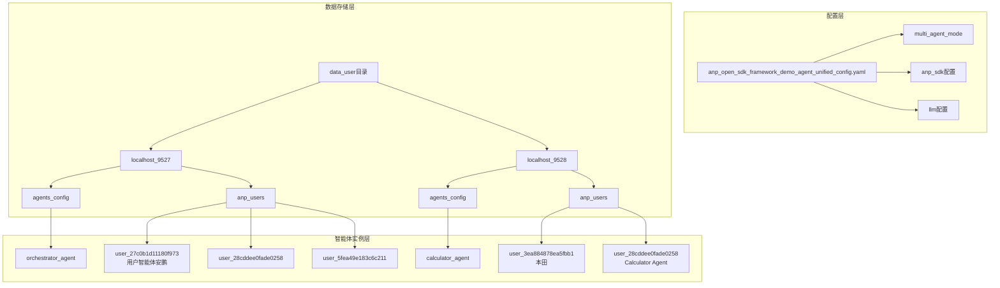
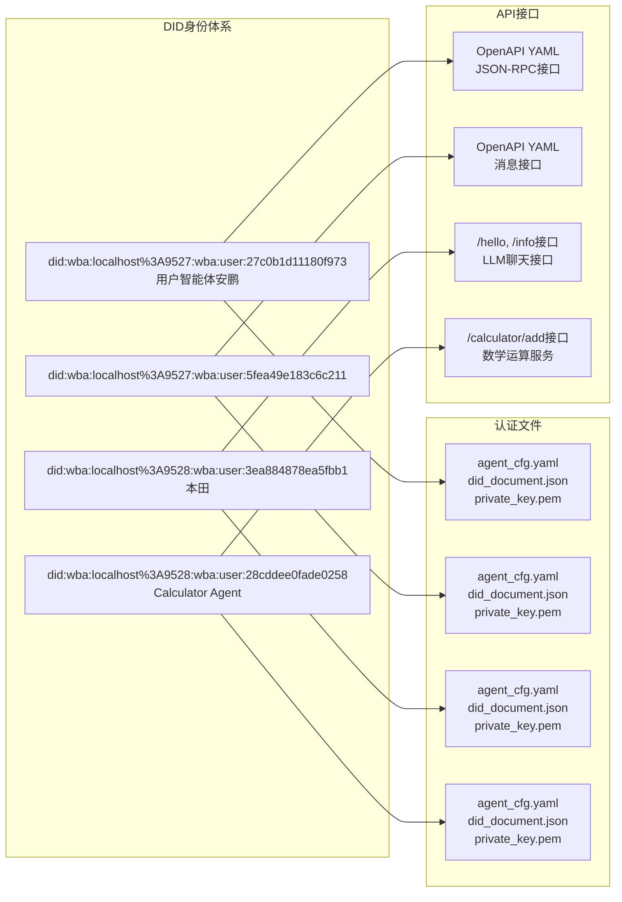
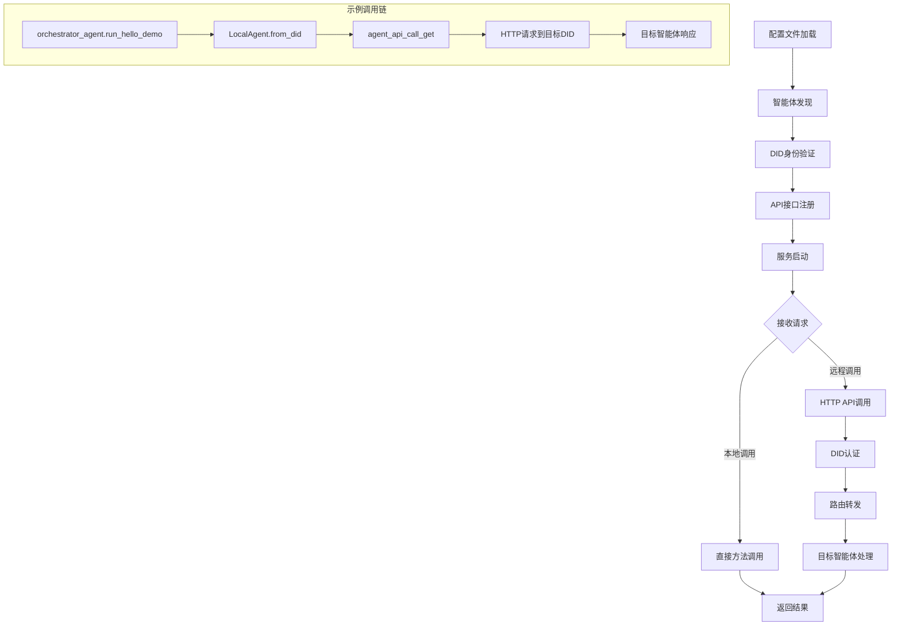

# ANP Open SDK 多智能体系统架构描述
## 系统概览
这是一个基于 ANP (Agent Network Protocol) 的分布式智能体网络系统，支持多个智能体在不同端口上运行并相互通信。

## 核心组件架构

## 智能体通信架构
```Mermaid

sequenceDiagram
    participant OA as Orchestrator Agent<br/>(localhost:9527)
    participant CA as Calculator Agent<br/>(localhost:9528)
    participant User as User Agent<br/>(5fea49e183c6c211)
    
    Note over OA,User: 跨端口智能体通信示例
    
    OA->>User: run_hello_demo()
    Note right of OA: target_did: did:wba:localhost%3A9527:wba:user:5fea49e183c6c211
    User-->>OA: {"message": "hello"}
    
    OA->>CA: agent_api_call_get()
    Note right of OA: 调用计算器服务 /calculator/add
    CA->>CA: 执行加法运算
    CA-->>OA: {"result": 5.79}
    
    Note over OA,CA: 基于DID的身份认证和API调用
```
## DID身份系统架构

## 配置文件结构分析
从 
anp_open_sdk_framework_demo_agent_unified_config.yaml
 可以看出：

### 核心配置项：

 - multi_agent_mode: 指向 data_user/localhost_9527/agents_config 作为智能体配置路径
 - anp_sdk: 配置主服务器运行在 localhost:9527
用户数据路径: 分别指向 9527 和 9528 端口的用户数据目录

### 关键特性：

 - 双端口支持: 系统同时支持 9527 和 9528 两个端口的智能体
 - DID身份管理: 每个智能体都有唯一的去中心化身份标识
 - API自动生成: 每个智能体都自动生成 OpenAPI 文档
 - 跨端口通信: 智能体可以跨不同端口进行通信和API调用

## 数据流向图

## 系统特点总结
 - 分布式架构: 支持多端口、多实例的智能体部署
 - 身份安全: 基于DID的去中心化身份认证
 - API标准化: 自动生成OpenAPI文档，支持标准化调用
 - 跨域通信: 智能体可以跨不同端口和主机进行通信
 - 配置驱动: 通过YAML配置文件管理整个系统
 - 插件化: 支持动态加载和注册新的智能体

这个架构展现了一个成熟的多智能体协作系统，具备了企业级应用所需的安全性、可扩展性和标准化特性。