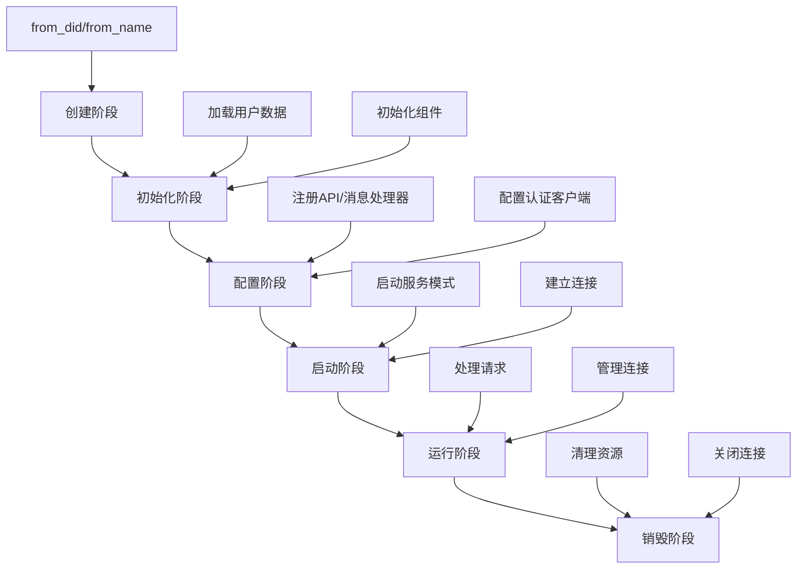
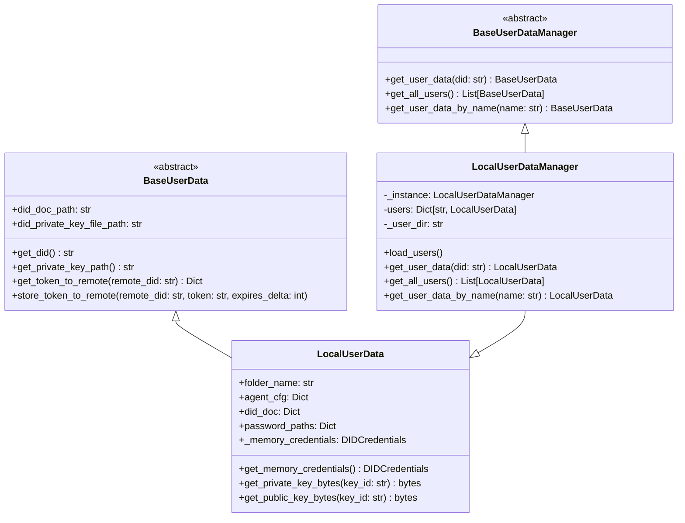
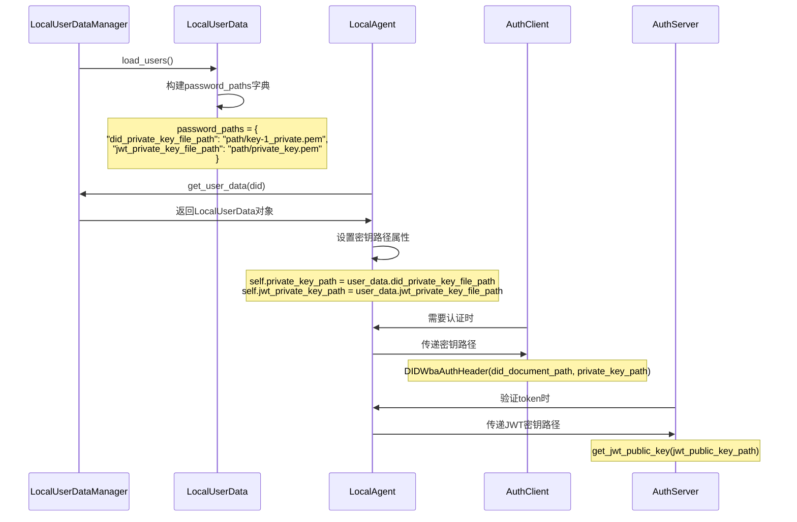
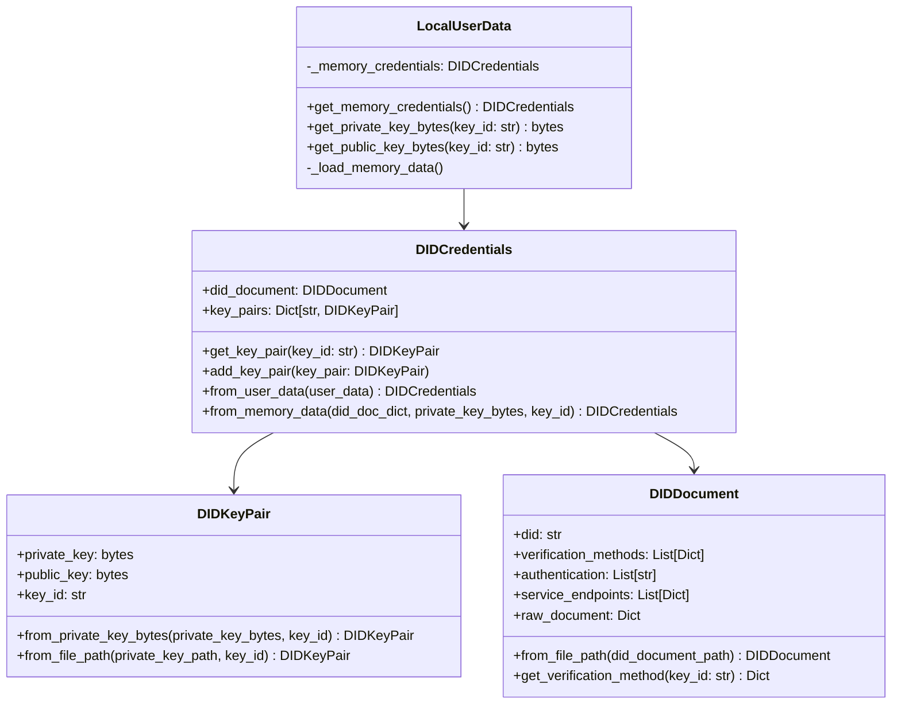
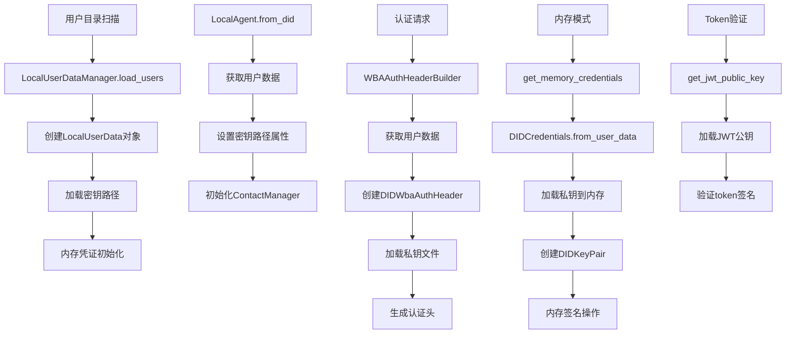

# LocalAgent全生命周期与数据传递机制分析

## 目录

- 1. LocalAgent生命周期概述
- 2. 用户数据管理架构
- 3. 密钥文件夹传递机制
- 4. 内存化对象传递流程
- 5. 完整数据流分析
- 6. 性能优化策略
- 7. 安全考虑

## 1. LocalAgent生命周期概述

### 1.1 生命周期阶段



### 1.2 详细生命周期分析

#### 阶段1：创建阶段

```python
# 三种创建方式
class LocalAgent:
    @classmethod
    def from_did(cls, did: str, name: str = "未命名", agent_type: str = "personal"):
        """从DID创建LocalAgent"""
        user_data_manager = LocalUserDataManager()
        user_data_manager.load_users()  # 加载所有用户数据
        user_data = user_data_manager.get_user_data(did)
        if not user_data:
            raise ValueError(f"未找到 DID 为 {did} 的用户数据")
        return cls(user_data, name, agent_type)

    @classmethod
    def from_name(cls, name: str, agent_type: str = "personal"):
        """从用户名创建LocalAgent"""
        user_data_manager = LocalUserDataManager()
        user_data_manager.load_users()
        user_data = user_data_manager.get_user_data_by_name(name)
        if not user_data:
            logger.error(f"未找到 name 为 {name} 的用户数据")
            return cls(None, name, agent_type)
        return cls(user_data, name, agent_type)

    def __init__(self, user_data, name: str = "未命名", agent_type: str = "personal"):
        """直接构造函数创建"""
        # 初始化核心属性...
```

#### 阶段2：初始化阶段

```python
def __init__(self, user_data, name: str = "未命名", agent_type: str = "personal"):
    # 1. 基础属性初始化
    self.user_data = user_data
    self.id = self.user_data.did
    self.name = name if name != "未命名" else self.user_data.name
    self.user_dir = user_data.user_dir
    self.agent_type = agent_type

    # 2. 配置加载
    config = get_global_config()
    self.key_id = config.anp_sdk.user_did_key_id

    # 3. 密钥路径设置
    self.did_document_path = self.user_data.did_doc_path
    self.private_key_path = self.user_data.did_private_key_file_path
    self.jwt_private_key_path = self.user_data.jwt_private_key_file_path
    self.jwt_public_key_path = self.user_data.jwt_public_key_file_path

    # 4. 组件初始化
    self._ws_connections = {}
    self._sse_clients = set()
    self.api_routes = {}
    self.message_handlers = {}
    self._group_event_handlers = {}
    self._group_global_handlers = []

    # 5. 特殊属性检查
    self.is_hosted_did = self._check_if_hosted_did()
    self.parent_did = self._get_parent_did() if self.is_hosted_did else None
    self.hosted_info = self._get_hosted_info() if self.is_hosted_did else None

    # 6. 联系人管理器初始化
    self.contact_manager = ContactManager(self.user_data)
```

#### 阶段3：配置阶段

```python
# API注册
def expose_api(self, path: str, func: Callable = None, methods=None):
    """注册API端点"""
    methods = methods or ["GET", "POST"]
    if func is None:
        def decorator(f):
            self.api_routes[path] = f
            # 注册到全局API注册表
            from anp_open_sdk.anp_sdk import ANPSDK
            if hasattr(ANPSDK, 'instance') and ANPSDK.instance:
                api_info = {
                    "path": f"/agent/api/{self.id}{path}",
                    "methods": methods,
                    "summary": f.__doc__ or f"{self.name}的{path}接口",
                    "agent_id": self.id,
                    "agent_name": self.name
                }
                ANPSDK.instance.api_registry.setdefault(self.id, []).append(api_info)
            return f
        return decorator

# 消息处理器注册
def register_message_handler(self, msg_type: str, func: Callable = None):
    """注册消息处理器"""
    if func is None:
        def decorator(f):
            self.message_handlers[msg_type] = f
            return f
        return decorator
    else:
        self.message_handlers[msg_type] = func
        return func

# 群组事件处理器注册
def register_group_event_handler(self, handler: Callable, group_id: str = None, event_type: str = None):
    """注册群组事件处理器"""
    if group_id is None and event_type is None:
        self._group_global_handlers.append((None, handler))
    elif group_id is None:
        self._group_global_handlers.append((event_type, handler))
    else:
        key = (group_id, event_type)
        self._group_event_handlers.setdefault(key, []).append(handler)
```

#### 阶段4：启动阶段

```python
def start(self, mode: SdkMode, ws_proxy_url=None, host="0.0.0.0", port=8000):
    """启动LocalAgent"""
    if mode == SdkMode.AGENT_SELF_SERVICE:
        self._start_self_service(host, port)
    elif mode == SdkMode.AGENT_WS_PROXY_CLIENT:
        self._start_self_service(host, port)
        asyncio.create_task(self._start_ws_proxy_client(ws_proxy_url))
    # 其他模式由ANPSDK主导

def _start_self_service(self, host, port):
    """启动自服务模式"""
    self.app = FastAPI(
        title=f"{self.name} LocalAgent",
        description="LocalAgent Self-Service API",
        version="1.0.0"
    )
    self._register_self_routes()
    import uvicorn
    uvicorn.run(self.app, host=host, port=port)
  
async def _start_ws_proxy_client(self, ws_proxy_url):
    """启动WebSocket代理客户端"""
    import websockets
    while True:
        try:
            async with websockets.connect(ws_proxy_url) as ws:
                await self._ws_proxy_loop(ws)
        except Exception as e:
            self.logger.error(f"WebSocket代理连接失败: {e}")
            await asyncio.sleep(5)
```

#### 阶段5：运行阶段

```python
async def handle_request(self, req_did: str, request_data: Dict[str, Any], request: Request):
    """处理请求的核心方法"""
    req_type = request_data.get("type")

    # 群组消息处理
    if req_type in ("group_message", "group_connect", "group_members"):
        handler = self.message_handlers.get(req_type)
        if handler:
            try:
                nest_asyncio.apply()
                if asyncio.iscoroutinefunction(handler):
                    # 异步处理
                    result = await handler(request_data)
                else:
                    # 同步处理
                    result = handler(request_data)
                return {"anp_result": result}
            except Exception as e:
                return {"anp_result": {"status": "error", "message": str(e)}}

    # API调用处理
    elif req_type == "api_call":
        api_path = request_data.get("path")
        handler = self.api_routes.get(api_path)
        if handler:
            try:
                result = await handler(request_data, request)
                if isinstance(result, dict):
                    status_code = result.pop('status_code', 200)
                    return JSONResponse(status_code=status_code, content=result)
                return result
            except Exception as e:
                return JSONResponse(
                    status_code=500,
                    content={"status": "error", "error_message": str(e)}
                )

    # 普通消息处理
    elif req_type == "message":
        msg_type = request_data.get("message_type", "*")
        handler = self.message_handlers.get(msg_type) or self.message_handlers.get("*")
        if handler:
            try:
                result = await handler(request_data)
                return {"anp_result": result}
            except Exception as e:
                return {"anp_result": {"status": "error", "message": str(e)}}
```

#### 阶段6：销毁阶段

```python
def __del__(self):
    """确保在对象销毁时释放资源"""
    try:
        for ws in self._ws_connections.values():
            self.logger.debug(f"LocalAgent {self.id} 销毁时存在未关闭的WebSocket连接")
        self._ws_connections.clear()
        self._sse_clients.clear()
        self.logger.debug(f"LocalAgent {self.id} 资源已释放")
    except Exception:
        pass
```

## 2. 用户数据管理架构

### 2.1 用户数据管理器层次结构



### 2.2 单例模式实现

```python
class LocalUserDataManager(BaseUserDataManager):
    _instance = None

    def __new__(cls, user_dir: Optional[str] = None):
        """单例模式确保全局唯一实例"""
        if cls._instance is None:
            cls._instance = super().__new__(cls)
        return cls._instance

    def __init__(self, user_dir: Optional[str] = None):
        """初始化检查避免重复初始化"""
        if hasattr(self, '_initialized') and self._initialized:
            return

        config = get_global_config()
        self._user_dir = user_dir or config.anp_sdk.user_did_path
        self.users: Dict[str, LocalUserData] = {}
        self.load_users()
        self._initialized = True
```

### 2.3 用户数据加载流程

```python
def load_users(self):
    """扫描用户目录并加载所有用户数据"""
    if not os.path.isdir(self._user_dir):
        logger.warning(f"用户目录不存在: {self._user_dir}")
        return

    for entry in os.scandir(self._user_dir):
        if entry.is_dir() and (entry.name.startswith('user_') or entry.name.startswith('user_hosted_')):
            user_folder_path = entry.path
            folder_name = entry.name

            try:
                # 1. 加载agent配置
                cfg_path = os.path.join(user_folder_path, 'agent_cfg.yaml')
                agent_cfg = {}
                if os.path.exists(cfg_path):
                    with open(cfg_path, 'r', encoding='utf-8') as f:
                        agent_cfg = yaml.safe_load(f)

                # 2. 加载DID文档
                did_doc_path = os.path.join(user_folder_path, 'did_document.json')
                did_doc = {}
                if os.path.exists(did_doc_path):
                    with open(did_doc_path, 'r', encoding='utf-8') as f:
                        did_doc = json.load(f)

                # 3. 构建密钥路径
                config = get_global_config()
                key_id = did_doc.get('key_id') or config.anp_sdk.user_did_key_id

                password_paths = {
                    "did_private_key_file_path": os.path.join(user_folder_path, f"{key_id}_private.pem"),
                    "did_public_key_file_path": os.path.join(user_folder_path, f"{key_id}_public.pem"),
                    "jwt_private_key_file_path": os.path.join(user_folder_path, 'private_key.pem'),
                    "jwt_public_key_file_path": os.path.join(user_folder_path, 'public_key.pem')
                }

                # 4. 创建用户数据对象
                if did_doc and agent_cfg:
                    user_data = LocalUserData(
                        folder_name, agent_cfg, did_doc,
                        did_doc_path, password_paths, user_folder_path
                    )
                    self.users[user_data.did] = user_data

            except Exception as e:
                logger.error(f"加载用户数据失败 ({folder_name}): {e}")

    logger.debug(f"加载用户数据共 {len(self.users)} 个用户")
```

## 3. 密钥文件夹传递机制

### 3.1 密钥文件组织结构

```
user_directory/
├── did_document.json           # DID文档
├── agent_cfg.yaml             # 代理配置
├── key-1_private.pem          # DID私钥
├── key-1_public.pem           # DID公钥
├── private_key.pem            # JWT私钥
└── public_key.pem             # JWT公钥
```

### 3.2 密钥路径传递流程



### 3.3 密钥路径解析详细实现

```python
class LocalUserData(BaseUserData):
    def __init__(self, folder_name: str, agent_cfg: Dict[str, Any], did_doc: Dict[str, Any],
                 did_doc_path, password_paths: Dict[str, str], user_folder_path):
        # 基础属性
        self.folder_name = folder_name
        self.agent_cfg = agent_cfg
        self.did_doc = did_doc
        self.password_paths = password_paths
        self.user_dir = user_folder_path

        # DID相关路径
        self.did = did_doc.get("id")
        self._did_doc_path = did_doc_path
        self._did_private_key_file_path = password_paths.get("did_private_key_file_path")
        self.did_public_key_file_path = password_paths.get("did_public_key_file_path")

        # JWT相关路径
        self.jwt_private_key_file_path = password_paths.get("jwt_private_key_file_path")
        self.jwt_public_key_file_path = password_paths.get("jwt_public_key_file_path")

        # 密钥ID
        self.key_id = did_doc.get('key_id') or did_doc.get('publicKey', [{}])[0].get('id') if did_doc.get('publicKey') else None

        # 内存凭证初始化
        self._memory_credentials = None
        self._load_memory_data()

    @property
    def did_private_key_file_path(self) -> str:
        """DID私钥文件路径属性"""
        return self._did_private_key_file_path

    @property
    def did_doc_path(self) -> str:
        """DID文档路径属性"""
        return self._did_doc_path
```

### 3.4 认证客户端密钥加载

```python
class DIDWbaAuthHeader:
    def _load_private_key(self) -> ec.EllipticCurvePrivateKey:
        """加载私钥"""
        try:
            key_path = self.private_key_path

            with open(key_path, 'rb') as f:
                private_key_data = f.read()

            private_key = serialization.load_pem_private_key(
                private_key_data,
                password=None
            )

            logger.debug(f"Loaded private key: {key_path}")
            return private_key

        except FileNotFoundError:
            # 特殊处理托管代理的情况
            if 'user_hosted_agent-did.com_80_' in key_path:
                logger.info(f"Optional private key for hosted agent not found (this is expected): {key_path}")
            else:
                logger.error(f"Error loading private key: File not found at {key_path}")
            return None
        except Exception as e:
            logger.debug(f"Error loading private key: {e}")
            raise

    def _sign_callback(self, content: bytes, method_fragment: str) -> bytes:
        """签名回调函数"""
        private_key = self._load_private_key()
        if not private_key:
            return None

        try:
            signature = private_key.sign(
                content,
                ec.ECDSA(hashes.SHA256())
            )
            logger.debug(f"Signed content with method fragment: {method_fragment}")
            return signature
        except Exception as e:
            logger.error(f"Error signing content: {e}")
            return None
```

## 4. 内存化对象传递流程

### 4.1 内存凭证架构



### 4.2 内存凭证加载流程

```python
class LocalUserData(BaseUserData):
    def _load_memory_data(self):
        """加载密钥数据到内存"""
        try:
            from anp_open_sdk.auth.schemas import DIDCredentials
            self._memory_credentials = DIDCredentials.from_user_data(self)
        except Exception as e:
            logger.warning(f"加载内存凭证失败: {e}")
            self._memory_credentials = None

    def get_memory_credentials(self):
        """获取内存中的DID凭证"""
        if self._memory_credentials is None:
            self._load_memory_data()
        return self._memory_credentials

    def get_private_key_bytes(self, key_id: str = "key-1") -> Optional[bytes]:
        """获取私钥字节数据"""
        credentials = self.get_memory_credentials()
        if credentials:
            key_pair = credentials.get_key_pair(key_id)
            if key_pair:
                return key_pair.private_key
        return None

    def get_public_key_bytes(self, key_id: str = "key-1") -> Optional[bytes]:
        """获取公钥字节数据"""
        credentials = self.get_memory_credentials()
        if credentials:
            key_pair = credentials.get_key_pair(key_id)
            if key_pair:
                return key_pair.public_key
        return None
```

### 4.3 DID凭证创建流程

```python
@classmethod
def from_user_data(cls, user_data):
    """从用户数据对象创建DID凭证"""
    # 1. 读取私钥文件内容到内存
    with open(user_data.did_private_key_file_path, "rb") as key_file:
        private_key_pem = key_file.read()

    # 2. 解析私钥
    from cryptography.hazmat.primitives import serialization
    from cryptography.hazmat.primitives.asymmetric import ec
    private_key = serialization.load_pem_private_key(private_key_pem, password=None)

    # 3. 获取私钥字节
    if isinstance(private_key, ec.EllipticCurvePrivateKey):
        # EC私钥（secp256k1等）
        private_key_bytes = private_key.private_numbers().private_value.to_bytes(32, byteorder="big")
    else:
        # 其他类型私钥的处理
        try:
            private_key_bytes = private_key.private_bytes(
                encoding=serialization.Encoding.DER,
                format=serialization.PrivateFormat.PKCS8,
                encryption_algorithm=serialization.NoEncryption()
            )
        except Exception:
            private_key_bytes = private_key.private_bytes(
                encoding=serialization.Encoding.PEM,
                format=serialization.PrivateFormat.PKCS8,
                encryption_algorithm=serialization.NoEncryption()
            )

    # 4. 获取key_id
    key_id = getattr(user_data, 'key_id', 'key-1')
    if not key_id:
        key_id = 'key-1'

    # 5. 创建内存凭证
    return cls.from_memory_data(user_data.did_doc, private_key_bytes, key_id)

@classmethod
def from_memory_data(cls, did_document_dict: Dict[str, Any], private_key_bytes: bytes, key_id: str = "key-1"):
    """从内存数据创建DID凭证"""
    # 1. 创建DID文档对象
    did_doc = DIDDocument(
        did=did_document_dict.get('id', ''),
        verification_methods=did_document_dict.get('verificationMethod', []),
        authentication=did_document_dict.get('authentication', []),
        service_endpoints=did_document_dict.get('service', []),
        raw_document=did_document_dict
    )

    # 2. 创建密钥对对象
    key_pair = DIDKeyPair.from_private_key_bytes(private_key_bytes, key_id)

    # 3. 创建凭证对象
    credentials = cls(did_document=did_doc)
    credentials.add_key_pair(key_pair)
    return credentials
```

### 4.4 内存认证头构建器

```python
class MemoryWBAAuthHeaderBuilder(BaseAuthHeaderBuilder):
    """基于内存数据的WBA认证头构建器"""

    def build_auth_header(self, context: AuthenticationContext, credentials: DIDCredentials) -> Dict[str, str]:
        """使用内存中的凭证构建认证头"""
        try:
            # 1. 获取内存中的密钥对
            key_pair = credentials.get_key_pair(context.key_id or "key-1")
            if not key_pair:
                raise ValueError(f"未找到密钥对: {context.key_id}")

            # 2. 构建签名数据
            data_to_sign = {
                "nonce": secrets.token_hex(16),
                "timestamp": datetime.now(timezone.utc).strftime('%Y-%m-%dT%H:%M:%SZ'),
                "service": context.domain,
                "did": context.caller_did,
                "resp_did": context.target_did
            }

            # 3. 生成签名
            canonical_json = jcs.canonicalize(data_to_sign)
            content_hash = hashlib.sha256(canonical_json).digest()

            # 4. 使用内存中的私钥签名
            private_key_obj = ec.derive_private_key(
                int.from_bytes(key_pair.private_key, byteorder="big"),
                ec.SECP256K1()
            )
            signature_bytes = private_key_obj.sign(content_hash, ec.ECDSA(hashes.SHA256()))
            signature = base64.b64encode(signature_bytes).decode('utf-8')

            # 5. 构建认证头
            auth_header = (
                f'DIDWba did="{context.caller_did}", '
                f'nonce="{data_to_sign["nonce"]}", '
                f'timestamp="{data_to_sign["timestamp"]}", '
                f'resp_did="{context.target_did}", '
                f'verification_method="{key_pair.key_id}", '
                f'signature="{signature}"'
            )

            return {"Authorization": auth_header}

        except Exception as e:
            logger.error(f"构建内存认证头失败: {e}")
            raise
```

## 5. 完整数据流分析

### 5.1 端到端数据流图



### 5.2 数据传递层次

```python
# 第1层：文件系统层
user_directory/
├── did_document.json
├── key-1_private.pem
└── private_key.pem

# 第2层：用户数据管理层
class LocalUserDataManager:
    users: Dict[str, LocalUserData]  # DID -> 用户数据映射

# 第3层：用户数据对象层
class LocalUserData:
    password_paths: Dict[str, str]   # 密钥路径映射
    _memory_credentials: DIDCredentials  # 内存凭证缓存

# 第4层：LocalAgent层
class LocalAgent:
    private_key_path: str           # DID私钥路径
    jwt_private_key_path: str       # JWT私钥路径
    contact_manager: ContactManager # 联系人管理器

# 第5层：认证组件层
class DIDWbaAuthHeader:
    did_document_path: str          # DID文档路径
    private_key_path: str           # 私钥路径

# 第6层：内存对象层
class DIDCredentials:
    key_pairs: Dict[str, DIDKeyPair]  # 内存中的密钥对
```

### 5.3 性能优化的数据传递

```python
# 文件路径传递（传统模式）
def file_based_auth():
    # 每次都读取文件
    with open(private_key_path, 'rb') as f:
        private_key_data = f.read()
    private_key = load_pem_private_key(private_key_data)
    signature = private_key.sign(content)

# 内存对象传递（优化模式）
def memory_based_auth():
    # 使用缓存的内存对象
    credentials = user_data.get_memory_credentials()
    key_pair = credentials.get_key_pair("key-1")
    private_key_obj = ec.derive_private_key(
        int.from_bytes(key_pair.private_key, byteorder="big"),
        ec.SECP256K1()
    )
    signature = private_key_obj.sign(content)
```

## 6. 性能优化策略

### 6.1 缓存策略

```python
# 1. 单例模式减少重复加载
class LocalUserDataManager:
    _instance = None  # 全局唯一实例

# 2. 内存凭证缓存
class LocalUserData:
    _memory_credentials = None  # 延迟加载，一次缓存

# 3. 用户数据字典缓存
class LocalUserDataManager:
    users: Dict[str, LocalUserData] = {}  # DID -> 用户数据映射

# 4. Token缓存
class ContactManager:
    token_to_remote_dict = {}  # 远程token缓存
    token_from_remote_dict = {}  # 本地token缓存
```

### 6.2 延迟加载策略

```python
def get_memory_credentials(self):
    """延迟加载内存凭证"""
    if self._memory_credentials is None:
        self._load_memory_data()
    return self._memory_credentials

def _load_private_key(self):
    """延迟加载私钥"""
    if not hasattr(self, '_cached_private_key'):
        with open(self.private_key_path, 'rb') as f:
            private_key_data = f.read()
        self._cached_private_key = load_pem_private_key(private_key_data)
    return self._cached_private_key
```

### 6.3 批量操作优化

```python
def load_users(self):
    """批量加载用户数据"""
    # 一次性扫描目录
    for entry in os.scandir(self._user_dir):
        if entry.is_dir() and entry.name.startswith('user_'):
            # 批量处理用户数据
            self._load_single_user(entry)

    logger.debug(f"批量加载完成，共 {len(self.users)} 个用户")
```

## 7. 安全考虑

### 7.1 密钥安全

```python
# 1. 私钥文件权限检查
def check_key_file_permissions(key_path: str):
    """检查密钥文件权限"""
    import stat
    file_stat = os.stat(key_path)
    if file_stat.st_mode & 0o077:  # 检查其他用户权限
        logger.warning(f"密钥文件权限过于宽松: {key_path}")

# 2. 内存中密钥的安全清理
def secure_clear_memory(data: bytes):
    """安全清理内存中的敏感数据"""
    if isinstance(data, bytes):
        # 覆写内存内容
        for i in range(len(data)):
            data[i] = 0

# 3. 密钥使用后的清理
class DIDKeyPair:
    def __del__(self):
        """销毁时清理敏感数据"""
        if hasattr(self, 'private_key'):
            secure_clear_memory(self.private_key)
```

### 7.2 访问控制

```python
# 1. 用户数据访问权限
def get_user_data(self, did: str) -> Optional[BaseUserData]:
    """只返回当前用户有权访问的数据"""
    if did in self.users:
        # 可以添加额外的权限检查
        return self.users[did]
    return None

# 2. 托管DID的特殊处理
def _check_if_hosted_did(self) -> bool:
    """检查是否为托管DID"""
    from pathlib import Path
    user_dir_name = Path(self.user_dir).name
    return user_dir_name.startswith('user_hosted_')

# 3. 密钥文件访问控制
def _load_private_key(self):
    """加载私钥时的安全检查"""
    try:
        # 检查文件是否存在且可读
        if not os.path.exists(self.private_key_path):
            raise FileNotFoundError(f"私钥文件不存在: {self.private_key_path}")

        # 检查文件权限
        check_key_file_permissions(self.private_key_path)

        # 加载私钥
        with open(self.private_key_path, 'rb') as f:
            private_key_data = f.read()

        return load_pem_private_key(private_key_data, password=None)

    except Exception as e:
        logger.error(f"加载私钥失败: {e}")
        raise
```

### 7.3 错误处理和日志

```python
# 1. 敏感信息过滤
def safe_log_user_info(user_data: LocalUserData):
    """安全地记录用户信息（过滤敏感数据）"""
    safe_info = {
        "did": user_data.did,
        "name": user_data.name,
        "user_dir": user_data.user_dir,
        "is_hosted": user_data.folder_name.startswith('user_hosted_')
    }
    logger.debug(f"用户信息: {safe_info}")

# 2. 异常处理
def load_users(self):
    """加载用户时的异常处理"""
    for entry in os.scandir(self._user_dir):
        try:
            # 加载单个用户数据
            user_data = self._load_single_user(entry)
            if user_data:
                self.users[user_data.did] = user_data
        except Exception as e:
            # 记录错误但不中断整个加载过程
            logger.error(f"加载用户数据失败 ({entry.name}): {e}")
            continue

# 3. 资源清理
def __del__(self):
    """确保资源正确清理"""
    try:
        # 清理WebSocket连接
        for ws in self._ws_connections.values():
            if not ws.closed:
                asyncio.create_task(ws.close())

        # 清理SSE客户端
        self._sse_clients.clear()

        # 清理敏感数据
        if hasattr(self, '_memory_credentials') and self._memory_credentials:
            # 清理内存中的密钥数据
            pass

    except Exception as e:
        logger.error(f"资源清理失败: {e}")
```

## 总结

LocalAgent的全生命周期管理和数据传递机制体现了以下设计原则：

### 优势

1. **分层架构**：清晰的数据传递层次，便于维护和扩展
2. **性能优化**：单例模式、缓存策略、延迟加载
3. **安全性**：密钥权限检查、内存清理、访问控制
4. **灵活性**：支持文件和内存两种模式
5. **可扩展性**：模块化设计，易于添加新功能

### 关键特性

1. **统一的用户数据管理**：LocalUserDataManager提供统一接口
2. **智能的密钥传递**：文件路径和内存对象两种模式
3. **完整的生命周期管理**：从创建到销毁的完整流程
4. **高效的缓存机制**：减少重复的文件I/O操作
5. **强大的错误处理**：优雅的异常处理和资源清理

这个架构为ANP SDK提供了稳定、高效、安全的身份管理基础设施。
