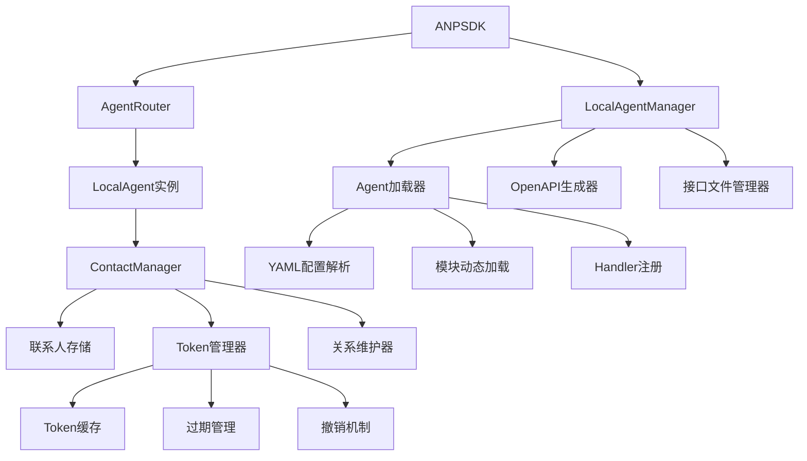
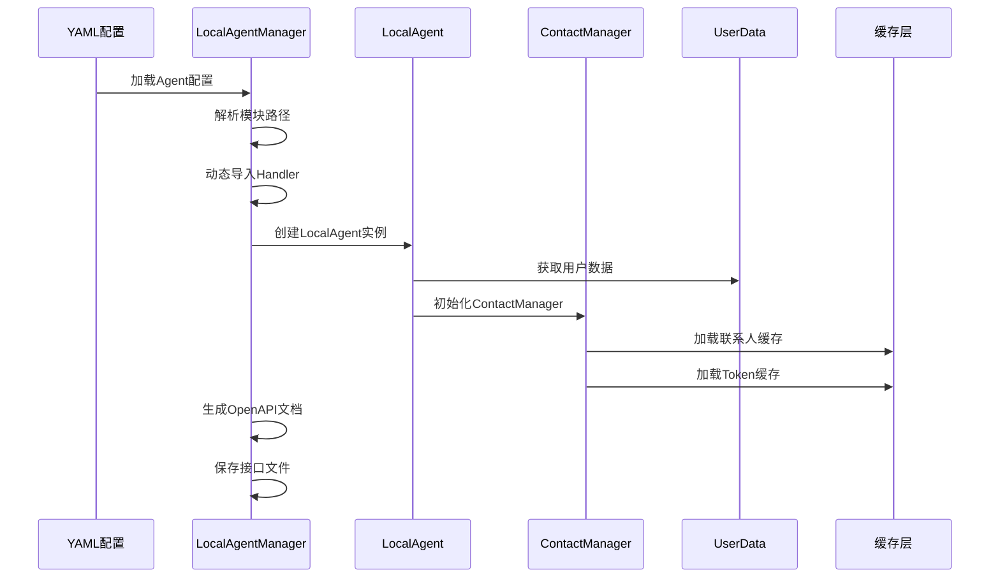
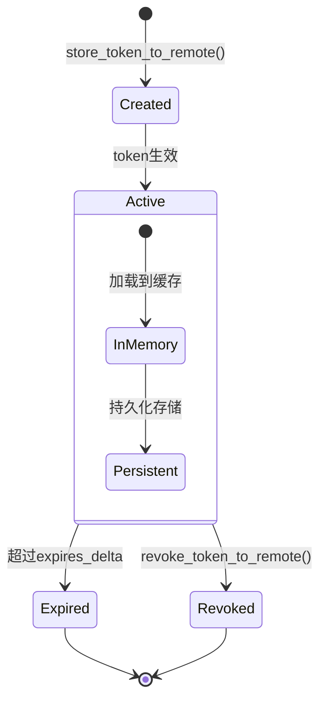
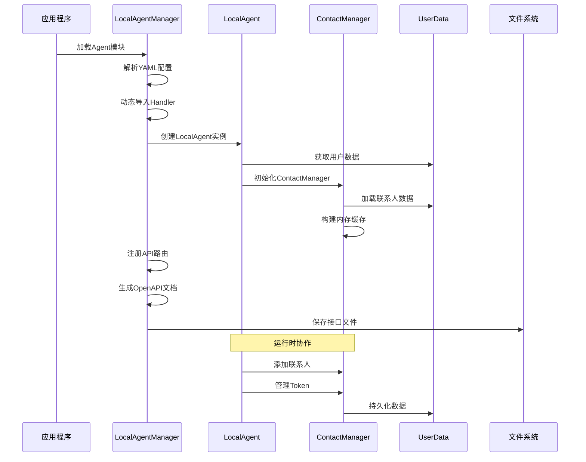
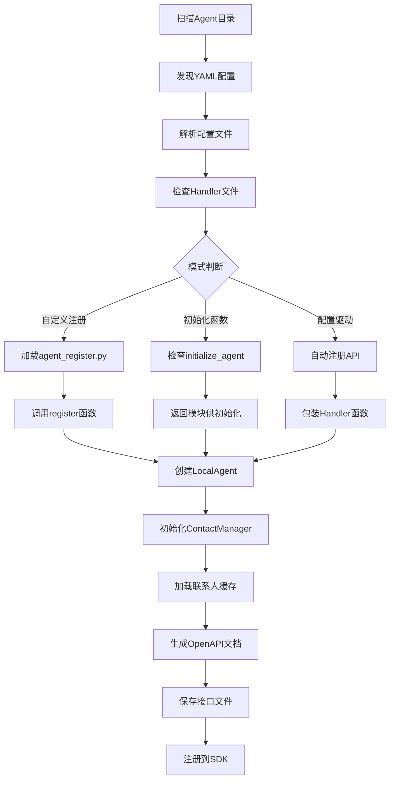

# Agent Manager 与 Contact Manager 完整分析

## 目录

- 1. 系统架构概述
- 2. LocalAgentManager详解
- 3. ContactManager详解
- 4. 两个管理器的协作关系
- 5. Agent加载生命周期
- 6. 联系人与Token管理
- 7. 性能优化策略
- 8. 使用场景与最佳实践

## 1. 系统架构概述

### 1.1 管理器层次结构



### 1.2 数据流向图



## 2. LocalAgentManager详解

### 2.1 核心功能架构

```python
class LocalAgentManager:
    """本地 Agent 管理器，负责加载、注册和生成接口文档"""

    # 三大核心功能：
    # 1. Agent模块加载
    # 2. OpenAPI文档生成
    # 3. 接口文件管理
```

### 2.2 Agent加载机制详解

#### 2.2.1 三种Agent加载模式

```python
@staticmethod
def load_agent_from_module(yaml_path: str) -> Tuple[Optional[LocalAgent], Optional[Any]]:
    """从模块路径加载 Agent 实例 - 支持三种模式"""

    plugin_dir = os.path.dirname(yaml_path)
    handler_script_path = os.path.join(plugin_dir, "agent_handlers.py")
    register_script_path = os.path.join(plugin_dir, "agent_register.py")

    # 检查必要文件
    if not os.path.exists(handler_script_path):
        logger.debug(f"⚠️  Skipping: No 'agent_handlers.py' found in {plugin_dir}")
        return None, None

    # 动态导入模块
    module_path_prefix = os.path.dirname(plugin_dir).replace(os.sep, ".")
    base_module_name = f"{module_path_prefix}.{os.path.basename(plugin_dir)}"
    base_module_name = base_module_name.replace("/", ".")
    handlers_module = importlib.import_module(f"{base_module_name}.agent_handlers")

    # 加载YAML配置
    with open(yaml_path, "r", encoding="utf-8") as f:
        cfg = yaml.safe_load(f)

    # 模式1: 自定义注册模式 (agent_002)
    if os.path.exists(register_script_path):
        register_module = importlib.import_module(f"{base_module_name}.agent_register")
        agent = LocalAgent.from_did(cfg["did"])
        agent.name = cfg["name"]
        agent.api_config = cfg.get("api", [])
        logger.info(f"-> self register agent : {agent.name}")
        register_module.register(agent)  # 调用自定义注册函数
        return agent, None

    # 模式2: 初始化函数模式 (agent_llm)
    if hasattr(handlers_module, "initialize_agent"):
        logger.debug(f"- Calling 'initialize_agent' in module: {base_module_name}.agent_handlers")
        agent = LocalAgent.from_did(cfg["did"])
        agent.name = cfg["name"]
        agent.api_config = cfg.get("api", [])
        logger.info(f"- pre-init agent: {agent.name}")
        return agent, handlers_module  # 返回模块供后续初始化

    # 模式3: 配置驱动模式 (agent_001 / agent_calculator)
    agent = LocalAgent.from_did(cfg["did"])
    agent.name = cfg["name"]
    agent.api_config = cfg.get("api", [])
    logger.debug(f"-> Self-created agent instance: {agent.name}")

    # 自动注册API
    for api in cfg.get("api", []):
        handler_func = getattr(handlers_module, api["handler"])
        sig = inspect.signature(handler_func)
        params = list(sig.parameters.keys())

        # 检查是否需要包装
        if params != ["request", "request_data"]:
            handler_func = wrap_business_handler(handler_func)

        agent.expose_api(api["path"], handler_func, methods=[api["method"]])
        logger.info(f"- config register agent: {agent.name}，api:{api}")

    return agent, None
```

#### 2.2.2 模块结构示例

```
agent_plugins/
├── agent_001/                    # 配置驱动模式
│   ├── agent_config.yaml
│   └── agent_handlers.py
├── agent_002/                    # 自定义注册模式
│   ├── agent_config.yaml
│   ├── agent_handlers.py
│   └── agent_register.py         # 自定义注册逻辑
├── agent_llm/                    # 初始化函数模式
│   ├── agent_config.yaml
│   └── agent_handlers.py         # 包含initialize_agent函数
└── agent_calculator/             # 配置驱动模式
    ├── agent_config.yaml
    └── agent_handlers.py
```

#### 2.2.3 YAML配置格式

```yaml
# agent_config.yaml 示例
did: "did:wba:localhost%3A9527:wba:user:calculator"
name: "计算器代理"
type: "service"
api:
  - path: "/add"
    method: "POST"
    handler: "handle_add"
    summary: "加法运算"
    params:
      a: {"type": "number", "description": "第一个数"}
      b: {"type": "number", "description": "第二个数"}
    result:
      sum: {"type": "number", "description": "计算结果"}
  - path: "/multiply"
    method: "POST"
    handler: "handle_multiply"
    summary: "乘法运算"
```

### 2.3 OpenAPI文档生成

#### 2.3.1 文档生成流程

```python
@staticmethod
def generate_custom_openapi_from_router(agent: LocalAgent, sdk) -> Dict:
    """根据 Agent 的路由生成自定义的 OpenAPI 规范"""

    # 1. 基础OpenAPI结构
    openapi = {
        "openapi": "3.0.0",
        "info": {
            "title": f"{agent.name}Agent API",
            "version": "1.0.0"
        },
        "paths": {}
    }

    # 2. 从SDK的API注册表获取摘要信息
    api_registry = getattr(sdk, "api_registry", {}).get(agent.id, [])
    summary_map = {
        item["path"].replace(f"/agent/api/{agent.id}", ""): item["summary"]
        for item in api_registry
    }

    # 3. 遍历Agent的API路由
    for path, handler in agent.api_routes.items():
        # 4. 分析函数签名
        sig = inspect.signature(handler)
        param_names = [p for p in sig.parameters if p not in ("request_data", "request")]
        properties = {name: {"type": "string"} for name in param_names}

        # 5. 获取API摘要
        summary = summary_map.get(path, handler.__doc__ or f"{agent.name}的{path}接口")

        # 6. 构建OpenAPI路径定义
        openapi["paths"][path] = {
            "post": {
                "summary": summary,
                "requestBody": {
                    "required": True,
                    "content": {
                        "application/json": {
                            "schema": {
                                "type": "object",
                                "properties": properties
                            }
                        }
                    }
                },
                "responses": {
                    "200": {
                        "description": "返回结果",
                        "content": {
                            "application/json": {
                                "schema": {"type": "object"}
                            }
                        }
                    }
                }
            }
        }

    return openapi
```

#### 2.3.2 接口文件生成与保存

```python
@staticmethod
async def generate_and_save_agent_interfaces(agent: LocalAgent, sdk):
    """为指定的 agent 生成并保存 OpenAPI (YAML) 和 JSON-RPC 接口文件"""

    logger.debug(f"开始为 agent '{agent.name}' ({agent.id}) 生成接口文件...")

    # 1. 获取用户数据和路径
    user_data_manager = LocalUserDataManager()
    user_data = user_data_manager.get_user_data(agent.id)
    if not user_data:
        logger.error(f"无法找到 agent '{agent.name}' 的用户数据，无法保存接口文件。")
        return
    user_full_path = user_data.user_dir

    # 2. 生成并保存 OpenAPI YAML 文件
    try:
        openapi_data = LocalAgentManager.generate_custom_openapi_from_router(agent, sdk)
        await save_interface_files(
            user_full_path=user_full_path,
            interface_data=openapi_data,
            inteface_file_name=f"api_interface.yaml",
            interface_file_type="YAML"
        )
    except Exception as e:
        logger.error(f"为 agent '{agent.name}' 生成 OpenAPI YAML 文件失败: {e}")

    # 3. 生成并保存 JSON-RPC 文件
    try:
        jsonrpc_data = {
            "jsonrpc": "2.0",
            "info": {
                "title": f"{agent.name} JSON-RPC Interface",
                "version": "0.1.0",
                "description": f"Methods offered by {agent.name}"
            },
            "methods": []
        }

        # 4. 从API配置生成JSON-RPC方法
        for api in getattr(agent, "api_config", []):
            path = api["path"]
            method_name = path.strip('/').replace('/', '.')
            params = api.get("params")
            result = api.get("result")

            # 如果没有预定义参数，从函数签名推断
            if params is None:
                sig = inspect.signature(agent.api_routes[path])
                params = {
                    name: {
                        "type": param.annotation.__name__
                        if (param.annotation != inspect._empty and hasattr(param.annotation, "__name__"))
                        else "Any"
                    }
                    for name, param in sig.parameters.items()
                    if name != "self"
                }

            # 构建方法对象
            method_obj = {
                "name": method_name,
                "summary": api.get("summary", api.get("handler", "")),
                "params": params
            }

            if result is not None:
                method_obj["result"] = result

            # 添加元数据
            method_obj["meta"] = {
                "openapi": api.get("openapi_version", "3.0.0"),
                "info": {
                    "title": api.get("title", "ANP Agent API"),
                    "version": api.get("version", "1.0.0")
                },
                "httpMethod": api.get("method", "POST"),
                "endpoint": api.get("path")
            }

            jsonrpc_data["methods"].append(method_obj)

        # 5. 保存JSON-RPC文件
        await save_interface_files(
            user_full_path=user_full_path,
            interface_data=jsonrpc_data,
            inteface_file_name="api_interface.json",
            interface_file_type="JSON"
        )

    except Exception as e:
        logger.error(f"为 agent '{agent.name}' 生成 JSON-RPC 文件失败: {e}")
```

## 3. ContactManager详解

### 3.1 核心数据结构

```python
class ContactManager:
    def __init__(self, user_data):
        self.user_data = user_data  # BaseUserData 实例

        # 核心数据结构
        self._contacts = {}              # did -> contact dict
        self._token_to_remote = {}       # did -> token dict (发给远程的token)
        self._token_from_remote = {}     # did -> token dict (从远程收到的token)

        # 初始化时加载数据
        self._load_contacts()
```

### 3.2 联系人管理功能

#### 3.2.1 联系人缓存机制

```python
def _load_contacts(self):
    """加载联系人和 token 信息到缓存"""
    # 1. 加载所有联系人
    for contact in self.user_data.list_contacts():
        did = contact['did']
        self._contacts[did] = contact

        # 2. 加载对应的token信息
        token_to = self.user_data.get_token_to_remote(did)
        if token_to:
            self._token_to_remote[did] = token_to

        token_from = self.user_data.get_token_from_remote(did)
        if token_from:
            self._token_from_remote[did] = token_from

def add_contact(self, contact: dict):
    """添加联系人（内存+持久化）"""
    did = contact['did']
    # 1. 更新内存缓存
    self._contacts[did] = contact
    # 2. 持久化到用户数据
    self.user_data.add_contact(contact)

def get_contact(self, did: str):
    """从缓存获取联系人"""
    return self._contacts.get(did)

def list_contacts(self):
    """列出所有联系人"""
    return list(self._contacts.values())
```

#### 3.2.2 Token管理机制

```python
# Token发送管理 (to_remote)
def store_token_to_remote(self, remote_did: str, token: str, expires_delta: int):
    """存储发给远程的token"""
    # 1. 持久化存储
    self.user_data.store_token_to_remote(remote_did, token, expires_delta)
    # 2. 更新内存缓存
    self._token_to_remote[remote_did] = self.user_data.get_token_to_remote(remote_did)

def get_token_to_remote(self, remote_did: str):
    """获取发给远程的token"""
    return self._token_to_remote.get(remote_did)

def revoke_token_to_remote(self, remote_did: str):
    """撤销发给远程的token"""
    # 1. 持久化撤销
    self.user_data.revoke_token_to_remote(remote_did)
    # 2. 清除内存缓存
    self._token_to_remote.pop(remote_did, None)

# Token接收管理 (from_remote)
def store_token_from_remote(self, remote_did: str, token: str):
    """存储从远程收到的token"""
    # 1. 持久化存储
    self.user_data.store_token_from_remote(remote_did, token)
    # 2. 更新内存缓存
    self._token_from_remote[remote_did] = self.user_data.get_token_from_remote(remote_did)

def get_token_from_remote(self, remote_did: str):
    """获取从远程收到的token"""
    return self._token_from_remote.get(remote_did)

def revoke_token_from_remote(self, target_did: str):
    """撤销与目标DID相关的本地token"""
    if target_did in self._token_from_remote:
        self._token_from_remote[target_did]["is_revoked"] = True
```

### 3.3 Token生命周期管理



## 4. 两个管理器的协作关系

### 4.1 协作流程图



### 4.2 数据流转关系

```python
# 1. Agent加载时的数据流
def load_and_initialize_agent():
    # LocalAgentManager负责
    agent, module = LocalAgentManager.load_agent_from_module(yaml_path)

    # LocalAgent初始化时自动创建ContactManager
    # 在LocalAgent.__init__中：
    self.contact_manager = ContactManager(self.user_data)

    # ContactManager自动加载缓存
    # 在ContactManager.__init__中：
    self._load_contacts()

# 2. 运行时的数据协作
def runtime_collaboration():
    # Agent处理认证请求时
    token_info = agent.contact_manager.get_token_to_remote(remote_did)

    # Agent添加新联系人时
    agent.add_contact(remote_agent)  # 调用ContactManager

    # Agent管理Token时
    agent.store_token_from_remote(remote_did, token)  # 调用ContactManager

# 3. 文档生成时的协作
def document_generation():
    # LocalAgentManager生成文档
    openapi_data = LocalAgentManager.generate_custom_openapi_from_router(agent, sdk)

    # 使用Agent的路由信息
    for path, handler in agent.api_routes.items():
        # 生成API文档...

    # 保存到Agent的用户目录
    await LocalAgentManager.generate_and_save_agent_interfaces(agent, sdk)
```

### 4.3 生命周期同步

```python
# Agent生命周期与ContactManager同步
class LocalAgent:
    def __init__(self, user_data, name: str = "未命名", agent_type: str = "personal"):
        # 1. 基础初始化
        self.user_data = user_data
        self.id = self.user_data.did

        # 2. ContactManager初始化（依赖user_data）
        self.contact_manager = ContactManager(self.user_data)

        # 3. 其他组件初始化...

    def __del__(self):
        """Agent销毁时的资源清理"""
        try:
            # ContactManager会随Agent一起销毁
            # 但持久化数据保留在UserData中
            pass
        except Exception:
            pass
```

## 5. Agent加载生命周期

### 5.1 完整加载流程



### 5.2 错误处理机制

```python
@staticmethod
def load_agent_from_module(yaml_path: str) -> Tuple[Optional[LocalAgent], Optional[Any]]:
    """带完整错误处理的Agent加载"""
    try:
        plugin_dir = os.path.dirname(yaml_path)
        handler_script_path = os.path.join(plugin_dir, "agent_handlers.py")

        # 1. 检查必要文件
        if not os.path.exists(handler_script_path):
            logger.debug(f"⚠️  Skipping: No 'agent_handlers.py' found in {plugin_dir}")
            return None, None

        # 2. 动态导入模块（可能失败）
        try:
            module_path_prefix = os.path.dirname(plugin_dir).replace(os.sep, ".")
            base_module_name = f"{module_path_prefix}.{os.path.basename(plugin_dir)}"
            handlers_module = importlib.import_module(f"{base_module_name}.agent_handlers")
        except ImportError as e:
            logger.error(f"Failed to import handlers module: {e}")
            return None, None

        # 3. 解析YAML配置（可能失败）
        try:
            with open(yaml_path, "r", encoding="utf-8") as f:
                cfg = yaml.safe_load(f)
        except (yaml.YAMLError, FileNotFoundError) as e:
            logger.error(f"Failed to load YAML config: {e}")
            return None, None

        # 4. 创建Agent（可能失败）
        try:
            agent = LocalAgent.from_did(cfg["did"])
            agent.name = cfg["name"]
            agent.api_config = cfg.get("api", [])
        except Exception as e:
            logger.error(f"Failed to create LocalAgent: {e}")
            return None, None

        # 5. 根据模式处理...

    except Exception as e:
        logger.error(f"Unexpected error loading agent from {yaml_path}: {e}")
        return None, None
```

### 5.3 性能优化策略

```python
# 1. 延迟加载策略
class LazyAgentLoader:
    def __init__(self):
        self._loaded_modules = {}  # 模块缓存
        self._agent_configs = {}   # 配置缓存

    def load_agent_lazy(self, yaml_path: str):
        """延迟加载Agent"""
        if yaml_path in self._loaded_modules:
            return self._loaded_modules[yaml_path]

        # 只有在真正需要时才加载
        agent, module = LocalAgentManager.load_agent_from_module(yaml_path)
        self._loaded_modules[yaml_path] = (agent, module)
        return agent, module

# 2. 批量加载优化
class BatchAgentLoader:
    @staticmethod
    def load_agents_batch(yaml_paths: List[str]) -> List[Tuple[Optional[LocalAgent], Optional[Any]]]:
        """批量加载多个Agent"""
        results = []
        for yaml_path in yaml_paths:
            try:
                result = LocalAgentManager.load_agent_from_module(yaml_path)
                results.append(result)
            except Exception as e:
                logger.error(f"Failed to load agent from {yaml_path}: {e}")
                results.append((None, None))
        return results
```

## 6. 联系人与Token管理

### 6.1 联系人数据结构

```python
# 联系人数据格式
contact_data = {
    "did": "did:wba:example.com:user:alice",
    "name": "Alice",
    "host": "example.com",
    "port": 443,
    "metadata": {
        "description": "Alice的代理",
        "capabilities": ["chat", "calculation"],
        "last_seen": "2024-01-01T12:00:00Z"
    }
}

# Token数据格式 (to_remote)
token_to_remote = {
    "token": "eyJhbGciOiJSUzI1NiIsInR5cCI6IkpXVCJ9...",
    "created_at": "2024-01-01T12:00:00Z",
    "expires_at": "2024-01-01T13:00:00Z",
    "is_revoked": False,
    "req_did": "did:wba:example.com:user:alice"
}

# Token数据格式 (from_remote)
token_from_remote = {
    "token": "eyJhbGciOiJSUzI1NiIsInR5cCI6IkpXVCJ9...",
    "created_at": "2024-01-01T12:00:00Z",
    "req_did": "did:wba:example.com:user:alice"
}
```

### 6.2 Token管理策略

#### 6.2.1 Token过期管理

```python
def check_token_expiry(self):
    """检查并清理过期Token"""
    from datetime import datetime, timezone
    current_time = datetime.now(timezone.utc)

    # 检查发出的Token
    expired_to_remote = []
    for did, token_info in self._token_to_remote.items():
        if isinstance(token_info.get("expires_at"), str):
            expires_at = datetime.fromisoformat(token_info["expires_at"])
        else:
            expires_at = token_info.get("expires_at")

        if expires_at and current_time > expires_at:
            expired_to_remote.append(did)

    # 清理过期Token
    for did in expired_to_remote:
        logger.debug(f"清理过期Token (to_remote): {did}")
        self._token_to_remote.pop(did, None)

def is_token_valid(self, remote_did: str, direction: str = "to_remote") -> bool:
    """检查Token是否有效"""
    if direction == "to_remote":
        token_info = self._token_to_remote.get(remote_did)
    else:
        token_info = self._token_from_remote.get(remote_did)

    if not token_info:
        return False

    # 检查撤销状态
    if token_info.get("is_revoked", False):
        return False

    # 检查过期时间
    if "expires_at" in token_info:
        from datetime import datetime, timezone
        current_time = datetime.now(timezone.utc)
        expires_at = token_info["expires_at"]
        if isinstance(expires_at, str):
            expires_at = datetime.fromisoformat(expires_at)
        if current_time > expires_at:
            return False

    return True
```

#### 6.2.2 Token安全管理

```python
def secure_token_storage(self, remote_did: str, token: str, expires_delta: int):
    """安全的Token存储"""
    from datetime import datetime, timezone, timedelta

    # 1. 验证Token格式
    if not self._validate_token_format(token):
        raise ValueError("Invalid token format")

    # 2. 计算过期时间
    now = datetime.now(timezone.utc)
    expires_at = now + timedelta(seconds=expires_delta)

    # 3. 构建Token信息
    token_info = {
        "token": token,
        "created_at": now.isoformat(),
        "expires_at": expires_at.isoformat(),
        "is_revoked": False,
        "req_did": remote_did,
        "security_hash": self._generate_token_hash(token)  # 安全哈希
    }

    # 4. 存储（持久化+缓存）
    self.user_data.store_token_to_remote(remote_did, token, expires_delta)
    self._token_to
