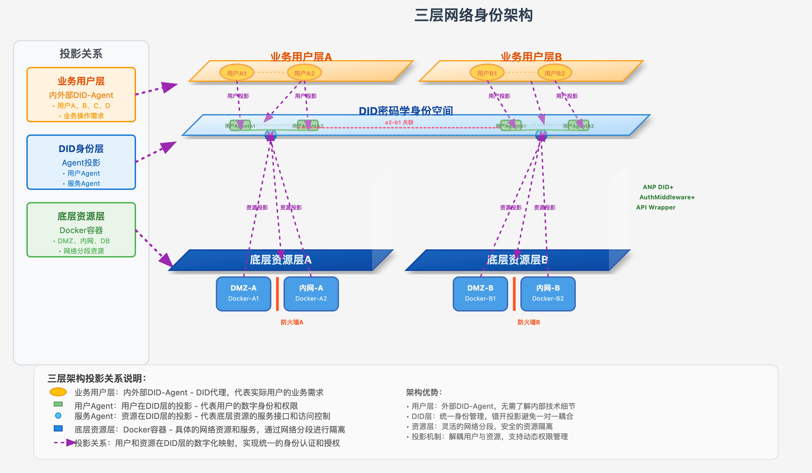
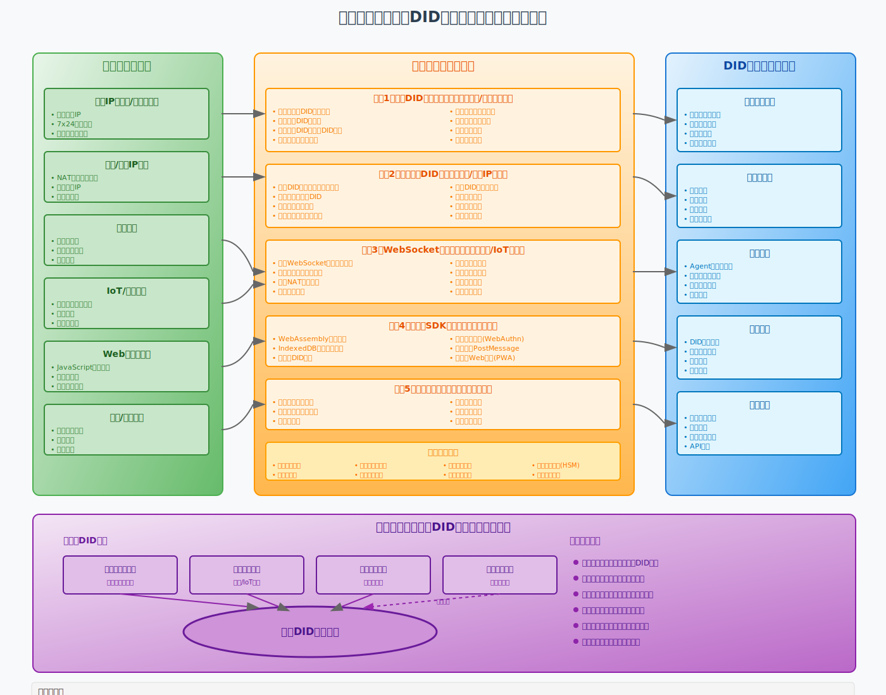
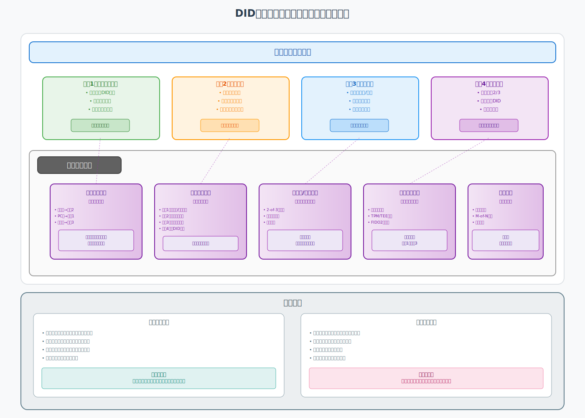

# ANP DID 系统总体说明

## 一、系统概述

ANP（Agent Network Protocol）是一个基于DID（去中心化身份）的智能体网络协议实现。系统通过三层架构实现了从底层网络资源到DID密码学身份空间的完整映射，支持各种网络环境下的智能体安全交互。

## 二、核心架构

### 2.1 三层架构模型

如下图所示，ANP采用三层架构设计，实现了用户、身份和资源的解耦：



三层架构包含：

- **业务用户层**：内外部DID-Agent，代表实际用户的业务需求
- **DID密码学身份空间**：统一的身份认证和授权层
- **底层资源层**：实际的网络资源和服务（Docker容器、服务器等）

### 2.2 映射机制

系统支持5种主要的映射方法，覆盖了从高性能服务器到离线设备的全场景：



- **方法1**：本地DID身份代理（服务器/长连接终端）
- **方法2**：协商托管DID（内网/动态IP设备）
- **方法3**：WebSocket反向代理（移动/IoT设备）
- **方法4**：轻量级SDK（浏览器环境）
- **方法5**：离线验证机制（断网设备）

## 三、用户视角

### 3.1 基本使用模式

如下图所示，用户可以选择4种基本模式使用ANP DID系统：



#### 模式1：用户持有密钥

- 适合技术用户
- 完全控制私钥
- 每次认证需签名

#### 模式2：云端托管

- 适合普通用户
- 云端代持私钥
- 用户名密码登录

#### 模式3：本地代理

- 适合企业用户
- 本地服务器管理
- 自主控制认证

#### 模式4：多级托管

- 适合跨平台用户
- 灵活的托管方案
- 增强的互操作性

### 3.2 增强功能

系统提供了一系列可选的增强功能（参见图3中的通用增强功能区）：

- **混合模式支持**：根据场景自动切换认证模式
- **身份恢复机制**：多种恢复方案确保身份不丢失
- **多签名/阈值签名**：高价值操作的额外保护
- **硬件安全模块**：支持硬件钱包和TPM
- **社交恢复**：通过信任网络恢复身份

### 3.3 使用场景示例

```python
# 创建本地智能体
agent = LocalAgent.from_name("我的智能体")

# 发送消息给其他智能体
await agent_msg_post(sdk, agent.id, target_did, "Hello!")

# 调用其他智能体的API
result = await agent_api_call(agent.id, target_did, "/api/weather", {"city": "北京"})
```

## 四、开发者视角

### 4.1 核心组件说明

#### anp_open_sdk（核心SDK）

- **anp_sdk.py**：SDK主类，支持多种运行模式
- **anp_sdk_agent.py**：本地智能体实现
- **auth/**：认证模块，支持DID-WBA双向认证
- **service/**：服务层，包含交互、发布、路由等功能

#### anp_user_service（用户服务）

- 提供用户管理和认证服务
- 支持多用户隔离
- RESTful API接口

#### anp_user_extension（浏览器扩展）

- 轻量级浏览器插件
- 支持Web环境下的DID认证
- 无需安装完整SDK

### 4.2 开发模式

#### 1. 单智能体开发

```python
# 创建智能体并暴露API
agent = LocalAgent.from_did("did:wba:localhost:9527:user:xxx")

@agent.expose_api("/hello")
async def hello_api(request_data, request):
    return {"message": "Hello from agent!"}

# 启动服务
sdk = ANPSDK(SdkMode.AGENT_SELF_SERVICE, agents=[agent])
sdk.start_server()
```

多智能体路由

```
# 管理多个智能体
sdk = ANPSDK(SdkMode.MULTI_AGENT_ROUTER)
sdk.register_agent(agent1)
sdk.register_agent(agent2)
sdk.start_server()
```

群组协作

```
# 创建群组运行器
class MyGroupRunner(GroupRunner):
    async def on_message(self, message: Message):
        # 处理群组消息
        await self.broadcast(response_message)

sdk.register_group_runner("my_group", MyGroupRunner)
```

### 4.3 认证机制

系统实现了完整的DID-WBA双向认证：

- 请求方认证：使用DID私钥签名请求
- 响应方验证：验证请求方签名并返回token
- 双向认证：响应方也提供自己的DID认证头
- Token管理：自动管理和刷新访问令牌
  4.4 扩展机制
  ANP Tool（智能工具）

```
# 使用ANP Tool进行智能爬取
crawler = ANPToolCrawler()
result = await crawler.run_crawler_demo(
    task_input="查询北京天气",
    initial_url="http://weather-agent/ad.json",
    use_two_way_auth=True
)
```

托管服务

```
# 申请托管DID
await agent.register_hosted_did(sdk)

# 检查托管响应
await agent.check_hosted_did()
```

## 五、架构优势

### 5.1 完备性

参考图2中的架构完备性展示区，系统实现了：

- 全场景覆盖：从服务器到浏览器，从在线到离线
- 灵活部署：支持各种网络环境和设备类型
- 渐进式采用：可从简单模式逐步升级到复杂模式

### 5.2 安全性

- 端到端加密：基于DID的密码学保证
- 去中心化：无单点故障和控制
- 隐私保护：最小化信息披露原则

### 5.3 易用性

- 多种认证模式：适应不同技术水平用户
- 自动化管理：Token自动刷新，连接自动恢复
- 标准兼容：遵循W3C DID规范

## 六、部署建议

基于图3中的基本模式特征：

- 开发测试：使用模式2（云端托管）快速开始
- 生产环境：使用模式3（本地代理）确保安全
- 跨平台应用：使用模式4（多级托管）实现灵活部署
- 高安全场景：结合硬件安全模块和多签名机制

## 七、架构对比总结

通过三张架构图的对比，我们可以看到：

- 图1（三层架构）：展示了系统的整体架构哲学，通过投影关系实现用户、身份和资源的解耦
- 图2（映射方法）：详细说明了不同网络环境下的技术实现方案，体现了架构的完备性
- 图3（使用模式）：从用户角度展示了简化的使用方式和可选的增强功能
  这种设计确保了ANP DID系统既有技术深度（支持各种复杂场景），又有良好的用户体验（提供简单易用的接口）。

## 八、未来展望

ANP DID系统正在持续演进，未来将支持：

- 更多DID方法（did:key, did:web等）
- 跨链互操作性
- 更丰富的隐私计算能力
- AI驱动的智能体协作
- 标准化的智能体市场
  通过不断完善三层架构和映射机制，ANP将成为连接Web2和Web3世界的桥梁，让每个人和每个设备都能在去中心化网络中拥有自主可控的数字身份。
