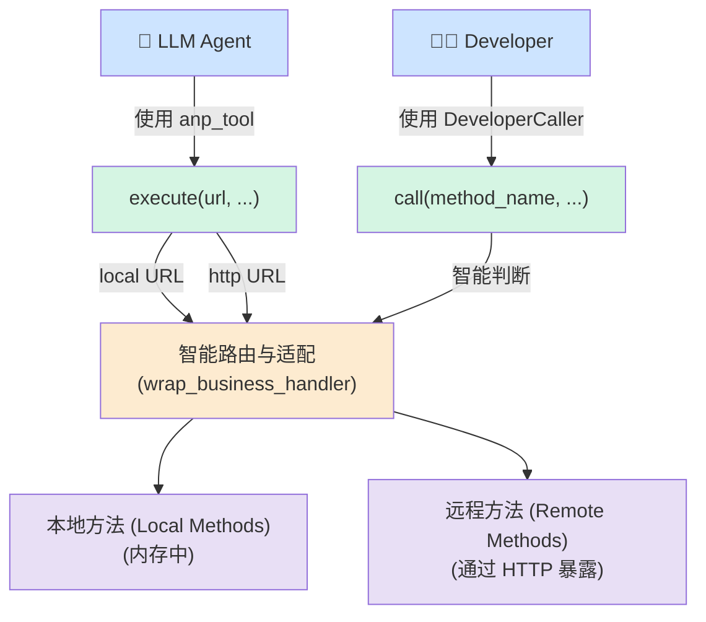

# 整体方案：本地与远程方法的统一调用与暴露

## 1. 愿景与目标

本方案旨在为 `anp-open-sdk` 构建一个统一、高效、且具备“位置透明性”的能力调用框架。其核心目标是：

1. **面向大模型（LLM）**: 提供一个**统一的 `anp_tool`**，使其能够无差别地调用本地（内存中）和远程（网络中）的各种能力（方法），无需关心其物理位置，从而简化模型决策逻辑，优化调用性能。
2. **面向开发者（Developer）**: 提供一个**高级别的 `Caller` SDK**，使其能够像调用本地函数一样轻松、可靠地调用框架内的任何方法，无论是本地还是远程，实现与 LLM 同等级别的简洁调用体验。
3. **实现能力动态演进**: 建立一个从远程 API 调用到本地方法（Local Method）沉淀的闭环机制。LLM 可以将频繁使用的远程服务调用固化为本地代码，持续降低 Token 消耗和网络延迟，实现系统的自优化。

此方案深度融合了 `KANAS` 的核心思想，将 `anp_tool` 和 `Caller` 视为同一层级的“能力调用端”，共同消费由 KANAS 节点或其他 Agent 暴露的“AI 原生 API”。

## 2. 核心设计原则

为实现上述目标，我们的设计遵循三大核心原则：

1. **位置透明性 (Location Transparency)**: 调用者（LLM 或开发者）只需知道能力的唯一标识（如 `calculator/add`），无需关心该能力是部署在本地内存还是远程服务器。框架应自动选择最优调用路径。
2. **体验对等 (Experience Parity)**: 无论是 LLM 通过 `anp_tool` 调用，还是开发者通过 `Caller` SDK 调用，其体验都应是高级、抽象且简洁的。底层的网络通信、参数封装、认证处理等复杂性必须被完全屏蔽。
3. **端到端容错 (End-to-End Fault Tolerance)**: 整个调用链路建立在 `_handle_anp_tool_call`（客户端）和 `wrap_business_handler`（服务端）的协同机制之上，确保系统能灵活适配、容忍 LLM 输出的不确定性和不同调用方的参数结构差异，保证调用的高成功率。

## 3. 整体架构

整体架构围绕着“统一调用层”和“KANAS 能力节点”展开，实现了调用方和能力提供方的解耦。



**架构组件说明:**

* **统一调用层**:
  * **`anp_tool`**: 专为 LLM 设计的工具。其 `execute` 方法是智能调度网关，根据 URL 的前缀（`local://` 或 `http://`）决定执行本地内存调用还是远程 HTTP 调用。
  * **`DeveloperCaller`**: 专为开发者设计的高级 SDK。其 `call` 方法封装了所有调用逻辑，开发者只需提供方法名和参数即可。
* **KANAS 能力节点**:
  * **智能路由与适配**: 接收来自调用层的请求，利用 `wrap_business_handler` 装饰器的能力，灵活解析参数并将其精准地映射到具体的业务函数上。
  * **能力层**: 包含具体的业务逻辑实现，既可以是注册在本地内存中的 Python 函数（Local Methods），也可以是通过 FastAPI 暴露的 HTTP 端点（Remote Methods）。

## 4. 方案详细实现

### 4.1. 赋能大模型：改造 `anp_tool` 实现统一调用

此部分采纳 `unified_tool_invocation_assessment.md` 的核心方案。

1. **引入 URI 方案**:

   * **本地调用**: 使用 `local://<agent_did>/<method_name>` 格式。
   * **远程调用**: 继续使用标准的 `http://` 或 `https://` URL。
2. **改造 `ANPTool.execute` 方法**:
   该方法将成为一个智能调度器。

   ```python
   # 伪代码 anp_open_sdk/service/interaction/anp_tool.py

   class ANPTool:
       def __init__(self, local_caller: LocalMethodsCaller, ...):
           self.local_caller = local_caller
           # ...

       async def execute(self, url: str, method: str = "POST", params: dict = None, body: dict = None, ...):
           if url.startswith("local://"):
               # 1. 解析本地 URI，获取 agent_did 和 method_name
               target_did, method_name = self._parse_local_uri(url)

               # 2. 准备参数，本地调用是函数调用，合并所有参数
               kwargs = (params or {}).copy()
               kwargs.update(body or {})

               # 3. 通过 LocalMethodsCaller 执行内存调用
               result = await self.local_caller.call_method_by_key(
                   f"{target_did}::{method_name}",
                   **kwargs
               )
               return {"status_code": 200, "data": result, "source": "local"}
           else:
               # 4. 保持现有逻辑，执行远程 HTTP 调用
               return await self._execute_remote_http_request(url, method, params, body, ...)

   ```
3. **更新工具描述**: 必须向 LLM 清晰地说明 `local://` 协议的用法和优势（速度快、成本低），以便其在决策时能充分利用此能力。

### 4.2. 赋能开发者：提供 `DeveloperCaller` SDK

此部分采纳 `Local-Remote_unified_call.md` 的核心方案，提供一个高级别 `Caller`。

**旧的方式 (不推荐):**

```python
import requests
# ...手动拼接 URL, headers, data...
response = requests.post("http://localhost:9527/calculator/add", ...)
```

**新的方式 (推荐):**

```python
from anp_open_sdk.caller import ANPCaller # 假设的模块名

# 1. 初始化 Caller，一次性配置认证信息
#    它可以智能地管理本地和远程的连接
caller = ANPCaller(
    host="http://localhost:9527", # 远程 KANAS 节点地址
    auth_method="apikey",
    api_key="your_secret_key",
    local_sdk_instance=anp_sdk # 注入本地 anp_sdk 实例
)

# 2. 像调用本地函数一样调用，无需关心位置
#    框架自动判断 "calculator/add" 是本地还是远程
result = await caller.call("calculator/add", a=123.45, b=678.90)
print(f"调用结果: {result}")

# 调用一个确定是本地的方法
local_data = await caller.call("local_agent/get_status")
```

`ANPCaller` 内部会维护一个本地方法注册表和一个远程客户端。调用 `call` 时，它会首先检查方法是否在本地注册，如果是，则执行内存调用；如果不是，则通过网络向远程 `host` 发起请求。

### 4.3. 能力的动态演进：从远程调用到本地方法沉淀

这是实现 KANAS 愿景中“自维接口”的关键闭环，也是对用户原始需求的直接回应。

**流程如下:**

1. **初始调用**: LLM Agent 需要执行一个任务，例如“分析报告 `report.pdf` 并总结要点”。它发现一个远程 KANAS 节点（`http://kanas.server/`）提供了一个 `doc_analyzer/summarize` 的能力。

   * LLM 生成 `anp_tool` 调用：`url="http://kanas.server/doc_analyzer/summarize"`, `body={"doc_url": "..."}`。
2. **观察与决策**: 系统（或一个专门的优化 Agent）观察到 `doc_analyzer/summarize` 是一个高频、高价值的调用。为了提升效率和降低成本，系统决定将其“本地化”。
3. **动态生成本地方法 (Local Method)**:
   LLM Agent 被赋予一个任务：“为 `doc_analyzer/summarize` API 创建一个本地代理函数”。它会生成如下的 Python 代码：

   ```python
   import httpx
   from anp_open_sdk.router import api # 假设的装饰器

   KANAS_HOST = "http://kanas.server"
   API_KEY = "retrieved_from_config"

   @api(description="本地代理：调用远程 KANAS 服务来总结文档。")
   async def summarize_document_local_proxy(doc_url: str) -> dict:
       """
       通过调用远程服务来总结文档，这是一个本地缓存的调用函数。
       """
       headers = {"X-API-Key": API_KEY, "Content-Type": "application/json"}
       try:
           async with httpx.AsyncClient() as client:
               response = await client.post(
                   f"{KANAS_HOST}/doc_analyzer/summarize",
                   json={"params": {"doc_url": doc_url}},
                   headers=headers,
                   timeout=120
               )
               response.raise_for_status()
               return response.json()
       except httpx.HTTPStatusError as e:
           # 返回结构化错误，以便上游处理
           return {"error": f"API request failed: {e.response.status_code}", "details": str(e)}
   ```
4. **注册本地方法**:

   * 这段代码被保存到一个文件中（例如 `local_methods/doc_analyzer.py`）。
   * 框架的 `LocalMethodsManager` 自动发现并加载这个新函数，将其注册到本地方法列表中，其能力标识为 `doc_analyzer/summarize_document_local_proxy`。
5. **优化调用路径**:

   * 下次 LLM Agent 需要总结文档时，它的工具列表中除了远程的 `doc_analyzer/summarize`，还多了一个本地的 `doc_analyzer/summarize_document_local_proxy`。
   * LLM 会被引导（通过 Prompt 或因为 `local://` 的成本更低）优先选择本地方法。
   * 它将生成 `anp_tool` 调用：`url="local://<local_agent_did>/summarize_document_local_proxy"`, `body={"doc_url": "..."}`。

这个过程完美地将一个外部的、高成本的 API 调用，转化为一个内部的、高效的、稳定的函数调用，实现了能力的“按需沉淀”和系统的“持续进化”。

## 5. 结论

本方案通过整合 `anp_tool` 和引入 `DeveloperCaller`，成功地为 LLM 和开发者构建了一个统一、简洁且具备位置透明性的能力调用框架。其核心优势在于：

* **简化了调用逻辑**: 调用方无需再关心能力的物理位置。
* **提升了开发体验**: 提供了与现代 RPC 框架相媲美的高级 SDK。
* **优化了系统性能**: 自动选择内存或网络路径，并通过本地方法沉淀机制持续降低延迟和成本。

该方案不仅解决了当前本地/远程调用分离的问题，更实现了 KANAS 架构的核心愿景，为构建高效、智能、自适应的 AI 原生应用奠定了坚实的基础。
